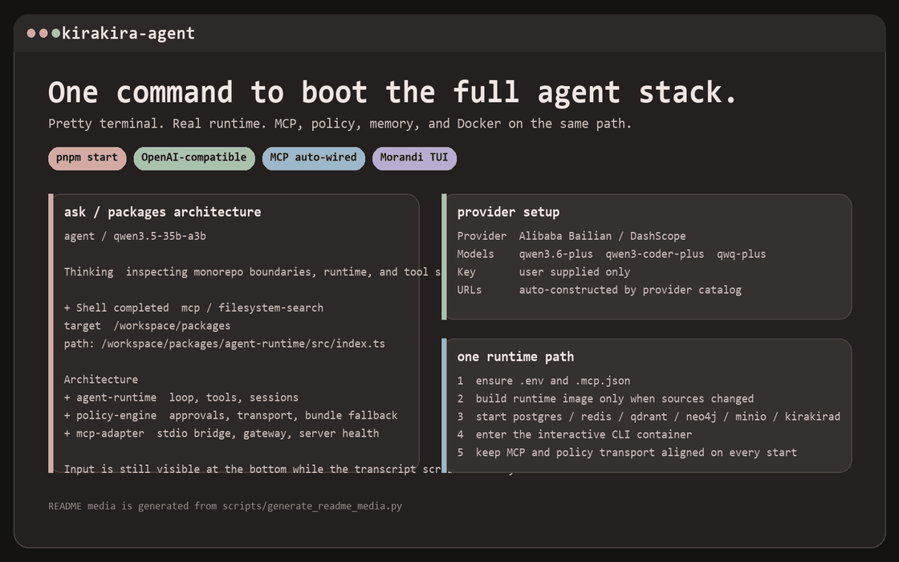
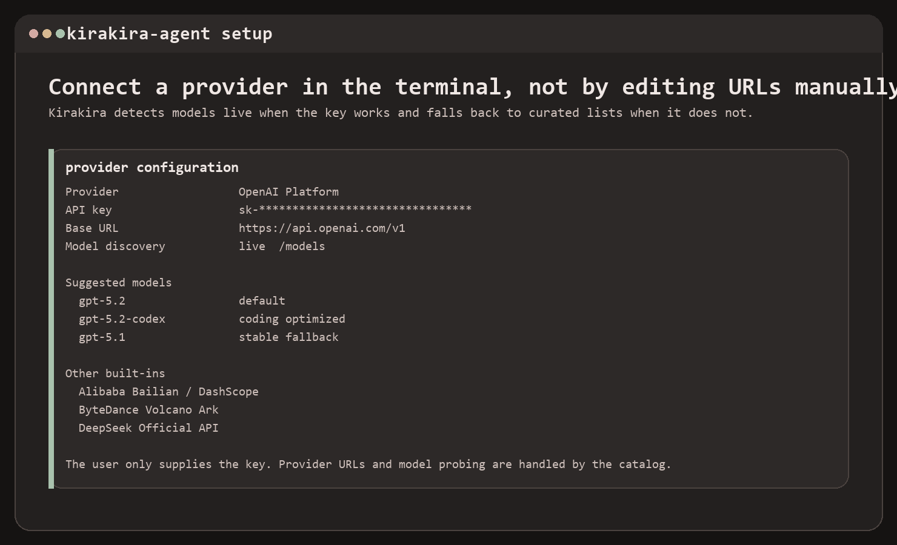
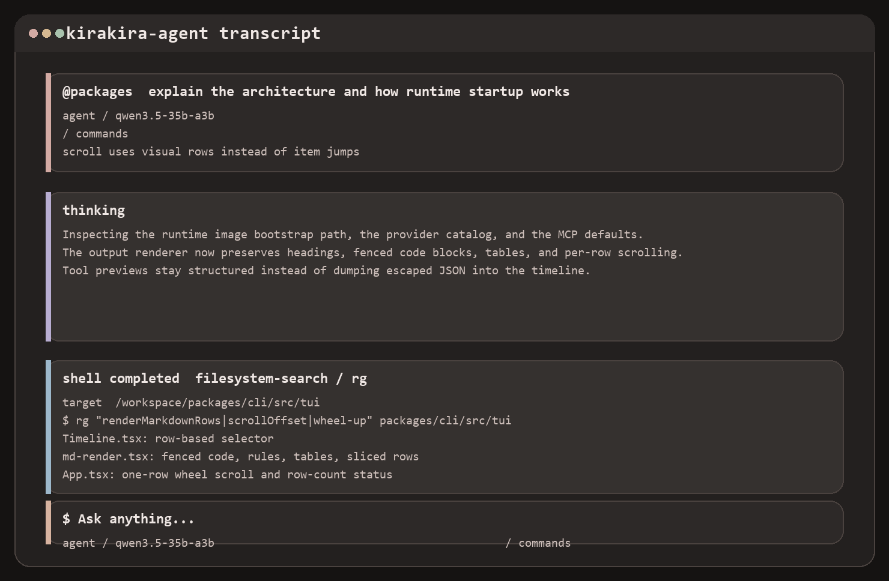
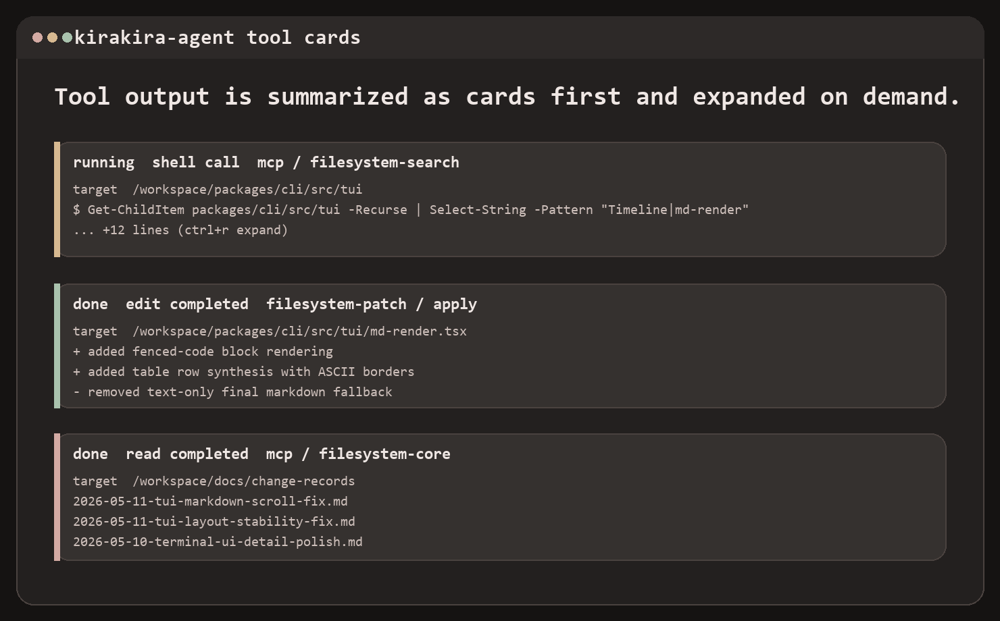
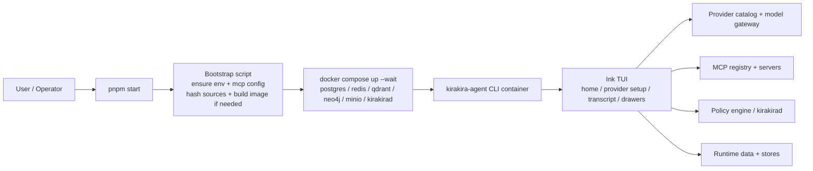

# kirakira-agent


Terminal-first agent runtime with a polished Ink TUI, a single Docker-backed startup path, structured MCP tooling, and provider setup that asks users for a key instead of asking them to hand-edit base URLs.


## What It Feels Like

Kirakira is trying to do one thing cleanly: make the local agent experience feel like a real product instead of a pile of scripts.

- One command opens the real interactive agent page: `pnpm start`
- One runtime path boots Docker services, policy, MCP, and the CLI together
- One provider flow supports OpenAI-compatible APIs without making the user enter URLs manually
- One transcript surface keeps markdown, tool calls, MCP activity, and approvals readable in the same timeline



## Why This Repo Exists

Most local agent projects fall apart in exactly the same places:

- local runs and Docker runs behave differently
- MCP installation works, but the actual startup path is ad hoc
- provider setup leaks transport details into the UX
- terminal output becomes unreadable once markdown, tools, and streaming collide

Kirakira pushes the opposite direction:

- `pnpm start` is the canonical entrypoint
- Docker is the runtime contract, not an optional side path
- provider catalogs own base URLs and model discovery
- the TUI renders structured rows, cards, and markdown blocks instead of dumping raw text

## Screenshots

### Provider setup

The user provides a key. Kirakira constructs the provider URL, probes `/models`, and falls back to curated lists when discovery fails.



### Transcript view

The timeline is row-based, so long assistant output scrolls line by line instead of jumping item by item.



### Tool cards

Tool output is summarized as cards first, then expanded on demand.



## Provider Support

Kirakira currently ships built-in catalogs for these OpenAI-compatible providers:

| Provider | Key env | Base URL handling | Model selection |
| --- | --- | --- | --- |
| OpenAI Platform | `OPENAI_API_KEY` | auto | live `/models` + fallback list |
| Alibaba Bailian / DashScope | `DASHSCOPE_API_KEY` | auto | live `/models` + fallback list |
| ByteDance Volcano Ark | `ARK_API_KEY` | auto | live `/models` + fallback list |
| DeepSeek Official API | `DEEPSEEK_API_KEY` | auto | live `/models` + fallback list |

The current setup path is intentionally simple:

1. put one provider key in `.env`
2. run `pnpm start`
3. choose from detected or fallback models in the TUI

No manual base URL entry is required for the built-in providers.

## One Command Startup

```bash
pnpm install
copy .env.example .env
# fill one of: OPENAI_API_KEY, DASHSCOPE_API_KEY, ARK_API_KEY, DEEPSEEK_API_KEY
pnpm start
```

`pnpm start` runs `scripts/kirakira.mjs`, which currently:

1. ensures `.env` exists
2. ensures `.mcp.json` exists
3. resolves the `container` runtime profile from `configs/runtime/profiles.json`
4. hashes the runtime-relevant sources declared by that profile
5. rebuilds the runtime image only when the hash changes
6. starts the profile-declared runtime services: `postgres`, `redis`, `qdrant`, `neo4j`, `minio`, and `kirakirad`
7. enters the interactive `kirakira-agent` CLI container

That is the intended operating model: one command, one runtime path, one place to debug.

## Startup Matrix

| Command | Purpose | Runtime profile |
| --- | --- | --- |
| `pnpm start` | Docker-backed interactive CLI, defaulting to `chat` | `container` |
| `pnpm start -- mcp list` | Run another CLI command through the same Docker runtime | `container` |
| `pnpm start:daemon` | Host daemon against Docker-published infra | `workbench-host` |
| `pnpm start:web` | Host daemon plus web workbench at `http://127.0.0.1:5183` | `workbench-host` |
| `pnpm start:desktop` | Host daemon plus desktop renderer at `http://127.0.0.1:5174` | `workbench-host` |
| `pnpm runtime:profile env workbench-host` | Print the workbench env contract, including gateway `ws://127.0.0.1:17373/runtime` | `workbench-host` |
| `pnpm dev:web` | UI-only Vite shortcut; does not start infra or daemon | none |
| `pnpm dev:desktop` | Desktop renderer-only shortcut; does not start infra or daemon | none |

The Kirakira web workbench default is port `5183`. A Vite server on `5173` is not this repo's default startup target.

## Common Flows

```bash
# open the interactive agent page
pnpm start

# run another CLI command through the same container/runtime path
pnpm start -- mcp list
pnpm start -- mcp add @modelcontextprotocol/server-filesystem
pnpm start -- chat
```

If you are not in the interactive page, you are usually still supposed to come through the same `pnpm start -- ...` entrypoint.

## Architecture



The repo is still a work-in-progress monorepo, but the current architectural direction is stable:

- `packages/cli`: commands, TUI, provider setup, MCP interaction
- `apps/web`: browser workbench shell for the daemon runtime gateway
- `apps/desktop`: desktop renderer shell aligned to the same runtime gateway
- `packages/kirakirad`: policy transport and runtime-side control server
- `packages/mcp-adapter`: MCP client and transport layer
- `packages/policy-engine`: local and remote PDP wiring
- `scripts/kirakira.mjs`: the single bootstrap entrypoint

More detail lives in [docs/architecture.md](docs/architecture.md).

## Repository Layout

```text
packages/
  cli/             interactive CLI and TUI
  kirakirad/       policy and runtime-side daemon
  mcp-adapter/     MCP transports and gateway integration
  policy-engine/   policy decision client/factory
policies/          rego policy and bundled data
scripts/           startup/bootstrap and README media generation
docs/              architecture, doc planes, and change records
test/              TUI and unit coverage
```

## Documentation

- [Documentation hub](docs/README.md)
- [Architecture overview](docs/architecture.md)
- [CLI documentation plane](docs/plane/kirakira-agent-cli/README.md)
- [TUI documentation plane](docs/plane/kirakira-agent-cli/04-tui/README.md)
- [Change records](docs/change-records/README.md)

## Validation Snapshot

Recent validation for the current runtime and TUI path includes:

```bash
pnpm.cmd --filter @kirakira/cli typecheck
pnpm.cmd --filter @kirakira/cli build
pnpm.cmd vitest run test\tui\layout-stability.test.ts test\tui\mouse.test.ts test\unit\cli\tui
pnpm.cmd start -- --help
```

The last command still goes through the Docker-backed startup path. That is currently intentional, even though it means `--help` is not a cheap path yet.

## Notes

- README media is generated by `scripts/generate_readme_media.py`
- the public-facing screenshots are illustrative and repo-generated, not hand-edited mockups
- the TUI is designed around muted Morandi tones rather than high-saturation terminal themes
