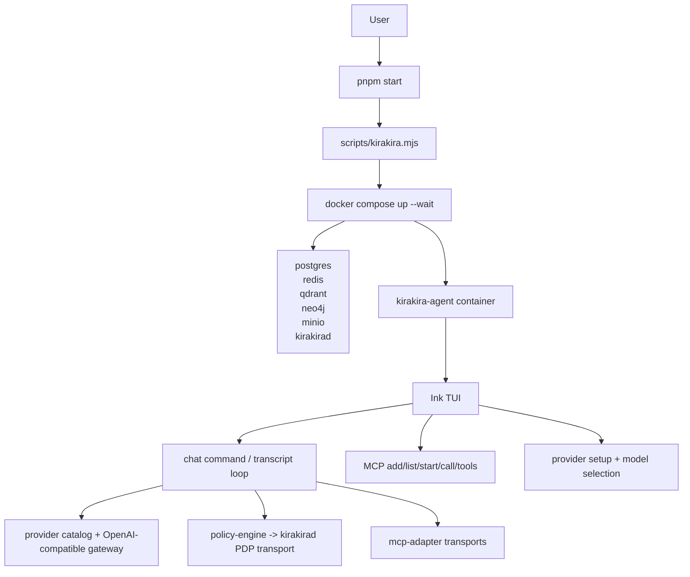
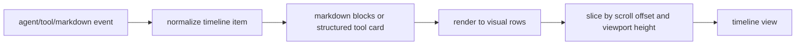

# kirakira-agent architecture

This document describes the current architecture direction of the repository as it exists today, not an aspirational future rewrite.

## Design goals

The repo is converging on a few hard constraints:

- **one startup path**: `pnpm start` is the canonical way to boot the system
- **one interaction surface**: the primary product surface is the interactive TUI
- **one provider contract**: users provide keys; provider catalogs handle URLs and model discovery
- **one runtime story**: Docker services, policy transport, MCP, and the CLI must stay aligned
- **one profile contract**: host, container, test, CI, MCP, and future presentation surfaces resolve paths and service URLs through runtime profiles

## High-level layout

## Startup path

The root script is [`scripts/kirakira.mjs`](../scripts/kirakira.mjs).

It is responsible for:

1. ensuring `.env` exists
2. ensuring `.mcp.json` exists
3. resolving `container` startup topology from `configs/runtime/profiles.json`
4. hashing runtime-relevant files declared by that profile
5. rebuilding the profile-declared runtime image only when the source hash changes
6. starting the profile-declared runtime services with `docker compose up -d --wait`
7. launching the profile-declared CLI container with `docker compose run --rm`

This is deliberately opinionated. The point is to remove branchy startup behavior from day-to-day use.

Workbench startup uses [`scripts/kirakira-workbench.mjs`](../scripts/kirakira-workbench.mjs)
and the `workbench-host` profile. `pnpm start:web` starts Docker-published infra,
the host daemon, and the web workbench at `http://127.0.0.1:5183`.
`pnpm start:desktop` uses the same daemon and the desktop renderer at
`http://127.0.0.1:5174`, then launches the Electron shell as the foreground
process. These workbench steps use profile-declared `waitFor` checks from the
shared runtime readiness plan rather than local port literals. The browser
runtime gateway is `ws://127.0.0.1:17373/runtime`.

Workbench smoke validation is exposed through `pnpm e2e:workbench -- --profile
workbench-host --surface web --timeout-ms 120000` and the same command with
`--surface desktop`. By default that command reports the resolved smoke plan
without starting Docker, daemon, Vite, or Electron dependencies. Live execution
is a second opt-in: add `--live` or set `KIRAKIRA_LIVE_E2E=1` to start the same
resolved workbench plan under supervision, wait on profile-declared readiness
checks such as `presentation:web` or `presentation:desktop`, and then tear down
local child processes. The launcher owns the smoke contract for each surface,
including the desktop Electron foreground assertion and its hidden-window
environment. The standalone smoke entrypoint only selects dry-run versus live
execution, so dry-run output and live execution share the same step/readiness
plan.

Runtime profile projection is exposed through `pnpm runtime:profile projection
<profile>`. The projection emits two reusable fragments without writing local
files: an MCP config JSON object rendered from `mcpCatalog` and the selected
profile roots, and a memory-stack startup fragment rendered from the profile's
memory services, compose files, checks, and non-secret env bindings. This keeps
Docker, host, workbench, and test profiles on the same profile-derived plan
instead of copying `.mcp.json` or memory service lists into each launcher.

## Runtime services

`docker-compose.yml` currently defines the runtime envelope:

- `postgres`
- `redis`
- `qdrant`
- `neo4j`
- `minio`
- `kirakirad`
- `kirakira-agent`

`kirakirad` is the control-side daemon used for policy transport. The CLI container then talks to the rest of the stack through the same runtime network.

## Key packages

| Package | Role |
| --- | --- |
| `packages/cli` | command layer, TUI, provider setup, MCP UX, chat flow |
| `packages/kirakirad` | daemon process for policy/runtime control transport |
| `packages/mcp-adapter` | MCP client, gateway, stdio transport handling |
| `packages/policy-engine` | PDP transport selection, fallback behavior, decision interface |
| `packages/frontend-core` | browser-safe transport contract and run-event projection for future web/desktop surfaces |
| `apps/web` | browser workbench shell for the runtime gateway |
| `apps/desktop` | Electron shell plus desktop renderer for the same runtime gateway |
| `policies/` | Rego policy and bundled data |

## Provider model

The provider layer is built around a catalog in [`packages/cli/src/gateway/provider-catalog.ts`](../packages/cli/src/gateway/provider-catalog.ts).

Current built-ins:

- OpenAI Platform
- Alibaba Bailian / DashScope
- ByteDance Volcano Ark
- DeepSeek Official API

The current contract is:

- the user supplies a key
- the catalog supplies the base URL
- Kirakira attempts live model discovery from `/models`
- if that fails, the UI falls back to a curated model list

This keeps transport details out of the interactive setup flow.

## TUI architecture

The active terminal UI lives under [`packages/cli/src/tui`](../packages/cli/src/tui).

The important parts are:

- `App.tsx`: top-level composition, layout budgeting, mode switching
- `Timeline.tsx`: row-based transcript slicing and scroll behavior
- `md-render.tsx`: markdown-to-terminal row rendering
- `InputArea.tsx`: composer, caret editing, bottom dock
- `key-handler.ts` and `mouse.ts`: keyboard and mouse event handling
- `ProviderSetup.tsx`, `SidebarPanel.tsx`, `ContextDrawer.tsx`: interactive panels

The TUI is not treated as a thin wrapper around console output. It has its own layout model, row accounting, and structured cards for tool activity.

## Transcript rendering

The transcript path now follows this structure:

That matters for two reasons:

1. long markdown output can scroll by visible rows instead of by item
2. tool output can be summarized first and expanded later without dumping raw JSON into the transcript

## MCP integration

MCP is treated as a first-class part of the user experience, not an afterthought.

There are two layers:

- **configuration and lifecycle** in the CLI commands under `packages/cli/src/commands/mcp`
- **runtime execution** through `packages/mcp-adapter`

The startup design goal is that a user should not need one manual installation path for local runs and a different hidden path for the containerized runtime.

## Runtime profiles

Runtime environment selection now has an explicit profile baseline in
[`configs/runtime/profiles.json`](../configs/runtime/profiles.json), with shared
toolchain pins in [`configs/runtime/versions.json`](../configs/runtime/versions.json).

The profile contract is deliberately separate from a single Docker compose file:

- `container` keeps the canonical Docker workspace path (`/workspace`) and app path (`/app`)
- `host` resolves services through localhost and renders host-oriented MCP roots
- `workbench-host` starts Docker infra with published ports, then runs the host daemon and web/desktop surfaces against the runtime gateway
- `test-host` matches the published ports in `docker-compose.test.yml`
- `ci` provides a non-interactive profile for future automation

[`scripts/runtime-profile.mjs`](../scripts/runtime-profile.mjs) renders the
selected profile into environment variables, compose flags, and MCP defaults.
MCP defaults are selected from `mcpCatalog` in
[`configs/runtime/profiles.json`](../configs/runtime/profiles.json), where
server groups and command descriptors are data rather than JS literals.
`scripts/kirakira-common.mjs` obtains managed MCP defaults from that renderer
instead of owning separate hardcoded `/workspace`, `/app`, or server package
constants.
The same profile contract also declares workbench smoke checks by name, keeping
live e2e readiness tied to resolved `runtime-profile.mjs` output instead of
duplicating port literals in test harnesses.

## Presentation baseline

Kirakira now has a shared presentation contract plus early host-run shells:

- [`packages/frontend-core`](../packages/frontend-core) defines the browser-safe runtime transport interface and projects `RunEvent` streams into a dashboard model.
- [`apps/web`](../apps/web) is the Vite browser workbench, served by `pnpm start:web` on `http://127.0.0.1:5183`.
- [`apps/desktop`](../apps/desktop) is the Electron shell plus desktop renderer. `pnpm start:desktop` runs the daemon, serves the renderer on `http://127.0.0.1:5174`, and launches Electron in the foreground.

Both presentation shells use the `workbench-host` profile and the browser runtime
gateway rather than duplicating CLI-only chat state. A Vite server on `5173` is
not a Kirakira validation target; use the Kirakira web shell on `5183`, desktop
renderer on `5174`, and browser gateway on `17373/runtime`.

The same profile now drives the opt-in live smoke gate:
`pnpm e2e:workbench -- --profile workbench-host --surface web --timeout-ms
120000 --live` or `pnpm e2e:workbench -- --profile workbench-host --surface
desktop --timeout-ms 120000 --live`. The command uses
`scripts/kirakira-workbench-smoke.mjs` to start the profile plan, wait for
profile-rendered readiness checks, and tear down foreground workbench processes
after the selected surface is reachable. For desktop, the Electron shell runs as
a foreground smoke assertion in hidden-window mode and exits only after the
renderer reports `did-finish-load`. That assertion is resolved by
`scripts/kirakira-workbench.mjs` as part of the shared smoke contract rather
than patched by the smoke wrapper. Without `KIRAKIRA_LIVE_E2E=1` or `--live`,
it reports the same smoke plan and exits without starting Docker, daemon, Vite,
or Electron.

The shared workbench MCP directory is rendered from runtime transport calls
(`mcp_list`) and browser-safe view models in `@kirakira/frontend-core`. Web and
Electron do not read local MCP config files directly; live server health and
tool schemas come through the daemon/gateway contract.
The same discovery result now feeds the workbench MCP argument playground:
`@kirakira/frontend-core` derives editable JSON argument drafts, input-field
summaries, and trust/policy/audit metadata rows from `runtime.listMcpTools()`.
Workbench execution sends the selected server/tool and parsed arguments through
`runtime.callMcpTool()` so web and Electron share the daemon-side PEP, audit,
and transport behavior without embedding server names, paths, or endpoint
literals in the UI.

## Policy transport

The policy layer supports remote PDP transport through `kirakirad`, with local fallback behavior where necessary.

Relevant areas:

- `packages/policy-engine/src/pdp`
- `packages/kirakirad/internal/pdp`

The recent direction has been to keep transport selection explicit and make failures legible, instead of silently drifting between incompatible local and container modes.

## Documentation map

For more detail:

- [README](../README.md)
- [CLI plane](./plane/kirakira-agent-cli/README.md)
- [TUI plane](./plane/kirakira-agent-cli/04-tui/README.md)
- [Change records](./change-records/README.md)
