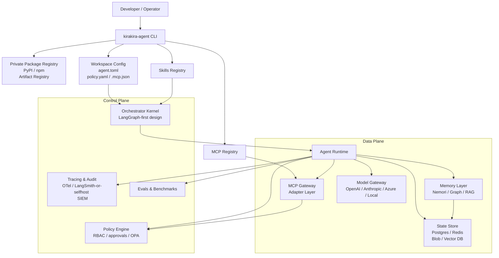
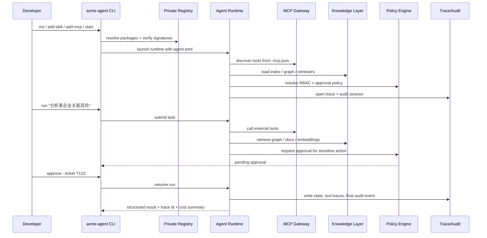
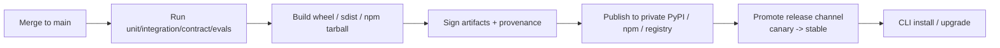

# 企业内部全能 Agent 框架与 CLI 研究报告

## 执行摘要

这次调研的核心结论很明确：**不要把“企业内部全能 agent 平台”押注在单一开源框架上**。就你提出的目标——一键安装、包管理友好、兼容私有仓库、支持 subagent、MCP、skills、高度可定制、且能覆盖金融图谱与更广泛企业任务——当前最稳妥的路线不是“选一个最大最火的框架”，而是采用**“编排内核 + 开放协议 + 知识/图谱层 + CLI 门面 + 治理与观测层”**的组合式架构。其中，**LangGraph** 最适合做长期可维护的编排内核；**Deep Agents** 最适合借鉴为企业内部 CLI/开发者体验；**LlamaIndex** 最适合承担知识接入、RAG、文档与图谱增强；**Pydantic AI** 很适合承担类型安全、能力拼装、durable execution 与 eval；如果组织以 entity["organization","OpenAI","ai company"] 生态为主，则 **OpenAI Agents SDK** 是强有力的 GPT-centric 备选；如果组织偏 .NET/Azure，则 **Microsoft Agent Framework** 是最自然的企业级备选；如果前端/Node 团队很强，则 **Mastra** 是目前最值得认真考虑的 TypeScript 原生替代方案。citeturn44view0turn33view0turn13search0turn39search0turn25search7turn24search7turn15search3

同样重要的是，**MCP 与 Agent Skills 应该被当作“平台契约”而不是“某个框架的插件特性”**。MCP 已经是 agent 工具层互操作的事实标准，定义了 JSON-RPC、生命周期、能力协商、resources/prompts/tools 等关键层次；Agent Skills 则把“可移植的程序化知识包”标准化为包含 `SKILL.md` 的目录结构，并采用 progressive disclosure 来控制上下文成本。把这两类规范上升为你们内部平台的一等公民，可以显著降低未来在 LangGraph、Pydantic AI、OpenAI Agents SDK、Mastra、Microsoft Agent Framework 之间迁移或混搭的成本。citeturn40search1turn40search3turn40search4turn24search1turn21search0

从工程决策角度看，我的**首选落地方案**是：**LangGraph 作为 orchestration/runtime kernel，Deep Agents 的 subagent/skills/CLI 目录约定作为开发者入口，LlamaIndex 作为知识与金融图谱增强层，Pydantic AI 作为类型安全与能力组合层，MCP 作为工具协议，OpenTelemetry + 自建审计日志作为观测与合规底座**。这条路线的优点是：能力边界清晰、可替换性高、协议层开放、便于接入私有 PyPI / npm / artifact registry，也更适合内建权限、审批、审计、回滚与 eval。citeturn44view0turn33view0turn13search0turn39search0turn22search5turn24search2

## 调研范围与判断边界

本报告优先采信官方文档、官方 GitHub 仓库、官方 release notes、原始规范与原始论文/预印本。框架活跃度优先使用官方 GitHub 快照中的 **stars、总提交历史、最新 release 日期**；但需要说明，**GitHub 匿名 HTML 快照并不总会直接暴露总 contributors 数**，因此除少数仓库外，我把“总提交历史 + 最新 release 贡献者变化 + release 频率”作为 contributor 活跃度的补充代理。当前证据链中，**LlamaIndex** 的 GitHub 快照直接显示了 `1,859 contributors`，而多数其他仓库仅显示了 Contributors 区块但未给出匿名可见的总数。citeturn13search0turn44view0turn33view0turn17view1turn17view4turn17view5turn34view2turn35view2

另一个边界是：**“skills”一词在不同框架中的含义并不统一**。有的框架把它定义为正式开放标准，例如 Agent Skills；有的框架用 capabilities/harness/plugins/knowledge packs 来承载同类概念；还有一些框架根本没有统一 skill 规范，只能靠工具、prompt、目录约定拼装。因此，下面的比较表会把“是否支持公开可移植的 skill 规范”与“是否支持可复用能力包”区分来看。citeturn40search4turn24search1turn21search0turn39search2turn39search4

## 候选框架比较

### 框架核心能力对比

| 框架 | 成熟度与社区活跃度 | subagent 支持 | MCP 支持 | skills / 能力包 | 扩展性 | 安全/权限治理 | 可观测性 | 类型安全 | 语言生态 | 企业部署友好度 | License | 初步判断 | 关键证据 |
|---|---|---|---|---|---|---|---|---|---|---|---|---|---|
| LangGraph | 很高；31.1k★、6,804 commits、521 releases，长期高频迭代 | 强；subgraphs + subagents pattern + 多 agent 架构 | 强；官方 `langchain-mcp-adapters` | 弱到中；核心不自带统一 skills 标准，但非常适合作为上层 skills runtime | 很强；低层图编排、持久化、memory、branching | 中到强；HITL、持久化、状态检查，真正权限治理需上层补 | 强；LangSmith tracing | 中到高 | Python / JS | 很高 | MIT | **最佳编排内核** | citeturn44view0turn20search1turn20search4turn38search1turn37search2 |
| Deep Agents | 高；22.1k★、1,661 commits、持续 release | **很强**；内建 `task`、自定义 subagents、async subagents、CLI 子代理目录 | 强；CLI 原生 `.mcp.json` | **很强**；明确采用 Agent Skills standard | 很强；可加工具、模型、技能、沙箱、memory | 中到强；文件系统权限、审批、沙箱，官方明确“trust the LLM, bound tools/sandbox” | 强；LangSmith tracing、CLI tracing | 中 | Python（JS/TS 有对应库但本文聚焦 Python） | 高 | MIT | **最佳 CLI/开发者体验母体** | citeturn33view0turn21search0turn21search1turn21search2turn21search3turn21search5turn31search5 |
| Agno | 高；39.9k★、5,496 commits、近期持续 release | 强；Teams / sub-teams | 强；`MCPTools`，还可把 AgentOS 暴露成 MCP server | 中；更偏 agent/team/runtime 组件化，非公开通用 skills 标准 | 强；Agent、Team、Workflow、Runtime 一体 | **很强**；JWT、RBAC、request isolation、approval、audit | **很强**；OTel + 自有 DB traces + audit | 中 | Python | 很高 | Apache-2.0 | **最强一体化企业运行时备选** | citeturn34view0turn34view1turn22search1turn22search3turn22search5turn22search0turn22search6turn22search8 |
| CrewAI | 很高；50.5k★、2,362 commits、184 releases | 强；Crews + Flows | 强；`mcps` DSL + MCP adapter | 强；官方 skills、skills CLI、docs MCP server | 强；高层 DSL 容易上手 | 中到强；HITL、MCP 安全提示、企业 AMP 更强 | 强；内建 tracing + AMP/第三方 observability | 中 | Python | 高；但部分强能力依赖 AMP | MIT（核心） | **适合快速上手的多 agent 业务流框架** | citeturn16view0turn17view5turn19view4turn23search2turn23search5turn23search7turn23search1 |
| OpenAI Agents SDK | 高；25.8k★、1,414 commits、92 releases，最近 release 到 2026-05-02 | 强；handoffs / agents as tools | **很强**；官方覆盖 hosted / HTTP / SSE / stdio / approvals | 中；仓库含 `.agents/skills`，但 SDK 主体不是 skills-first 内核 | 强；primitives 少、抽象轻 | 强；guardrails、tool approvals、HITL；但治理仍需应用层设计 | **很强**；内建 tracing 默认开启 | 中到高 | Python（另有 JS/TS 版本） | 高，尤其 GPT-centric | MIT | **最适合 GPT-centric 产品线** | citeturn18view2turn17view2turn17view3turn25search3turn25search5turn25search0turn25search7 |
| Microsoft Agent Framework | 高；10.1k★、1,992 commits、79 releases，跨 Python/.NET | 强；graph workflows + multi-agent + hosting | 中到强；官方定位支持跨 runtime 互操作，A2A 文档更成熟，MCP 可见度略弱 | **很强**；官方 Agent Skills 文档完整 | 强；workflow、hosting、executors、edges | 强；Responsible AI 提示 + 企业 hosting 语境 | **很强**；OTel + GenAI semantics | **很强**；尤其 .NET | Python / .NET / 少量 TS | **很高** | MIT | **最适合 .NET/Azure 企业栈** | citeturn17view0turn18view1turn19view0turn24search1turn24search2turn24search6turn24search7turn32view0 |
| Pydantic AI | 高；16.8k★、1,987 commits、242 releases | 中；更偏 graph/capabilities/A2A 组合，不是 subagent-first | 强；官方 MCP 集成 | 中到强；核心是 capabilities / harness，另有 coding-agent skills | **很强**；capabilities 可组合，甚至可 YAML/JSON 定义 agents | **很强**；类型校验、tool approval、durable execution | **很强**；Logfire / OTel / evals / cost tracking | **很强** | Python | 很高 | MIT | **最适合作为类型安全与能力组合层** | citeturn39search0turn39search2turn39search3turn39search4turn18view0turn18view3turn17view4 |
| LlamaIndex | 很高；49.1k★、7,760 commits、493 releases；contributors 直接可见 1,859 | 中到强；workflow + agents + LlamaAgents | 中；可接 FastMCP / 自定义工具，但官方主轴仍是 data/agentic applications | 弱到中；无统一公开 skills 主轴 | **很强**；数据接入、RAG、workflow、文档/解析/图谱增强 | 中 | 强；instrumentation、workflow observability | 中 | Python / TypeScript | **很高**，特别适合知识系统 | MIT | **最佳知识/RAG/金融图谱增强层** | citeturn13search0turn35view0turn34view6turn26search1turn26search0turn26search6turn26search8 |
| Mastra | 高；23.5k★、14,698 commits、TypeScript 原生、高速演进 | 中到强；supervisor/network/workflow 组合 | **很强**；既能消费 MCP，也能把 tools/agents 暴露成 MCP server | 中；无统一 Agent Skills 标准，但模板、scorers、CLI 很完善 | **很强**；full-stack TS、workflow、server、memory、evals | 中到强；auth 模块、guardrails、sensitive-data filter，但部分仍标 experimental | **很强**；AI tracing + OTEL | **很强**（TS） | TypeScript / Node | 高 | Apache-2.0 + Enterprise 双许可 | **最佳 TS 原生替代内核** | citeturn15search3turn34view3turn34view4turn27search0turn27search5turn28search0turn28search1 |
| mcp-agent | 中到高；8.3k★、767 commits，定位非常清晰 | 中；更强调 composable patterns，而非多层级 subagent DSL | **最强之一**；full MCP、tools/resources/prompts/notifications/oauth/sampling | 弱；无统一 skills 规范 | 强；以 MCP + workflow patterns + Temporal durable 为中心 | 中；安全主要靠 MCP server 生命周期和运行环境边界 | 中 | 中 | Python | 高 | Apache-2.0 | **最适合作为 MCP-native 工具/协议层** | citeturn36view0 |
| AutoGen | 历史上很高；57.7k★、3,782 commits，但**已进入 maintenance mode** | 强；多 agent 协作模型成熟 | 强；`McpWorkbench` | 弱；无统一 skill 标准 | 中到强；历史包袱较重 | 中 | 中 | 中 | Python / .NET / TS | 低到中（新项目） | CC-BY-4.0 + MIT code | **不建议作为新平台内核** | citeturn32view0turn35view3turn31search7 |
| smolagents | 中到高；27k★、1,037 commits，极受欢迎 | 中；更偏 code agents / tool-calling，不是 enterprise orchestration-first | 中到强；官方 `MCPClient` | 弱；无统一公开 skills 标准 | 中到强；简单、轻量、代码即动作 | 中；代码代理可跑沙箱（Modal/E2B/Docker 等） | 中 | 中 | Python | 中 | Apache-2.0 | **适合轻量实验，不适合作唯一企业中台** | citeturn30view0turn35view1turn29search1turn29search0 |

### 综合结论

如果只看“**企业内部全能 agent 中台**”，我会把候选分成四层：**第一层是 LangGraph、Agno、Microsoft Agent Framework、Mastra；第二层是 Deep Agents、Pydantic AI、OpenAI Agents SDK、LlamaIndex；第三层是 CrewAI、mcp-agent；第四层是 AutoGen、smolagents**。这个分层不是“谁好谁坏”，而是看它们对“中台内核、协议层、开发者入口、知识层、实验工具”的匹配程度。citeturn44view0turn22search3turn24search7turn15search3turn33view0turn39search0turn25search7turn13search0turn36view0turn32view0turn29search1

对你这个场景，最值得警惕的误区有两个。第一，**把“CLI 上手快”误判为“内核最适合”**；第二，**把“多 agent demo 很顺手”误判为“企业合规最稳”**。前者会让你过度依赖某个 harness 而难以治理；后者会让你在权限、审计、成本、回滚与 registry 管理上补很多债。于是，最优解通常是：**编排内核选 LangGraph 或 Agent Framework / Agno / Mastra 之一，CLI 与 skills 体验借鉴 Deep Agents，知识层叠加 LlamaIndex，类型与能力契约借鉴 Pydantic AI，MCP 作为工具协议层固化**。这是本报告最核心的架构判断。citeturn44view0turn24search6turn22search5turn15search3turn33view0turn13search0turn39search0turn40search1turn40search4

## 推荐架构

### 推荐的分层设计

我建议把平台拆成九层：**CLI 门面层、包与发布层、编排层、agent runtime 层、MCP 工具层、skills 层、知识/存储层、观测与审计层、策略与权限层**。其中，CLI 只负责“开发者体验”；技能与工具必须通过统一契约注册；底层 runtime 必须无感支持 checkpoint、approval、trace、rollback；而模型供应商适配应该被推到 provider gateway，避免任何业务包直接绑死某一家模型厂商。这个分层正是 LangGraph 的 durable execution / HITL、Deep Agents 的 CLI 与 skills、Pydantic AI 的 capability composition、MCP 的开放工具协议、LlamaIndex 的知识层、以及 OpenTelemetry 观测模式在工程上可组合后的结果。citeturn44view0turn21search1turn21search0turn39search0turn40search1turn13search0turn24search2



这套架构的关键点有三个。第一，**subagent、skill、MCP tool 都必须是“包化对象”**，而不是直接写死在 monorepo 代码里。第二，**平台的“能力复用单位”应该是技能包与工具包，而不是 agent 本身**。第三，**agent 的执行状态必须天然可追踪、可恢复、可审批**，否则一旦你进入金融图谱、调查、合规审阅、批量分析等长流程任务，就会遇到重放、幂等、人工确认、成本控制与审计留痕问题。LangGraph、Pydantic AI、Agno、Microsoft Agent Framework 与 Mastra 在这方面都有明确证据支持 durable execution、workflow、approval 或 observability 的设计，因此这是高置信度判断。citeturn20search1turn39search3turn22search5turn24search6turn27search2

### 关键流程时序



### 推荐组合

| 场景 | 首选组合 | 原因 | 替代方案 | 关键证据 |
|---|---|---|---|---|
| 金融图谱主导 | **LangGraph + LlamaIndex + mcp-agent + Pydantic AI + 自研 CLI** | 最强编排、最强知识层、MCP 原生、类型化能力层、最适合图谱/RAG/长流程混合任务 | Agno 一体化路线 | citeturn44view0turn13search0turn36view0turn39search0 |
| GPT-centric 产品线 | **OpenAI Agents SDK + Deep Agents 式 CLI + Agent Skills + MCP** | handoffs/MCP/tracing 最成熟，且对 Codex/Claude Code 样式 CLI 很自然 | Pydantic AI + OpenAI 作为 provider | citeturn25search7turn25search3turn25search0turn33view0turn21search1turn40search4 |
| 企业合规 /.NET / Azure | **Microsoft Agent Framework + Agent Skills + OTel + A2A/MCP** | .NET/Python 双生态、企业 hosting/workflow/observability 更自然 | LangGraph + 自建治理层 | citeturn24search7turn24search1turn24search2turn24search6turn32view0 |
| 轻量快速迭代 | **Mastra（TS）或 smolagents（Python）** | 一个赢在 TS 全栈，一个赢在极简 code-agent 体验 | CrewAI | citeturn15search3turn27search0turn29search1turn29search0turn23search2 |

## 工程规范与代码组织

### 推荐目录结构

下面这套目录结构的目标不是“好看”，而是让 **skills、MCP、subagents、policy、eval、release** 都能成为可发布、可审计、可回滚的独立单元。

```text
acme-agent-platform/
├─ pyproject.toml
├─ package.json
├─ agent.toml
├─ .mcp.json
├─ policies/
│  ├─ rbac.yaml
│  ├─ approvals.yaml
│  └─ egress.yaml
├─ packages/
│  ├─ python/
│  │  ├─ acme_agent_core/
│  │  ├─ acme_agent_runtime/
│  │  ├─ acme_agent_cli/
│  │  ├─ acme_skill_fin_graph/
│  │  └─ acme_mcp_bloomberg/
│  └─ ts/
│     ├─ @acme/agent-core/
│     ├─ @acme/agent-cli/
│     ├─ @acme/skill-fin-graph/
│     └─ @acme/mcp-marketdata/
├─ agents/
│  ├─ analyst/
│  │  ├─ AGENTS.md
│  │  ├─ agent.toml
│  │  ├─ skills/
│  │  └─ prompts/
│  └─ reviewer/
│     ├─ AGENTS.md
│     └─ skills/
├─ skills/
│  ├─ fin-graph-extract/
│  │  ├─ SKILL.md
│  │  ├─ references/
│  │  ├─ templates/
│  │  └─ scripts/
│  └─ compliance-review/
├─ mcp/
│  ├─ marketdata/
│  │  ├─ manifest.yaml
│  │  ├─ server.py
│  │  └─ tests/
│  └─ graph-query/
├─ evals/
│  ├─ datasets/
│  ├─ golden/
│  ├─ rubrics/
│  └─ scenarios/
├─ tests/
│  ├─ unit/
│  ├─ integration/
│  └─ contract/
└─ docs/
   ├─ architecture/
   ├─ runbooks/
   └─ release-notes/
```

这套结构直接继承了 Agent Skills 的 `SKILL.md` 目录思想、Deep Agents 的 `AGENTS.md` 与 skills 约定、以及 MCP 的“server/tool/resource/prompts”边界；它的价值在于，今后你可以让 `skills/`、`mcp/`、`agents/` 各自作为私有包发布，而不必一次发整个平台。citeturn40search4turn21search1turn21search0turn40search1

### `SKILL.md` 规范样例

建议直接兼容 Agent Skills 标准，再加企业私有扩展字段。

```md
---
name: fin-graph-extract
description: 从企业公告、新闻、研报与工商数据中抽取实体、关系、事件与时间约束，并生成可入库的金融图谱增量。
version: 1.2.0
owner: risk-platform
inputs:
  - company_documents
  - optional_market_news
outputs:
  - entities.json
  - relations.json
  - events.json
activation:
  - "当任务涉及实体抽取、关系归因、事件时间线梳理、图谱增量更新"
risk_level: medium
requires_approval_for:
  - "写入生产图数据库"
references:
  - references/schema.md
  - references/relation-taxonomy.md
scripts:
  - scripts/validate_entities.py
  - scripts/postprocess_relations.py
---

# Purpose

你是金融图谱抽取技能。你的目标不是写报告，而是生成可审计、可复跑、可验证的结构化产物。

# Procedure

1. 先读取 `references/schema.md`，确认实体、关系、事件 schema。
2. 再读取 `references/relation-taxonomy.md`，确认允许关系类型与方向。
3. 对原始文档做：
   - 实体标准化
   - 关系抽取
   - 时间归一化
   - 证据句定位
4. 运行 `scripts/validate_entities.py`
5. 如果目标环境是 `prod`，写图前必须触发审批。
```

### MCP tool manifest 规范样例

MCP 本身定义的是协议，不强制你的企业包长什么样；因此，建议在 MCP 之上加一个内部 manifest，显式描述 **权限、审批、幂等、缓存、输入输出 schema**。这比只留 `.mcp.json` 更适合企业治理。citeturn40search1turn40search3

```yaml
name: marketdata.quote
version: 0.4.2
server:
  transport: streamable-http
  url: https://mcp.marketdata.internal/mcp
auth:
  mode: oauth2_client_credentials
  scopes:
    - marketdata.read
rbac:
  roles:
    - analyst
    - reviewer
approval:
  required: false
timeouts:
  connect_seconds: 10
  read_seconds: 20
rate_limit:
  rpm: 300
cache:
  enabled: true
  ttl_seconds: 15
idempotency:
  required: true
input_schema:
  type: object
  properties:
    symbol:
      type: string
    fields:
      type: array
      items:
        type: string
  required: [symbol]
output_schema:
  type: object
  properties:
    symbol: { type: string }
    ts: { type: string }
    values: { type: object }
security:
  pii: false
  data_classification: internal
observability:
  redact:
    - auth.headers.Authorization
```

### 接口与类型约定

```python
# python/contracts.py
from typing import Protocol, TypedDict, Any

class ToolCall(TypedDict):
    name: str
    args: dict[str, Any]
    approval_required: bool

class Skill(Protocol):
    name: str
    version: str
    def matches(self, task: str) -> bool: ...
    def load(self) -> str: ...

class SubAgent(Protocol):
    name: str
    description: str
    def run(self, task: str, context: dict[str, Any]) -> dict[str, Any]: ...
```

```ts
// ts/contracts.ts
export interface ToolCall {
  name: string;
  args: Record<string, unknown>;
  approvalRequired: boolean;
}

export interface Skill {
  name: string;
  version: string;
  matches(task: string): boolean;
  load(): Promise<string>;
}

export interface SubAgent {
  name: string;
  description: string;
  run(task: string, context: Record<string, unknown>): Promise<Record<string, unknown>>;
}
```

### 版本化、测试、审计与 RBAC

| 主题 | 建议 |
|---|---|
| 版本策略 | 所有 skills / MCP / agents / CLI 统一用 SemVer；平台 API 与 manifest schema 另设 `platform_api_version` |
| 兼容策略 | 任何 breaking change 必须 bump major；skills 与 MCP manifest 至少支持最近 2 个 minor 版本 |
| 测试门槛 | unit ≥ 80% 覆盖；每个 skill 至少 1 个 golden eval；每个 MCP server 至少 1 个 contract test；每个审批工具必须有拒绝路径集成测试 |
| 审计日志 | JSONL；必须记录 `trace_id`、`run_id`、`user_id`、`agent_id`、`skill_version`、`tool_name`、`approval_ticket`、`decision`、`cost`、`artifact_hash` |
| RBAC 模板 | 角色至少分 `developer`、`analyst`、`reviewer`、`approver`、`operator`；工具权限细化到 `tool.invoke`、`tool.write`、`tool.deploy` |

审计日志建议采用下面这种 shape：

```json
{
  "ts": "2026-05-02T18:42:11Z",
  "trace_id": "trace_9f2a...",
  "run_id": "run_7d13...",
  "user_id": "u_1024",
  "agent_id": "analyst",
  "subagent": "researcher",
  "skill": "fin-graph-extract@1.2.0",
  "tool": "graph.upsert",
  "approval_ticket": "APR-2026-0412",
  "decision": "approved",
  "input_hash": "sha256:...",
  "output_hash": "sha256:...",
  "token_in": 8123,
  "token_out": 1421,
  "cost_usd": 0.91,
  "status": "success"
}
```

RBAC 模板建议这样写：

```yaml
roles:
  developer:
    allow:
      - skill.create
      - mcp.register
      - eval.run
  analyst:
    allow:
      - tool.invoke.readonly
      - skill.use
  reviewer:
    allow:
      - tool.invoke.readonly
      - approval.request
      - trace.read
  approver:
    allow:
      - approval.approve
      - approval.reject
  operator:
    allow:
      - deploy.execute
      - rollback.execute
      - policy.update
```

## 私有包管理与一键安装

### 包命名与发布策略

建议把内部平台拆成**可独立发布的基础包**，而不是一个巨大的“全家桶”。Python 与 TypeScript 分别遵守一致的命名约定：

| 类型 | Python 包名 | npm 包名 | 说明 |
|---|---|---|---|
| 核心 | `acme-agent-core` | `@acme/agent-core` | contracts、runtime interface、manifests |
| CLI | `acme-agent-cli` | `@acme/agent-cli` | 命令行入口 |
| Skill | `acme-skill-fin-graph` | `@acme/skill-fin-graph` | 一个 skill 一个包 |
| MCP | `acme-mcp-marketdata` | `@acme/mcp-marketdata` | 一个 MCP server / adapter 一个包 |
| Provider | `acme-agent-provider-openai` | `@acme/agent-provider-openai` | 模型网关适配 |
| Policy | `acme-agent-policy-banking` | `@acme/agent-policy-banking` | 行业策略包 |

发布策略建议是：**平台核心慢版本、skills/MCP 快版本**。也就是：
- `core/runtime/cli`：双周或月度发布
- `skills/mcp`：按需发布
- `policy`：审批后立即发布
- `eval datasets`：版本冻结并附带基线结果

### 发布流程



### CI 示例

#### GitHub Actions

```yaml
name: release-python
on:
  push:
    tags:
      - "py/*"
jobs:
  build-publish:
    runs-on: ubuntu-latest
    steps:
      - uses: actions/checkout@v4
      - uses: actions/setup-python@v5
        with:
          python-version: "3.12"
      - run: pip install build twine pytest
      - run: pytest tests/unit tests/integration
      - run: python -m build
      - run: twine upload --repository-url ${{ secrets.PRIVATE_PYPI_URL }} dist/*
        env:
          TWINE_USERNAME: ${{ secrets.PRIVATE_PYPI_USER }}
          TWINE_PASSWORD: ${{ secrets.PRIVATE_PYPI_PASS }}
```

#### Azure DevOps

```yaml
trigger:
  tags:
    include:
      - npm/*
pool:
  vmImage: ubuntu-latest
steps:
  - checkout: self
  - task: NodeTool@0
    inputs:
      versionSpec: "20.x"
  - script: |
      npm ci
      npm test
      npm run build
      npm publish --registry=$(NPM_REGISTRY)
    env:
      NODE_AUTH_TOKEN: $(NPM_TOKEN)
```

#### GitLab CI

```yaml
stages: [test, build, publish]

test:
  stage: test
  image: python:3.12
  script:
    - pip install -U uv pytest
    - uv sync
    - pytest tests/unit tests/contract

publish:
  stage: publish
  image: python:3.12
  script:
    - pip install build twine
    - python -m build
    - twine upload --repository-url $PRIVATE_PYPI_URL dist/*
  only:
    - tags
```

### 一键安装命令与安装脚本

```bash
# Python-first
pipx install --index-url https://pypi.acme.internal/simple acme-agent-cli

# npm-first
npm install -g @acme/agent-cli --registry=https://npm.acme.internal

# 升级
acme-agent self update
```

```bash
#!/usr/bin/env bash
set -euo pipefail

PYPI_URL="${PYPI_URL:-https://pypi.acme.internal/simple}"
CLI_PKG="${CLI_PKG:-acme-agent-cli}"

command -v python3 >/dev/null 2>&1 || { echo "python3 required"; exit 1; }
python3 -m pip install --upgrade pip pipx
python3 -m pipx ensurepath
python3 -m pipx install --index-url "$PYPI_URL" "$CLI_PKG"

echo "Running bootstrap..."
acme-agent doctor
acme-agent login --sso
acme-agent init --interactive
```

### Dockerfile 示例

```dockerfile
FROM python:3.12-slim

ENV PIP_INDEX_URL=https://pypi.acme.internal/simple
ENV ACME_AGENT_HOME=/opt/acme-agent

RUN pip install --no-cache-dir pipx && \
    pipx install acme-agent-cli

WORKDIR /workspace
COPY . /workspace

ENTRYPOINT ["/root/.local/bin/acme-agent"]
CMD ["start", "--config", "agent.toml"]
```

## CLI 设计、模板与最小示例

### 命令集设计

| 命令 | 作用 | 关键参数 | 集成点 |
|---|---|---|---|
| `init` | 初始化工作区 | `--template`, `--provider`, `--policy` | registry / config wizard |
| `install` | 安装 skill、mcp、agent 包 | `skill|mcp|agent <name>` | private PyPI / npm |
| `start` | 启动本地 runtime | `--config`, `--env`, `--watch` | runtime / trace |
| `deploy` | 部署到私有云/混合云 | `--target`, `--channel` | CI/CD / artifact registry |
| `add-skill` | 添加 skill 模板 | `--name`, `--project` | skills registry |
| `add-mcp` | 添加 MCP manifest/server 模板 | `--name`, `--transport` | MCP registry |
| `run-eval` | 跑基准与回归评估 | `--suite`, `--dataset`, `--model` | eval service |
| `approve` | 处理审批工单 | `--ticket`, `--decision` | policy/audit |
| `rollback` | 回滚 release | `--release`, `--to` | deploy control plane |
| `trace` | 查看 trace/audit | `--trace-id`, `--run-id`, `--json` | observability |

### 示例交互流程

```text
$ acme-agent init --template fin-graph --provider openai --policy banking
✔ workspace created
✔ private registry authenticated
✔ baseline skills installed: fin-graph-extract, compliance-review
✔ MCP servers configured: marketdata, graph-query

$ acme-agent add-skill controversy-check
✔ generated skills/controversy-check/SKILL.md

$ acme-agent add-mcp filing-search --transport streamable-http
✔ generated mcp/filing-search/manifest.yaml

$ acme-agent start --watch
runtime: ready
trace: enabled
policy: banking
mcp: 3 servers loaded

$ acme-agent run "分析A公司、B公司、C公司过去12个月的关联交易风险"
run_id: run_01J...
trace_id: trace_01J...
status: waiting_approval
approval_ticket: APR-2026-0412

$ acme-agent approve --ticket APR-2026-0412 --decision approve
✔ resumed run

$ acme-agent trace --trace-id trace_01J... --json
{
  "status": "success",
  "cost_usd": 1.82,
  "skills": ["fin-graph-extract@1.2.0"],
  "tools": ["marketdata.quote", "graph.upsert"]
}
```

### subagent 与 skill 模板

#### `AGENTS.md`

```md
---
name: researcher
description: 做资料搜集、长上下文隔离、证据拼接，不直接写生产库。
model: openai:gpt-4o-mini
risk_level: low
---

你是研究型子代理。优先调用只读工具，返回结构化证据，而不是长篇总结。
```

#### `SKILL.md`

前面已经给出完整样例；建议每个 skill 至少包含：
- `name`
- `description`
- `version`
- `activation`
- `references`
- `scripts`
- `requires_approval_for`

### Python 最小示例

下面这个示例借鉴 Deep Agents 的 subagents/skills 形态，用它做你们内部 wrapper 的原型最省事。citeturn21search3turn21search4turn33view0

```python
from deepagents import create_deep_agent
from langchain.chat_models import init_chat_model

def lookup_company(name: str) -> str:
    return f"{name}: mock company profile"

research_subagent = {
    "name": "researcher",
    "description": "只负责研究与证据归档",
    "system_prompt": "Return concise structured evidence.",
    "tools": [lookup_company],
    "skills": ["./skills/research"],
}

agent = create_deep_agent(
    model=init_chat_model("openai:gpt-4o-mini"),
    tools=[lookup_company],
    skills=["./skills/common"],
    subagents=[research_subagent],
)

if __name__ == "__main__":
    result = agent.invoke({
        "messages": [{"role": "user", "content": "Research LangGraph and summarize why it is good for durable orchestration."}]
    })
    print(result)
```

#### Python 单元测试

```python
def test_lookup_company():
    assert "mock company profile" in lookup_company("ACME")
```

#### Python mock MCP 集成测试思路

```python
class MockMCPServer:
    def list_tools(self):
        return [{"name": "marketdata.quote"}]

    def call_tool(self, name, args):
        assert name == "marketdata.quote"
        return {"symbol": args["symbol"], "value": 123.45}
```

### TypeScript 最小示例

下面这个示例选择 `@langchain/mcp-adapters`，因为它和 LangGraph/agent 组合时非常贴近你要的 MCP-first 企业模式。citeturn20search3turn20search4

```ts
import { createAgent } from "langchain";
import { ChatOpenAI } from "@langchain/openai";
import { MultiServerMCPClient } from "@langchain/mcp-adapters";

async function main() {
  const client = new MultiServerMCPClient({
    mcpServers: {
      docs: {
        transport: "streamable-http",
        url: "https://docs.langchain.com/mcp"
      }
    }
  });

  const tools = await client.getTools();

  const agent = createAgent({
    model: new ChatOpenAI({ model: "gpt-4o-mini" }),
    tools
  });

  const result = await agent.invoke({
    messages: [{ role: "user", content: "List tools available from the MCP server." }]
  });

  console.log(result);
  await client.close();
}

main().catch(console.error);
```

#### TypeScript 单元测试

```ts
import { describe, it, expect } from "vitest";

describe("tool manifest", () => {
  it("parses minimal config", () => {
    const cfg = {
      name: "marketdata.quote",
      version: "0.1.0"
    };
    expect(cfg.name).toBe("marketdata.quote");
  });
});
```

## 生命周期、SLO 与论文/标准启发

### 全生命周期建议

企业内部 agent 平台的推荐流程是：**开发 → contract test → eval → canary → stable → 运行监控 → 审批与回滚 → 周期性重评估**。这里最容易被低估的是两个环节：一个是 **eval 必须和 release 绑定**，另一个是 **tool/skill 的审批、审计与 artifact 哈希必须贯穿整个生命周期**。没有这两点，平台会很快变成“能跑但不可管”的系统。LangGraph、Pydantic AI、Agno、Microsoft Agent Framework、Mastra、OpenAI Agents SDK 都提供了不同程度的 tracing / graph / durable / eval / approval 基础，证明这不是“加日志”这么简单，而是平台设计问题。citeturn44view0turn39search0turn22search0turn24search2turn28search2turn25search0

### 建议的 SLO / SLA

| 指标 | 建议目标 |
|---|---|
| 交互型任务 p95 延迟 | ≤ 15s |
| 长流程研究任务成功完成率 | ≥ 95% |
| 审批型任务可恢复率 | ≥ 99% |
| trace 覆盖率 | 100% 关键路径、≥ 95% 全路径 |
| 成本回归阈值 | 单任务 token 成本环比上升 > 20% 触发告警 |
| rollback RTO | ≤ 10 min |
| 审批工单 SLA | 一般 ≤ 30 min，高风险 ≤ 5 min |

### 成本控制策略

成本控制最有效的做法不是“统一换小模型”，而是把成本拆成五个方面治理：**模型路由、上下文预算、工具前置、缓存与重放、subagent 隔离**。其中 subagent 的价值不仅是多代理协作，更是**隔离大输出、压缩主上下文、降低 token 污染**；而 MCP tool list caching、state checkpoint、graph replay、只读工具优先、approval 前暂停，都是真正能省钱的工程手段。Deep Agents、OpenAI Agents SDK、Pydantic AI、LangGraph、CrewAI 的官方文档都对这些方向给出了明确支持。citeturn21search3turn25search3turn39search3turn37search12turn23search6

### 安全与审计流程

MCP、skills、subagents 三者共同带来了供应链与权限面扩大。安全基线建议如下：  
其一，**MCP server 配置是特权资产**，任何 `stdio` 服务器的 command/args 都必须来自受控 manifest，而不能来自用户输入。其二，**所有写操作工具默认进入审批名单**。其三，**skills 只能从签名过的私有 registry 安装**。其四，**trace 和 audit 分离存储**：trace 用于调试与性能，audit 用于合规与责任归属。其五，**外部网络出口按 tool 白名单管理**。这些建议与 MCP 规范中的生命周期/授权设计、各框架对 trusted servers 的警告、以及 Agno/Pydantic AI/Microsoft Agent Framework 的 approval/auth/OTel 能力是一致的。citeturn40search3turn23search6turn32view0turn22search5turn39search0turn24search2

### 近三年相关论文与标准

| 项目 | 类型 | 核心贡献 | 对本设计的影响 | 关键证据 |
|---|---|---|---|---|
| MCP 2024-11-05 | 标准 | 把 agent 工具接入统一到 JSON-RPC、生命周期、server/client features | **把 tools 层做成协议，而不是框架私有 API** | citeturn40search1turn40search5 |
| MCP 2025-06-18 | 标准 | 增强了 authorization、capability layering 等描述 | **HTTP transport 与企业授权更值得单独抽象** | citeturn40search3 |
| Agent Skills | 标准 | `SKILL.md` + progressive disclosure + cross-product reuse | **skills 应独立包化并成为平台契约** | citeturn40search4turn24search1 |
| A2A | 标准 | 跨 agent 协作的开放协议 | **为未来跨 runtime/跨组织 agent 协作留接口** | citeturn40search2 |
| ReAct | 论文 | 将 reasoning 与 acting 交织，证明工具调用与思维链耦合价值 | **说明 tool-use 与 orchestration 不应分离设计** | citeturn41search0 |
| PlanBench | 论文/评测 | 用规划基准系统性评估 LLM planning | **说明平台必须有 eval，而不能只看 demo 成功率** | citeturn41search2 |
| MIRAI | 论文/评测 | 系统评估 LLM agents 在事件预测中的工具使用与时间推理 | **金融/情报类任务必须有时间与数据源评估集** | citeturn41search1 |
| AgentBench | 论文/评测 | 早期全面的 LLM agents 评测基准之一 | **平台需要跨工具、跨环境 benchmark** | citeturn43search0 |
| Voyager | 论文 | 开放式 embodied agent，强调长期 skill acquisition | **skills 应长期积累、可版本化，而不是临时 prompt** | citeturn43search0 |
| Cognitive Architectures for Language Agents | 论文 | 从认知架构视角分析 language agents 设计 | **支持“分层架构 + 记忆 + 工具 + 控制流”路线** | citeturn43search0 |

### 最终推荐

如果你的目标是**企业内部、长期维护、支持金融图谱且能扩展到更广泛任务**，我的最终建议是：

**首选方案**
- **编排内核**：LangGraph
- **CLI / 开发者入口**：自研 `acme-agent CLI`，但目录约定、skills/subagents 体验直接借鉴 Deep Agents
- **知识与图谱层**：LlamaIndex
- **类型安全与能力层**：Pydantic AI
- **工具协议层**：MCP-first，必要时叠加 mcp-agent 作为 MCP-native 运行/模式层
- **观测与合规**：OTel + 自建审计 + 可选 LangSmith / Logfire / SIEM
- **审批与策略**：OPA / 自研 policy engine + manifest 驱动审批

**备选方案**
- 组织是 .NET/Azure 重度用户：把 LangGraph 内核替换成 Microsoft Agent Framework
- 组织是 TypeScript 全栈团队：把内核替换成 Mastra
- 产品强依赖 OpenAI 原生生态：把能力层替换成 OpenAI Agents SDK

**不建议**
- 用 AutoGen 作为新平台唯一内核；官方已明确进入 maintenance mode，并建议迁移到 Microsoft Agent Framework。citeturn32view0

## 开放问题与局限

本次报告有三点需要显式说明。第一，部分 GitHub 匿名页面**没有直接给出总 contributors 数**，因此社区活跃度比较以官方可见的 stars、commit history、release 频率为主。第二，**Microsoft Agent Framework 的 MCP 公开文档可见度弱于其 Skills / Workflows / Observability 文档**，所以我把它评为“企业型强备选”，而不是 MCP-first 首选。第三，**LlamaIndex 在 MCP 与 skills 规范上的公开主轴，没有 LangGraph/Deep Agents/Pydantic AI/Mastra 那么鲜明**，所以我强烈建议把它放在知识与图谱增强层，而不是把它当作整个企业 agent 中台的唯一内核。citeturn13search0turn24search7turn13search0turn26search8

整体上，这些局限**不影响最终推荐**：对你这个目标，最佳路线仍然是**“开放标准优先、组合式平台、LangGraph-first 内核、Deep Agents 风格 CLI、LlamaIndex 知识层、Pydantic AI 类型层、MCP/Skills 契约化”**。这条路线在质量、简洁、可定制性和长期效益之间，给出了目前我能给出的最稳健答案。citeturn44view0turn33view0turn13search0turn39search0turn40search1turn40search4