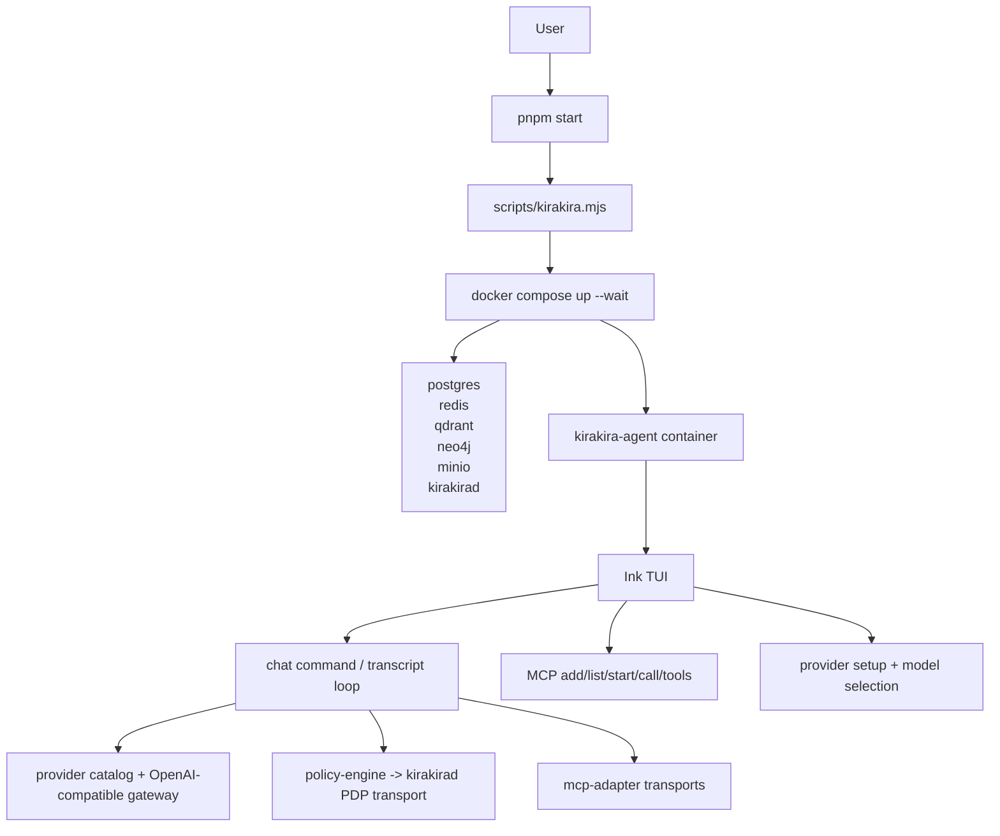
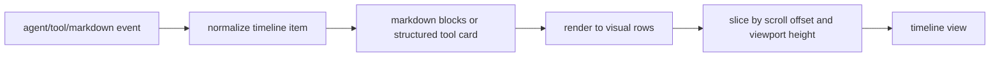

# kirakira-agent architecture

This document describes the current architecture direction of the repository as it exists today, not an aspirational future rewrite.

## Design goals

The repo is converging on a few hard constraints:

- **one startup path**: `pnpm start` is the canonical way to boot the system
- **one interaction surface**: the primary product surface is the interactive TUI
- **one provider contract**: users provide keys; provider catalogs handle URLs and model discovery
- **one runtime story**: Docker services, policy transport, MCP, and the CLI must stay aligned
- **one profile contract**: host, container, test, CI, MCP, and future presentation surfaces resolve paths and service URLs through runtime profiles

## High-level layout

## Startup path

The root script is [`scripts/kirakira.mjs`](../scripts/kirakira.mjs).

It is responsible for:

1. ensuring `.env` exists
2. ensuring `.mcp.json` exists
3. hashing runtime-relevant files
4. rebuilding `kirakira-agent-runtime:local` only when the source hash changes
5. starting the runtime services with `docker compose up -d --wait`
6. launching the CLI container with `docker compose run --rm`

This is deliberately opinionated. The point is to remove branchy startup behavior from day-to-day use.

## Runtime services

`docker-compose.yml` currently defines the runtime envelope:

- `postgres`
- `redis`
- `qdrant`
- `neo4j`
- `minio`
- `kirakirad`
- `kirakira-agent`

`kirakirad` is the control-side daemon used for policy transport. The CLI container then talks to the rest of the stack through the same runtime network.

## Key packages

| Package | Role |
| --- | --- |
| `packages/cli` | command layer, TUI, provider setup, MCP UX, chat flow |
| `packages/kirakirad` | daemon process for policy/runtime control transport |
| `packages/mcp-adapter` | MCP client, gateway, stdio transport handling |
| `packages/policy-engine` | PDP transport selection, fallback behavior, decision interface |
| `packages/frontend-core` | browser-safe transport contract and run-event projection for future web/desktop surfaces |
| `policies/` | Rego policy and bundled data |

## Provider model

The provider layer is built around a catalog in [`packages/cli/src/gateway/provider-catalog.ts`](../packages/cli/src/gateway/provider-catalog.ts).

Current built-ins:

- OpenAI Platform
- Alibaba Bailian / DashScope
- ByteDance Volcano Ark
- DeepSeek Official API

The current contract is:

- the user supplies a key
- the catalog supplies the base URL
- Kirakira attempts live model discovery from `/models`
- if that fails, the UI falls back to a curated model list

This keeps transport details out of the interactive setup flow.

## TUI architecture

The active terminal UI lives under [`packages/cli/src/tui`](../packages/cli/src/tui).

The important parts are:

- `App.tsx`: top-level composition, layout budgeting, mode switching
- `Timeline.tsx`: row-based transcript slicing and scroll behavior
- `md-render.tsx`: markdown-to-terminal row rendering
- `InputArea.tsx`: composer, caret editing, bottom dock
- `key-handler.ts` and `mouse.ts`: keyboard and mouse event handling
- `ProviderSetup.tsx`, `SidebarPanel.tsx`, `ContextDrawer.tsx`: interactive panels

The TUI is not treated as a thin wrapper around console output. It has its own layout model, row accounting, and structured cards for tool activity.

## Transcript rendering

The transcript path now follows this structure:

That matters for two reasons:

1. long markdown output can scroll by visible rows instead of by item
2. tool output can be summarized first and expanded later without dumping raw JSON into the transcript

## MCP integration

MCP is treated as a first-class part of the user experience, not an afterthought.

There are two layers:

- **configuration and lifecycle** in the CLI commands under `packages/cli/src/commands/mcp`
- **runtime execution** through `packages/mcp-adapter`

The startup design goal is that a user should not need one manual installation path for local runs and a different hidden path for the containerized runtime.

## Runtime profiles

Runtime environment selection now has an explicit profile baseline in
[`configs/runtime/profiles.json`](../configs/runtime/profiles.json), with shared
toolchain pins in [`configs/runtime/versions.json`](../configs/runtime/versions.json).

The profile contract is deliberately separate from a single Docker compose file:

- `container` keeps the canonical Docker workspace path (`/workspace`) and app path (`/app`)
- `host` resolves services through localhost and renders host-oriented MCP roots
- `test-host` matches the published ports in `docker-compose.test.yml`
- `ci` provides a non-interactive profile for future automation

[`scripts/runtime-profile.mjs`](../scripts/runtime-profile.mjs) renders the
selected profile into environment variables, compose flags, and MCP defaults.
`scripts/kirakira-common.mjs` now obtains managed MCP defaults from the same
renderer instead of owning separate hardcoded `/workspace` and `/app` constants.

## Presentation baseline

Kirakira still does not ship a full web or Electron UI. The first current
presentation package is [`packages/frontend-core`](../packages/frontend-core),
which defines a browser-safe runtime transport interface and projects
`RunEvent` streams into a dashboard model. This keeps the future web and
desktop shells aligned to the daemon/event-store boundary instead of duplicating
CLI-only chat state.

The visual design direction is intentionally not finalized in code yet. The
local design skills under `.agents/skills` require a confirmed design brief
before a major visual system is created; until then, presentation work should
stay on contracts, projections, security boundaries, and neutral diagnostic
surfaces.

## Policy transport

The policy layer supports remote PDP transport through `kirakirad`, with local fallback behavior where necessary.

Relevant areas:

- `packages/policy-engine/src/pdp`
- `packages/kirakirad/internal/pdp`

The recent direction has been to keep transport selection explicit and make failures legible, instead of silently drifting between incompatible local and container modes.

## Documentation map

For more detail:

- [README](../README.md)
- [CLI plane](./plane/kirakira-agent-cli/README.md)
- [TUI plane](./plane/kirakira-agent-cli/04-tui/README.md)
- [Change records](./change-records/README.md)
