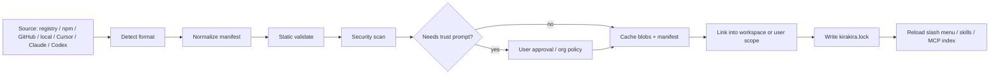

# kirakira-agent CLI 层深度调研与实施设计报告

## 执行摘要

基于 entity["company","Anthropic","ai company"] 的 Claude Code、entity["company","OpenAI","ai company"] 的 Codex、entity["company","GitHub","developer platform"] 的 Copilot CLI、entity["company","Google","technology company"] 的 Gemini CLI、以及 entity["company","Anysphere","cursor developer"] 的 Cursor CLI 的官方文档与仓库资料，可以看到一个非常稳定的行业收敛：**现代 agentic CLI 的首要价值，不是“多命令”，而是把三类入口严格分层**——`/` 负责会话与界面控制，`@` 负责显式上下文与资源附着，`!` 负责本地 shell 直通；同时，把 Skills 与 MCP 统一为“可发现、可验证、可按需加载”的扩展层，而不是把所有能力硬编码进主二进制。Gemini 明确把 `/ @ !` 作为内建交互前缀；Copilot、Claude Code、Codex、Cursor 也分别把 slash 命令、文件/资源 mention、shell 执行、MCP 集成与技能化扩展沉淀为稳定产品面。citeturn4view7turn7view7turn7view8turn5view8turn14view0turn4view0turn30view0

对 kirakira-agent 而言，CLI 层最合理的实现路线不是“复制某一家”，而是**二进制优先、企业注册表优先、兼容导入优先**：用户入口只保留一个统一命令 `kirakira-agent`，内部再分成交互模式、非交互 `exec` 模式、技能/MCP/插件管理命令与注册表命令；安装同时支持企业内部 npm-like registry 和原生二进制发布；外部 Skills/MCP 通过“导入—归一化—验证—信任—锁定”五段式流程即插即用。这样可以满足企业内部分发、团队规范、外部生态兼容、以及后续长期维护四个目标。citeturn15view0turn17view0turn21search0turn31search3turn9view3turn9view4turn23view0turn23view2

我给出的结论是：**kirakira-agent CLI 应采用“薄前端、厚适配层、强规范元数据”的结构**。薄前端只负责命令解析、TUI、审批与输出；厚适配层负责兼容 Claude/Codex/Cursor/Copilot/Gemini 的配置与技能/MCP 格式；强规范元数据则通过 `agent.toml`、`policy.yaml`、`.mcp.json`、`SKILL.md`、`kirakira.lock`、trace/log 契约把整个 CLI 层固定住。Skills 采用 Agent Skills 开放标准作为主格式，MCP 以 2025 版规范中的 `stdio + Streamable HTTP` 为标准传输，同时保留对遗留 SSE 的兼容适配，因为当前 MCP 规范已把标准传输收敛到 `stdio` 与 `Streamable HTTP`，而 Claude 文档也明确将 SSE 标记为 deprecated。citeturn26view0turn26view3turn6view14turn4view11

## 对标结论与设计边界

kirakira-agent 这次设计**只覆盖 CLI 层**：命令分类、交互语义、TUI、安装分发、注册表、Skills/MCP 导入安装、配置文件、审批、审计、输出、插件、测试与兼容策略；**不进入 orchestration kernel、policy engine 规则求值、subagent 创建算法、runtime 内部执行器实现**。这与当前主流产品的边界划分是吻合的：Claude Code、Copilot CLI、Codex、Cursor CLI 都把大量“用户入口能力”独立成 CLI/TUI/配置/审批面，而把更深层的 agent 运行机制放到单独文档或后端能力中。citeturn14view0turn4view4turn8search9turn10search3

下表浓缩了对标时最值得继承的能力，不是为了“功能堆叠”，而是为了识别已经被社区验证过的 CLI 交互共识。

| 产品 | 用户入口特征 | Skills / Commands | MCP | 输出 / 自动化 | 我们应继承什么 |
|---|---|---|---|---|---|
| Claude Code | `/` 命令菜单、强交互 REPL、hooks、插件、权限面板 | `SKILL.md`、技能可自动触发、可作为 `/skill-name` 执行 | 支持 HTTP、SSE、stdio；MCP prompts 会注入 slash 菜单 | 有 hooks、设置分层、交互模式完整 | 技能即命令、插件组件化、MCP prompt 命名空间 |
| Codex | slash 菜单、apps/plugins、技能按需加载、统一 config.toml | Skills 基于开放标准、`$`/`/skills` 入口、插件打包 skills+apps+MCP | `codex mcp` 管理，配置在 `config.toml` | 非交互模式、插件目录、配置层级清晰 | 统一配置、插件作为分发单元、按需加载 |
| Copilot CLI | 交互 + 程序化双模式，`@ # ! /` 清晰分工 | `/skills` 管理、hooks、agents | `~/.copilot/mcp-config.json` + session augment | OTel、JSON、Actions/CI 友好 | 程序化模式、审批键位、OTel/JSONL |
| Gemini CLI | `/ @ !` 语义最直白，memory、tools、mcp 命令清晰 | 自定义命令与 settings.json | `/mcp` 浏览服务器与 schema | text/json 输出、sandbox 配置显式 | 最清晰的三分法语义、简单可学 |
| Cursor CLI | 终端 agent、slash palette、`/setup-terminal`、auto-run/sandbox | skills / commands / rules 分层 | `.cursor/mcp.json`、CLI MCP 命令 | headless / automation、shell mode | 模式切换、终端体验、Cursor 格式兼容 |

上表对应的公开依据来自各产品官方文档与官方页面，包括 Claude Code commands/skills/MCP/plugins、Codex CLI/config/skills/plugins、Copilot CLI command reference/install docs、Gemini CLI commands/config/sandbox、Cursor CLI slash commands/terminal setup/overview。citeturn14view0turn3view9turn3view8turn23view0turn9view3turn9view4turn23view2turn4view4turn17view0turn22view0turn22view1turn30view0turn17view7turn31search3

从研究角度看，这种“把交互面设计成稳定接口”的做法也有论文支撑。ReAct 强调 reasoning 与 acting 的交错必须通过清晰动作接口落地；Toolformer 表明模型能学会何时调用工具、如何传参；SWE-agent 进一步直接指出**agent-computer interface 的设计会显著影响软件工程任务效果**；近年的工具学习综述则把工具选择、工具调用、响应生成拆成独立阶段，说明 CLI 层必须为“显式工具边界”和“人类审计点”提供稳定外壳。citeturn12search1turn11search13turn12search2turn11search3

**因此结论很明确：kirakira-agent CLI 不该做成工作流壳子，而应做成一个稳定、强规范、可扩展的“agent 操作系统前门”。**

## 命令体系与交互语义

### 顶层命令分类

我建议 kirakira-agent 的顶层命令保持极简，但每个命令都要能稳定脚本化。

| 命令 | 作用 | 是否交互 | 说明 |
|---|---|---:|---|
| `kirakira-agent` | 启动 TUI/REPL | 是 | 默认入口 |
| `kirakira-agent exec` | 非交互单次执行 | 否 | CI、脚本、批处理 |
| `kirakira-agent init` | 初始化工作区 | 半交互 | 生成 `agent.toml`、示例 `.mcp.json`、`SKILL.md` 模板 |
| `kirakira-agent login` / `logout` | 认证 | 半交互 | 模型、注册表、插件市场认证 |
| `kirakira-agent config` | 查看/修改配置 | 半交互 | 读写 `agent.toml`、用户配置 |
| `kirakira-agent session` | 会话管理 | 否/半交互 | list/resume/export/prune |
| `kirakira-agent skill` | skill 管理 | 否 | search/install/import/link/validate/list/export |
| `kirakira-agent mcp` | MCP 管理 | 否 | search/add/import/link/login/test/list |
| `kirakira-agent plugin` | CLI 插件管理 | 否 | install/enable/disable/list/update |
| `kirakira-agent registry` | 企业注册表交互 | 否 | login/search/publish/yank/whoami |
| `kirakira-agent trace` | trace / audit 导出 | 否 | tail/show/export |
| `kirakira-agent eval` | CLI 层测试与评测 | 否 | run/list/report |
| `kirakira-agent doctor` | 环境自检 | 否 | PATH、证书、registry、sandbox、shell、MCP 健康检查 |
| `kirakira-agent completion` | shell completion | 否 | bash/zsh/fish/pwsh |
| `kirakira-agent self-update` | 更新 CLI | 否 | 二进制或注册表通道 |

这个分类吸收了 Copilot 的程序化模式、Claude/Codex 的管理型子命令、以及 Cursor/Gemini 的交互优先模式，但避免把深层运行时能力暴露成一堆难记的入口。citeturn17view1turn15view0turn9view4turn22view0

### `/` 命令的精确定义

`/` 只做**会话控制、界面控制、扩展入口**，永不直接承载业务 prompt。解析规则如下：

- **只有在输入首字符位置出现 `/` 才解析为 slash 命令**。
- 输入框已有文本时，允许通过快捷键打开 slash palette 并插入命令，不清空现有草稿，参考 Copilot 和 Codex 的操作习惯。citeturn5view8turn4view0
- slash 命令在本地先执行；若忙碌中则进入“下一轮队列”，这和 Codex 的 queued slash command 模式一致。citeturn4view0
- 所有 slash 命令必须返回统一事件对象，便于 `--json` / `--jsonl` 输出。

**kirakira-agent 的精确 slash 列表建议如下：**

| slash 命令 | 精确定义 | 对标来源 |
|---|---|---|
| `/help [cmd]` | 列出可用 slash、skills、MCP prompts、插件命令 | Claude/Cursor/Copilot/Gemini 通用 |
| `/model [name]` | 切换或查看模型与推理档位 | Claude/Codex/Cursor |
| `/plan` | 切到 planning mode，不主动写文件 | Cursor/Copilot/Codex 经验 |
| `/ask` | 切到 read-only ask mode | Cursor/Copilot |
| `/new` | 新会话 | Claude/Cursor/Copilot |
| `/resume [id]` | 恢复会话 | Claude/Copilot/Cursor |
| `/compact` | 压缩上下文，保留摘要 | Claude/Codex/Copilot/Cursor |
| `/permissions` | 打开审批规则面板 | Claude/Codex/Copilot |
| `/auto-run [on\|off\|status]` | 设置自动审批模式 | Cursor/Copilot/Gemini yolo-like |
| `/sandbox` | 查看/切换 shell 与 MCP 沙箱策略 | Cursor/Gemini/Codex |
| `/mcp` | 打开 MCP 浏览器 | Claude/Codex/Cursor/Gemini |
| `/skills` | 打开 skills 浏览器 | Codex/Copilot |
| `/commands` | 打开兼容命令编辑器 | Cursor 风格 |
| `/trace` | 当前会话 trace 摘要与导出入口 | Copilot OTel/LangSmith CLI 思路 |
| `/export [md\|html\|json]` | 导出会话、计划、审计片段 | Copilot/Codex |
| `/vim` | 切换 Vim 输入模式 | Cursor/Gemini/Claude 终端模式 |
| `/setup-terminal` | 检测回车/换行/Meta 键配置 | Cursor |
| `/usage` | 会话统计、模型/工具消耗 | Gemini/Cursor/Copilot |
| `/about` | 版本、平台、registry、request id | Cursor/Gemini |
| `/feedback` | 反馈入口 | Cursor/Copilot/Gemini |
| `/quit` | 退出 | 通用 |

这些命令与现有产品的公开菜单高度一致：Claude 的 commands reference、Codex 的 slash commands、Copilot CLI 的 slash commands、Gemini 的 CLI commands、Cursor 的 slash commands 页面都能找到对应能力。citeturn14view0turn4view0turn6view0turn6view1turn6view2turn6view3turn6view4turn7view3turn7view5turn7view6turn30view0

### `@` 语义

`@` 必须只做**显式上下文附着**，不要再混入控制语义。建议 grammar：

| 语法 | 意义 | 是否发送给模型 | 是否需要审批 |
|---|---|---:|---:|
| `@path/to/file.py` | 附着文件快照 | 是 | 否 |
| `@path/to/dir/` | 附着目录摘要或多文件读取结果 | 是 | 视读取范围 |
| `@skill/review-risk` | 显式激活某个 skill | 是 | 否 |
| `@mcp/github:repo://org/repo` | 附着 MCP resource | 是 | 可能 |
| `@session/ses_...` | 附着旧会话摘要 | 是 | 否 |
| `@trace/trc_...` | 附着审计片段/失败点 | 是 | 否 |

解析规则：

- `@path` 优先，本地存在文件即按文件解析。
- 非本地路径才进入 `skill/`、`mcp/`、`session/`、`trace/` 命名空间。
- 所有 `@` 解析结果都必须产出不可变附件对象，带 digest、source、size、redaction 状态。
- 大目录默认只附着**摘要 + 最相关文件清单**，而不是整目录全文，以避免爆 context。
- `@` 解析应支持模糊搜索补全，这一点已在 Claude 的 MCP resource autocomplete、Copilot 的 `@ FILENAME`、Gemini 的 `@path`、Codex 的 apps/plugins/skills mention 中被验证有效。citeturn6view12turn5view8turn7view7turn9view3turn23view2

### `!` 语义

`!` 只做**shell passthrough**，而且必须是**显式、可审计、可沙箱化**的 passthrough，不得偷偷走模型工具路径。

| 语法 | 精确定义 | 默认行为 |
|---|---|---|
| `!git status` | 一次性执行 shell 命令，返回到聊天态 | 通过 shell adapter 执行 |
| `!` | 切换 shell mode | 输入条改色、状态栏显示 `SHELL` |
| `!!` | 重新执行上一条 passthrough shell | 仅在同会话启用 |
| `! --host <cmd>` | 明确要求在宿主机执行 | 仅 trusted workspace 允许，强审批 |

关键规则：

- `!` **绕过模型重写**，但**不绕过审批与沙箱**。
- 默认执行容器/受控子进程里的 shell adapter；不是直接在宿主 shell 裸跑。
- 非交互 `exec` 模式下，默认关闭 `!`，除非显式传 `--shell-allow-list` 或在 `policy.yaml` 放开，类似 Deep Agents CLI 对非交互 shell 的默认收紧做法。citeturn20view3
- Gemini 的 `!` 直通 shell 证明这是高价值交互；Copilot 的 `! COMMAND` 也证明用户需要一键绕开 agent；但 Gemini 官方也明确提醒 shell 权限风险，因此 kirakira-agent 必须把 `!` 置于显式审批和沙箱之下。citeturn7view8turn5view8

## 安装分发与企业注册表

### 分发策略

**推荐主方案：原生二进制优先，企业 npm-like registry 为第二通道。**

原因很简单：

- Claude Code、Cursor CLI 都在强化原生安装脚本与原生分发。citeturn15view0turn31search3
- Copilot CLI、Codex、Gemini CLI 都保留 npm 作为跨平台安装入口。citeturn17view0turn33search0turn21search0
- 对企业内网环境，原生二进制更容易做代码签名、离线镜像、受控升级；npm-like registry 更适合分发 skills / adapters / plugins 这类高频更新扩展件。

**因此建议：**
- 用户安装 `kirakira-agent` 时，优先拿到平台原生二进制。
- 开发者与扩展作者安装 `@company/kirakira-agent` 时，拿到 npm 包与相同版本的二进制封装。
- skills / mcp adapters / plugins 统一走企业 registry。

### 包命名与版本规范

建议采用以下命名：

| 类型 | 包名 | 可执行名 | 版本规则 |
|---|---|---|---|
| CLI 主包 | `@company/kirakira-agent` | `kirakira-agent` | SemVer |
| CLI 插件 | `@company/kirakira-plugin-<name>` | 无 | SemVer |
| Skill 包 | `@company/kirakira-skill-<name>` | 无 | SemVer |
| MCP 适配器包 | `@company/kirakira-mcp-<name>` | 可选 | SemVer |
| 兼容 bundle | `@company/kirakira-bundle-<domain>` | 无 | SemVer |
| 原生二进制 | `kirakira-agent_<ver>_<os>_<arch>.tar.gz` | `kirakira-agent` | 与主包同版 |

还要再区分两个版本：
- `packageVersion`：包版本，走 SemVer。
- `schemaVersion`：manifest/lock/config schema 版本，独立演进，避免为了字段变更强行 bump 主包 major。

### 安装示例

**企业 npm-like registry 安装：**

```bash
npm install -g @company/kirakira-agent --registry=https://npm.company.internal
kirakira-agent --version
```

**原生二进制一键安装：**

```bash
curl -fsSL https://pkg.company.internal/kirakira/install.sh | bash
kirakira-agent --version
```

**Windows PowerShell：**

```powershell
irm https://pkg.company.internal/kirakira/install.ps1 | iex
kirakira-agent --version
```

这些例子遵循的不是“随便抄一个脚本”，而是当前主流 CLI 的通行范式：Claude 提供原生 install script、Copilot 提供 install script + npm + 包管理器、Codex 与 Gemini 提供 npm 安装，Cursor 官方页面也把一条 install script 作为主入口。citeturn15view0turn17view0turn33search0turn21search0turn31search3

### 注册表 API 设计

最稳妥的做法不是发明一个陌生协议，而是：

- **对 npm 包暴露标准 npm registry API**。
- **对二进制与规范化元数据暴露 Kirakira facade API**。
- **对大文件与签名走 blob store**。

建议最小 API：

| 方法 | 路径 | 作用 |
|---|---|---|
| `GET` | `/v1/search?q=` | 搜索 skills/mcp/plugins/bundles |
| `GET` | `/v1/packages/{kind}/{name}` | 读包元数据 |
| `GET` | `/v1/packages/{kind}/{name}/{version}/manifest` | 读规范化 manifest |
| `GET` | `/v1/blobs/{sha256}` | 拉 artifact |
| `GET` | `/v1/trust/publishers/{id}` | 读发行者信任状态 |
| `GET` | `/v1/advisories` | 安全公告 |
| `POST` | `/v1/publish` | 发布包 |
| `POST` | `/v1/resolve` | 解析依赖并返回 lock 结果 |

### 本地缓存与锁文件

**缓存布局建议：**

```text
~/.kirakira/
  bin/
  cache/
    blobs/sha256/<digest>
    manifests/<digest>.json
    index.sqlite
  registry/
    auth.json
    trust.json
  sessions/
    <session-id>.jsonl
  traces/
    <trace-id>.jsonl
  skills/
  plugins/
```

**工作区锁文件：`kirakira.lock`**

```yaml
schemaVersion: 1
workspace: fin-kg
generatedAt: 2026-05-04T18:20:10Z
packages:
  - kind: skill
    name: review-risk
    version: 1.4.2
    source: registry
    registry: company
    digest: sha256:6f1f...
    trust: internal-signed
  - kind: mcp
    name: github
    version: 0.9.1
    source: imported-cursor
    digest: sha256:91ab...
    transport: stdio
    trust: user-approved
  - kind: plugin
    name: finops
    version: 2.0.0
    source: github
    ref: org/finops-plugin@9e12d4c
    digest: sha256:03fd...
```

锁文件必须记录 `digest + source + trust + normalized kind`，否则导入式生态会越来越不可审计。

### 安装与导入流程图



## Skills 与 MCP 的兼容层设计

### Skills 的主格式与发现规则

kirakira-agent 应把 **Agent Skills 标准** 作为主格式，因为该标准已经把 `SKILL.md + scripts/ + references/ + assets/` 固化下来，并明确要求 `name` 与 `description` 为必选字段，同时建议 progressive disclosure：启动时只读 metadata，真正激活时再加载全文与资源。Claude Code、Codex、Cursor 都已公开对齐或显式支持这一标准。citeturn26view0turn26view1turn26view2turn9view3turn4view10turn31search11

**发现顺序建议：**

1. 工作区 `.kirakira/skills/**/SKILL.md`
2. 锁定依赖包里的 skills
3. 兼容目录：
   - `.claude/skills/**/SKILL.md`
   - `.agents/skills/**/SKILL.md`
   - `.cursor/skills/**/SKILL.md`
   - `.cursor/commands/*.md` 转技能别名
4. 用户目录 `~/.kirakira/skills`
5. 托管目录 `/etc/kirakira/skills`

**重要规则：**
- 启动只索引 `name/description/path/tags/trust/source`。
- `SKILL.md` 正文按需加载。
- `scripts/` 与 `references/` 继续懒加载。
- 如果来源是外部导入，技能名自动加 namespace，例如 `cursor:frontend-review`，直到用户显式“收编并重命名”为本地技能。

这与 Claude 的按目录自动发现、附加目录发现、嵌套目录发现，以及 Codex 的按需加载、元数据预算控制是同一思路。citeturn6view8turn6view9turn6view10turn9view3

### MCP 的标准与兼容适配

MCP 现在的规范基线应当是：

- **标准传输：`stdio`、`Streamable HTTP`**
- **兼容传输：SSE（只作为 legacy adapter）**

原因不是偏好，而是规范本身与官方产品文档已经给出方向：MCP 2025-03-26 规范把标准传输写成 `stdio + Streamable HTTP`，并说明客户端应尽可能支持 stdio；Claude Code 同时指出 HTTP 是推荐的 remote transport，而 SSE 已被标注为 deprecated。citeturn6view14turn4view11

因此 kirakira-agent 的策略应是：

- 导入时接受 `stdio` / `http` / `sse`
- 归一化时映射为：
  - `transport.kind = stdio`
  - `transport.kind = http`
  - `transport.kind = sse_legacy`
- 新建配置时**不再生成 SSE**
- 对 `sse_legacy` 显示黄色兼容提示，并提供自动迁移建议

### 导入来源与支持矩阵

| 来源 | Skills | MCP | 建议支持方式 |
|---|---:|---:|---|
| 企业 registry | 是 | 是 | 一等公民 |
| npm 包 | 是 | 是 | 解析 `package.json` + `kirakira.manifest` |
| GitHub 仓库 | 是 | 是 | `git clone --depth=1` 到临时目录后检测 |
| 本地目录 | 是 | 是 | 直接检测 |
| Claude 格式 | 是 | 是 | 读 `.claude/skills`、`.mcp.json` / `~/.claude.json` 兼容层 |
| Codex 格式 | 是 | 是 | 读 `.agents/skills`、`.codex/config.toml` |
| Cursor 格式 | 是 | 是 | 读 `.cursor/skills` / `.cursor/commands` / `.cursor/mcp.json` |
| Copilot 格式 | 部分 | 是 | 重点兼容 `mcp-config.json` 与会话 augment |
| Gemini 格式 | 部分 | 是 | 兼容 `settings.json` 中的 `mcpServers` |

Claude、Codex、Cursor、Copilot、Gemini 的公开文档已经分别表明：skills/commands/MCP 都被视为扩展能力的一部分，只是目录、配置载体和显示入口不同。citeturn14view2turn9view3turn9view4turn6view5turn6view6turn22view0turn30view0

### 信任与安全提示

导入 skill / MCP / plugin 时，只要命中下列条件之一，就必须弹 trust prompt：

- 含 `scripts/` 或可执行文件
- skill frontmatter 声明 `allowed-tools`
- MCP 为远程 HTTP / OAuth / 自定义 header
- 发现环境变量插值
- 发现 shell command / postinstall / setup hook
- 来源不是内部签名发布者
- 来源是 SSE legacy
- 依赖访问网络、写文件、执行 shell

这并非保守过度，而是现实需要。Claude 官方已经明确提醒第三方 MCP 服务器存在 prompt injection 风险；MCP 官方也有专门的安全最佳实践与 OAuth 教程；Gemini 还专门提醒 shell 工具的字符串前缀限制不应被当作真正安全机制。citeturn3view8turn25search0turn25search1turn22view2

### 归一化 manifest

**skill 归一化 manifest：**

```yaml
kind: skill
schemaVersion: 1
name: review-risk
displayName: Review Risk
source:
  type: cursor
  path: .cursor/skills/review-risk
trust:
  level: ask
  publisher: external
activation:
  mode: auto-or-explicit
  aliases: ["/review-risk", "@skill/review-risk"]
files:
  entry: SKILL.md
  scripts: ["scripts/check.sh"]
  references: ["references/guide.md"]
compat:
  format: agent-skills-1
  importedFrom: cursor
```

**MCP 归一化 manifest：**

```yaml
kind: mcp
schemaVersion: 1
name: github
source:
  type: claude
  file: .mcp.json
transport:
  kind: stdio
  command: npx
  args: ["-y", "@modelcontextprotocol/server-github"]
auth:
  mode: oauth
tools:
  enabled: ["issues", "pull_requests"]
timeouts:
  startupSec: 10
  toolSec: 60
trust:
  level: enterprise-allow
compat:
  importedFrom: claude
```

### 示例 `SKILL.md`

下面这个样例严格遵循 Agent Skills 的必选字段与推荐结构。citeturn26view0turn26view3turn4view12

```markdown
---
name: timeline-extraction
description: Extract financial event timelines from filings, news, and notes. Use when the task involves temporal ordering, event normalization, or entity-event linking.
compatibility: Requires Python 3.11+, jq, and read access to local filings.
allowed-tools: Read Bash(python:*) Bash(jq:*)
metadata:
  owner: fin-kg
  version: "1.0.0"
---

# Goal

Build a normalized event timeline for the target company or instrument.

# Steps

1. Read the provided filings, notes, or attachments.
2. Extract event candidates with date spans and source evidence.
3. Normalize dates to ISO-8601.
4. Resolve aliases to canonical entity IDs.
5. Emit JSON with `event_id`, `time`, `entity`, `type`, `evidence`.

# Edge cases

- Approximate dates like "late March"
- Multiple sources disagreeing on event time
- Same event repeated across filings and news
```

### 示例 `.mcp.json`

这个样例同时兼顾 Claude/Cursor/Copilot/Gemini 常见字段风格，并显式声明 transport。citeturn14view2turn6view5turn6view6turn22view0

```json
{
  "mcpServers": {
    "github": {
      "type": "stdio",
      "command": "npx",
      "args": ["-y", "@modelcontextprotocol/server-github"],
      "env": {
        "GITHUB_TOKEN": "${GITHUB_TOKEN}"
      },
      "tools": ["issues", "pull_requests", "repos"],
      "timeout": 60000
    },
    "research": {
      "type": "http",
      "url": "https://mcp.company.internal/research",
      "headers": {
        "Authorization": "Bearer ${RESEARCH_MCP_TOKEN}"
      },
      "tools": ["search", "fetch", "extract_timeline"]
    }
  }
}
```

## TUI、审批与输出契约

### TUI 布局

建议采用**单主输入框 + 时间线主视图 + 右侧上下文/工具抽屉**，不要上来就做多窗格 IDE。CLI 的第一职责是“快、清楚、可审计”。

```text
┌──────────────────────────────────────────────────────────────────────────────┐
│ kirakira-agent  fin-kg  main  trusted  model:gpt-5.5  mode:ask  trace:trc_01... │
├───────────────────────────────┬──────────────────────────────────────────────┤
│ Timeline                      │ Context / Tools                              │
│                               │                                              │
│ User: 分析近三季公告里的时间线 │ Attachments                                  │
│ Agent: 已读取 6 个文件        │  @reports/q1.md                              │
│ Tool: read 6 files            │  @mcp/research:report://Q1                  │
│ Tool: mcp research.search     │                                              │
│ Skill: timeline-extraction    │ Active skills                                │
│ Approval: shell pytest?       │  timeline-extraction                         │
│ Agent: 已生成初步事件序列     │                                              │
│                               │ MCP                                          │
│                               │  github (stdio) ✓                            │
│                               │  research (http) ✓                           │
├───────────────────────────────┴──────────────────────────────────────────────┤
│ / commands · @ attachments · ! shell · Tab complete · Shift+Enter newline   │
│ >                                                                            │
├──────────────────────────────────────────────────────────────────────────────┤
│ F1 help  Ctrl+L redraw  Ctrl+O details  Ctrl+R history  Ctrl+T tasks/tools  │
└──────────────────────────────────────────────────────────────────────────────┘
```

这种布局吸收了 Claude 对 transcript viewer / task list 的处理、Copilot 对 timeline / reasoning toggle 的处理、以及 Cursor 对“slash + @ files + ! shell”统一入口的做法。citeturn14view1turn5view8turn31search3

### 核心 UX 流

**首次进入：**
1. 未登录则引导 `kirakira-agent login`
2. 未初始化仓库则建议 `kirakira-agent init`
3. 检测外部兼容配置：`.cursor/mcp.json`、`.claude/skills`、`.codex/config.toml`
4. 提示一键导入，但默认只“预览，不写入”
5. 进入会话时展示 workspace trust 状态

**安装 skill：**
1. `/skills` 或 `kirakira-agent skill search timeline`
2. 看摘要、来源、签名、脚本、网络声明
3. trust prompt
4. 安装到 workspace 或 user scope
5. 写 `kirakira.lock`
6. slash 菜单与 `@skill/` 立即热加载

**安装 MCP：**
1. `/mcp` 或 `kirakira-agent mcp import cursor:.cursor/mcp.json`
2. 解析 transport/auth/tools
3. 静态体验证
4. OAuth / token / env 提示
5. 测试连通性
6. 写 `.mcp.json` 与 `kirakira.lock`

### 审批卡片

批准体验要“短而硬”，不能冗长。Copilot 的 `y / n / ! / # / ?` 是极好的键位范式，值得直接吸收。citeturn5view5

**Shell 审批卡：**

```text
┌─ Approval: Shell command ─────────────────────────────────────────────┐
│ Command    : pytest -q tests/test_timeline.py                        │
│ Scope      : workspace only                                          │
│ Sandbox    : container / no host network                             │
│ Risk       : read + execute                                           │
│ Requested by: explicit ! command                                      │
│                                                                    ? │
│ [y] allow once   [!] allow similar this session   [n] deny   [#] deny│
└───────────────────────────────────────────────────────────────────────┘
```

**MCP 审批卡：**

```text
┌─ Approval: MCP remote call ───────────────────────────────────────────┐
│ Server     : research                                                 │
│ Transport  : http                                                     │
│ Tool       : extract_timeline                                         │
│ URL        : https://mcp.company.internal/research                    │
│ Data class : documents + metadata                                     │
│ OAuth scope: report.read                                              │
│ [y] allow once   [!] allow this tool this session   [v] details  [n] │
└───────────────────────────────────────────────────────────────────────┘
```

### 输出模式

建议固定三种：

| 模式 | 用途 | 约束 |
|---|---|---|
| `human` | 默认 REPL / TUI | 富文本、进度、审批卡、折叠工具事件 |
| `json` | 单次脚本消费 | 一个完整 JSON 对象 |
| `jsonl` | 流式事件 / CI / 审计 | 每行一个事件对象 |

这既符合 LangSmith CLI “JSON 默认、pretty 可选”的脚本友好原则，也符合 Copilot CLI 可以把信号导出成 JSON-lines 的做法。citeturn20view0turn6view7

**`kirakira-agent exec --json` 示例：**

```json
{
  "session_id": "ses_01JT2KJ6YQJ1FWR4GQ1D0N9W3A",
  "trace_id": "9c7f9d9d77b84214b0f3c7f8f2f9f1ab",
  "status": "ok",
  "mode": "exec",
  "result": {
    "summary": "已抽取 43 条时间事件，发现 3 组冲突日期。",
    "artifacts": ["timeline.json", "timeline_report.md"]
  }
}
```

**`kirakira-agent exec --jsonl` 事件流示例：**

```jsonl
{"ts":"2026-05-04T18:20:10Z","event":"session.start","session_id":"ses_01...","trace_id":"9c7f..."}
{"ts":"2026-05-04T18:20:11Z","event":"attachment.resolved","path":"reports/q1.md","digest":"sha256:..."}
{"ts":"2026-05-04T18:20:12Z","event":"skill.activated","name":"timeline-extraction"}
{"ts":"2026-05-04T18:20:13Z","event":"mcp.invoke","server":"research","tool":"extract_timeline"}
{"ts":"2026-05-04T18:20:18Z","event":"session.finish","status":"ok"}
```

### 会话 ID 与 trace ID

建议：

- `session_id`：ULID，前缀 `ses_`
- `conversation_id`：与 session 一致，不再另造概念
- `trace_id`：W3C / OTel 兼容 16-byte hex
- `span_id`：8-byte hex
- `request_id`：前缀 `req_`
- `approval_id`：前缀 `apr_`

这能无缝接入 OTel，因为 OTel 对 trace/span/log 的字段与上下文传播已有稳定规范；同时 logs 中应使用 `trace_id`、`span_id`、`trace_flags` 顶层字段。citeturn24search13turn24search5turn24search1turn24search2

### 审计与 trace hooks

CLI 层建议原生发出以下 spans：

- `session.start`
- `prompt.submit`
- `attachment.resolve`
- `skill.select`
- `mcp.connect`
- `mcp.invoke`
- `shell.exec`
- `approval.wait`
- `approval.decision`
- `output.emit`

属性遵循 OTel GenAI 与 MCP 语义约定；如果接入 LangSmith，则通过可选 exporter 或 bridge 输出，不绑死实现。OTel 已提供 GenAI semantic conventions、MCP semantic conventions，以及日志与 trace 的关联规范；Copilot CLI 也已经把 agent 交互、LLM 调用、工具执行、token 使用暴露为 OTel spans；LangSmith 则支持 tracing、自托管 observability/evaluation，以及一个 JSON-first 的 CLI。citeturn24search0turn24search21turn5view6turn6view7turn20view1turn20view2

## 配置契约与兼容映射

### 文件位置

建议采用以下位置约定：

| 范围 | kirakira-agent | 兼容读取 |
|---|---|---|
| 用户级 | `~/.kirakira/config.toml` | `~/.claude/settings.json`、`~/.codex/config.toml`、`~/.copilot/mcp-config.json`、`~/.cursor/cli-config.json` |
| 工作区级 | `agent.toml`、`.mcp.json`、`policy.yaml` | `.claude/settings.json`、`.codex/config.toml`、`.cursor/mcp.json` |
| 工作区私有 | `.kirakira/local.toml` | `.claude/settings.local.json` 类似语义 |
| 锁文件 | `kirakira.lock` | 无 |
| 扩展目录 | `.kirakira/skills/`、`.kirakira/plugins/` | `.claude/skills/`、`.agents/skills/`、`.cursor/commands/` |

Claude 与 Codex 都明确支持 user/project 分层配置；Claude 还把 settings/MCP/plugins/skills 分别按 scope 管理；Gemini 也有明确的 settings precedence；Cursor CLI 已有 `~/.cursor/cli-config.json` 与 slash/terminal 相关配置入口。citeturn14view2turn9view5turn9view6turn22view0turn17view7

### `agent.toml` 建议模式

`agent.toml` 只承载 CLI-facing 配置，不直接承载策略引擎逻辑。

```toml
schema_version = 1
workspace_name = "fin-kg"
trust = "trusted"

[model]
default = "gpt-5.5"
fallback = "gpt-5.5-mini"

[ui]
theme = "default"
vim_mode = true
show_trace_ids = true

[output]
default = "human"
exec_default = "json"

[approvals]
mode = "ask"
auto_run_readonly = false

[sandbox]
mode = "container"
network = "restricted"

[skills]
discover = [
  ".kirakira/skills",
  ".claude/skills",
  ".agents/skills",
  ".cursor/skills"
]

[mcp]
config_files = [".mcp.json", ".cursor/mcp.json"]

[compat]
read_claude = true
read_codex = true
read_cursor = true
read_copilot = true

[telemetry]
mode = "off"
otel = false
```

### `policy.yaml` 建议模式

`policy.yaml` 是 CLI 的**前端策略声明**，不实现 OPA/Rego 本体；它只说明“CLI 允许或提示什么”，后端要不要编译到 OPA/审批引擎是另一层问题。这样能保持边界清晰。OPA 本身强调 policy-as-code、配置文件、bundles 与 decision logs，但那属于策略后端，不属于 CLI 内核。citeturn18search3turn18search2turn18search0turn18search1

```yaml
schemaVersion: 1
workspaceTrust: trusted

shell:
  hostExecution: deny
  allowlist:
    - git:*
    - pytest:*
    - python -m pytest:*
  denylist:
    - rm:*
    - sudo:*
    - curl * | bash

mcp:
  allowRemoteHttp: true
  allowLegacySse: ask
  approvedServers:
    - research
    - github

skills:
  allowExternalScripts: ask
  allowAllowedToolsField: ask

privacy:
  redactEnv:
    - OPENAI_API_KEY
    - GITHUB_TOKEN
    - AWS_SECRET_ACCESS_KEY
```

### 兼容映射规则

| 外部格式 | 导入到 kirakira-agent 的规则 |
|---|---|
| Claude `SKILL.md` | 原样保留 frontmatter；Claude 扩展字段放到 `compat.claude.*` |
| Claude `.claude/commands/*.md` | 升级为 skill，并生成别名 `/name` |
| Codex `.agents/skills` | 直接导入为标准 skill |
| Codex `config.toml` 中 `mcp_servers.*` | 转为 `.mcp.json` 标准化 server 条目 |
| Cursor `.cursor/commands` | 转 skill 别名；默认 `explicit-only` |
| Cursor `.cursor/mcp.json` | 直接转 `.mcp.json`，保留 source |
| Copilot `mcp-config.json` | server/tool 配置导入；权限模式映射到 `policy.yaml` |
| Gemini `settings.json:mcpServers` | 转 `.mcp.json`；工具限制映射到 policy |

这个兼容层必须是**只增不改**的：导入后不应回写原文件，除非用户显式执行 `kirakira-agent compat write --target=claude` 之类的反向生成命令。

## 扩展、测试、CI 与开发者指南

### 插件系统边界

kirakira-agent 的插件系统只允许扩展 **CLI 能力**，不允许插件直接把未审计能力注入模型上下文。建议允许四类插件：

| 插件类型 | 允许做什么 | 不允许做什么 |
|---|---|---|
| command plugin | 新增顶层子命令、slash 命令 | 直接注入模型工具 |
| import adapter plugin | 新增外部格式检测与归一化 | 绕过 trust/lock 流程 |
| renderer plugin | 新增 TUI 卡片、面板、pretty output | 绕过 JSON/JSONL 标准事件 |
| registry plugin | 新增源站解析、认证方式 | 绕过签名与 digest 校验 |

这样做的依据也很充分：Claude plugins、Codex plugins 都越来越倾向“把 skills + MCP + app integration 打包成分发单元”，而不是鼓励插件直接在主进程里无边界运行。citeturn23view0turn23view2

### 插件开发接口建议

```ts
export interface CliCommandPlugin {
  name: string;
  version: string;
  register(registry: CommandRegistry): void;
}

export interface ImportAdapterPlugin {
  kind: "skill" | "mcp" | "plugin";
  detect(input: DetectInput): Promise<DetectResult | null>;
  normalize(input: NormalizeInput): Promise<NormalizedArtifact>;
  validate(artifact: NormalizedArtifact): Promise<ValidationResult>;
}

export interface RendererPlugin {
  id: string;
  supports(card: UiCard): boolean;
  render(card: UiCard, ctx: RenderContext): RenderedNode;
}
```

### 推荐测试与 CI 检查

**单元测试**
- slash/@/! parser
- 路径 quoting / escaping
- import detect / normalize / validate
- semver / schemaVersion 校验
- lockfile 读写与重现安装
- redaction、digest、trust state 机

**集成测试**
- 从 registry / npm / GitHub / local 导入 skill
- 从 Claude / Codex / Cursor / Copilot / Gemini 配置导入 MCP
- MCP `stdio`/`http`/`sse_legacy` 冒烟
- TUI snapshot / golden tests
- approvals 键位与 session allow/deny 行为
- `exec --json` / `--jsonl` 契约测试

**安全测试**
- symlink escape / path traversal
- postinstall / setup hook 误执行
- env redaction 泄漏
- 恶意 `SKILL.md` frontmatter 注入
- shell allowlist 绕过
- 远程 MCP header/token 泄漏
- 签名不匹配 / digest 不匹配 / downgrade 攻击
- prompt injection fixtures（尤其资源型 MCP）

**CI 建议**
- Linux/macOS/WSL 三平台矩阵
- release artifact 签名校验
- SBOM 与 license 扫描
- `kirakira-agent doctor --ci`
- `kirakira-agent eval run cli-smoke`
- `kirakira-agent trace validate --strict`

研究层面的理由同样充分：SWE-agent 把接口设计视为效果变量；Tool Learning 综述也把工具选择/调用/评测作为独立环节；OpenAI 近期关于用 eval 系统化测试 skills 的文章则说明**skills 的质量不能靠“能跑”判断，而要有专门 eval**。citeturn12search2turn11search3turn8search21

### 精确命令示例与预期输出

**初始化仓库：**

```bash
kirakira-agent init
```

预期：
- 生成 `agent.toml`
- 可选生成 `policy.yaml`
- 若发现 `.cursor/mcp.json` 或 `.claude/skills`，给出“仅预览导入”的提示

**从 Cursor 导入 MCP：**

```bash
kirakira-agent mcp import cursor:.cursor/mcp.json
```

预期：

```text
Detected 2 MCP servers from Cursor config
  - github (stdio)
  - research (http)

Validation: 2 passed, 0 failed
Trust prompts required: 1 (remote HTTP)

Write normalized config to .mcp.json? [y/N]
```

**从 GitHub 导入 skill：**

```bash
kirakira-agent skill import github:acme/fin-skills//timeline-extraction
```

预期：

```text
Detected skill layout: Agent Skills
Name: timeline-extraction
Description: Extract financial event timelines...
Scripts: 1
References: 2
Trust: external unsigned

Install to:
  1) workspace
  2) user
Choose [1/2]:
```

**非交互模式：**

```bash
kirakira-agent exec -p "总结最近三次财报中的关键时间事件" --json
```

预期：stdout 返回单个 JSON 对象；stderr 仅打印 diagnostics。

### 最终实施清单

把这份设计真正落地时，不要并行做太多。**推荐实施顺序只有四步：**

1. **先把用户入口做稳**：`kirakira-agent`、`exec`、`init`、`doctor`、`completion`、`/ @ !` parser、TUI 主屏。
2. **再把兼容层做稳**：Cursor / Claude / Codex / Copilot / Gemini 的 skill 与 MCP 导入器，统一归一化 manifest 与 `kirakira.lock`。
3. **再做企业分发**：原生二进制发布、内部 npm-like registry、签名、local cache。
4. **最后做插件与观测**：OTel、JSONL、trace hooks、renderer/adapter plugins、测试矩阵。

## 开放问题与局限

有几处需要明确说明：

- Cursor 官方文档的部分页面在网页抓取中只能拿到摘要或 markdown 片段，无法像 Claude/Copilot/Codex 那样完整展开全部正文；因此对 Cursor 的某些细节，我优先采用了官方 snippet、官方 CLI 页面与 markdown 片段，而没有对不可抓取页面做过度推断。citeturn29search2turn30view0turn31search3
- MCP 的运输层正在继续演进；当前最稳妥的工程决策是以 `stdio + Streamable HTTP` 为标准、SSE 为兼容，而不是把三者都当作同等一等公民。citeturn6view14turn4view11
- `allowed-tools` 在 Agent Skills 标准中仍属 experimental，各家实现支持程度不一致，所以 kirakira-agent 应把它当“提示 + 审批预设”，不要当绝对安全边界。citeturn26view3

**最终结论**：如果目标是做一个能与 Claude Code、Cursor CLI、Codex、Copilot CLI、Gemini CLI 同级对齐的企业级前门，kirakira-agent CLI 最正确的路线不是把功能继续堆高，而是把 CLI 规范收紧到三件事：**统一入口、统一元数据、统一审计链路**。只要 `/ @ !` 语义稳定、Skills/MCP 导入归一化稳定、安装分发和 trust/lock 稳定，这个 CLI 就已经具备成为长期平台的骨架。