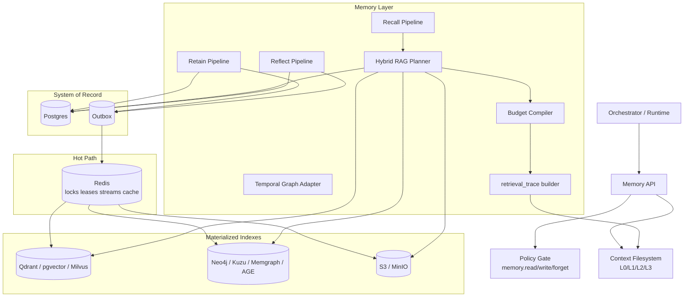
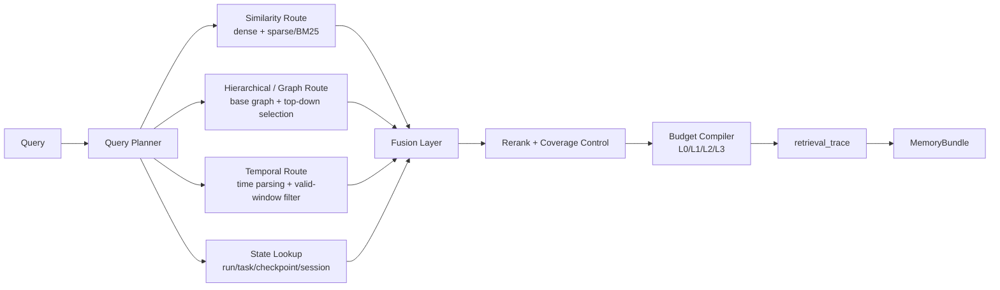

# kirakira-agent Memory Layer 与 State Store 完整落地方案

**Executive Summary：**建议将 `kirakira-agent` 的记忆与状态持久化拆成两层：`Memory Layer` 负责跨会话知识、时间演化、证据—推断分离与可解释召回；`State Store` 负责运行态、checkpoint、artifact、outbox 与恢复。实现上采用 **Postgres 作为系统事实源**，**Redis 作为热路径与异步编排层**，**S3/MinIO 作为原始 artifact/blob 层**，**Qdrant 或 pgvector 作为向量召回层**，**Neo4j/Kuzu/AGE 作为图层备选**；召回路径采用 **Hindsight 的多策略 Recall + Mnemis 双路检索 + Graphiti/Zep 的时间图谱 + Nemori 的 episode/retain 原则**，从而同时满足长期记忆、执行恢复、治理可删、审计可解释与企业级高可用。citeturn15view0turn15view1turn16search0turn16search2turn15view4turn20view19

## 要求与目标

本报告默认的部署假设是：`kirakira-agent` 运行于企业云或私有云；向量模型与 embedding 供应商未预设；权限与审批沿用前述 `Policy Engine`，通过 OPA/Cedar 在 `memory.read / memory.write / memory.forget / checkpoint.restore` 等动作上做前置决策；日志与审计沿用前述 `Tracing & Audit`。在这个前提下，Memory Layer 必须不是“聊天记录堆积器”，而是一个可长期保留、可解释召回、可治理删除、可恢复执行的“记忆操作系统”。Hindsight 把长期记忆抽象为 retain / recall / reflect 三类核心操作，并强调世界事实、经验、观察、观点四类不同记忆网络；Zep/Graphiti 则强调时间感知知识图谱与 point-in-time 查询；LangGraph 则说明 durable execution 的 checkpoint 应以 thread/run 视角持续保存，以支持中断恢复、时间旅行调试与容错执行。citeturn15view0turn24view2turn20view19turn11search2turn11search6

工程目标可归纳为十个维度。第一，**跨会话记忆**：同一用户、同一工作区、同一 agent 模板的长期知识必须在多天、多周、多月后仍可召回。第二，**证据/推断分离**：原始 episode、事实 fact、推断 belief、观察 observation 必须分开存储；否则删除、纠错、再推理都会失真。第三，**时间演化**：事实需要支持 `valid_at / invalid_at` 与 `created_at / expired_at` 的双时间轴，以回答“那时是真的什么”。第四，**可解释召回**：系统不仅要返回结果，还要返回“由哪些 route、哪些 graph path、哪些证据片段、为何入选”。第五，**多路检索**：至少要同时支持 dense semantic、lexical/BM25、graph route、temporal route、state lookup。第六，**治理/删除/脱敏**：必须支持 redact、forget、保留策略、冻结策略与 subject export。第七，**可恢复 checkpoint**：运行态不能只靠内存，应支持运行中断后的恢复。第八，**artifact 管理**：文件、网页、截图、工具结果、模型产物、沙箱输出都要可追踪。第九，**性能/可扩展性**：检索、写入、重建索引、批量导入都要可水平扩展。第十，**高可用性**：数据库、向量库、图库、对象存储都要有明确备份、恢复与故障边界。以上目标与近两年的 agent-memory 主流论文和生产系统方向高度一致。citeturn15view0turn15view1turn16search0turn16search2turn24view2turn24view3turn20view19

在设计原则上，建议 `kirakira-agent` 明确区分四类对象：**事件流**、**记忆对象**、**执行状态**、**artifact**。事件流是 retain 输入与 runtime 输出；记忆对象是可召回的长期知识；执行状态是 run/task/checkpoint；artifact 是原始文件与二进制产物。Hindsight 明确了“记忆不是上下文本身，记忆是持久化的事实与观点结构，retrieval 才是访问方式”；OpenViking 则把上下文组织成 L0/L1/L2 的渐进式内容模型，用结构化上下文代替无差别 chunk 注入。把这两种思想合并后，`kirakira-agent` 的 Memory Layer 既能持久，又能低 token 成本地对外供给上下文。citeturn33search20turn19view5turn22search1

## 参考与技术选型

优先参考源建议按以下顺序排序：**原始论文与官方实现** 优先于博客；**官方文档** 优先于社区文章；**生产系统文档** 优先于概念性项目页。具体到本方案，优先级最高的是 Hindsight、Mem0、Nemori、Mnemis、Zep/Graphiti、LoCoMo、LongMemEval；其次是 OpenViking、LangGraph 的持久化文档；再次是 pgvector、Qdrant、Milvus、Neo4j、Memgraph、Kuzu、Redis、S3/MinIO 的官方文档；最后才是 GitHub topics 生态扫描。特别要注意一个现实约束：Mem0 近期路线中已将 OSS SDK 的 graph memory 驱动移除，图记忆能力转向平台侧，因此 `kirakira-agent` 不能把 Mem0 OSS 当作“自带图后端”绑定，而应把 Mem0 当作**记忆提炼与生产系统形态参考**。citeturn15view0turn15view1turn16search0turn16search2turn15view4turn19view4turn20view19

### 向量层选型

| 方案 | 适用场景 | 优点 | 局限 | kirakira-agent 建议 | 依据 |
|---|---|---|---|---|---|
| pgvector | 中小规模、强事务一致、想把状态与向量放在一个数据库 | 与 Postgres 同事务域；支持 HNSW/IVFFlat；0.8.0 后增强过滤与 iterative scan | 超大规模 ANN 与高并发独立扩展不如专用向量库 | `v0/v1` 默认首选，尤其当 Memory 与 State 强耦合时 | citeturn28view0turn25view1turn21view6 |
| Qdrant | 在线检索、高并发、强过滤、多租户分片 | named vectors、payload index、RRF/Universal Query、分片复制、时间分片成熟 | 事务一致性需与 Postgres 通过 outbox 协调 | `v1/v2` 推荐主力向量层 | citeturn20view4turn20view5turn21view1turn19view10turn25view2 |
| Milvus | 超大规模、多向量/多模态、高吞吐 ANN | 原生 multi-vector hybrid search、HNSW/IVF、多种备份方案 | 运维面更重；对中小团队较“硬” | 百亿级或重多模态再上 | citeturn20view6turn20view8turn20view9 |
| Redis Vector Search | 热缓存、小规模相似度、低延迟 KV+向量混合 | 与 cache/queue 共栈；KNN 方便 | 不适合作为长期事实源或主 ANN 层 | 只做热点缓存，不做主记忆库 | citeturn20view3turn21view2 |

结论是：**Postgres + pgvector** 适合作为一体化最小可行实现，**Postgres + Qdrant** 适合作为生产主流栈，**Milvus** 适合明显超出单集群 Qdrant/pgvector 的大规模向量场景。Qdrant 的多路融合、payload 过滤、复制与时间分片尤其适合 agent memory 这种“强过滤 + 时间裁剪 + 多路 merge”的工作负载。citeturn25view1turn20view5turn21view1turn19view10turn25view2

### 图层选型

| 方案 | 适用场景 | 优点 | 局限 | kirakira-agent 建议 | 依据 |
|---|---|---|---|---|---|
| Neo4j | 企业生产、HA、图检索与全文/向量混合 | vector index、full-text index、集群、在线备份成熟 | 商业化特性较多，成本较高 | 企业 default 图层首选 | citeturn28view5turn26view0turn31search1turn31search2turn31search5 |
| Memgraph | 高写入、内存图处理、WAL+快照恢复 | WAL + snapshot，恢复直观 | 生态与托管选择少于 Neo4j | 若偏实时图更新可选 | citeturn20view16turn28view4 |
| Kuzu | 本地/嵌入式、单租户、分析型图查询 | 嵌入式、快、支持 FTS/vector 扩展 | HA 与分布式不是强项 | 本地开发、单租户私有部署首选 | citeturn20view15turn27search5 |
| Apache AGE | 想留在 Postgres 体系内做轻图查询 | 在 PostgreSQL 内引入 graph query | 生态和时序/向量能力仍需外部补足 | 只作轻量统一栈方案 | citeturn20view18 |

如果你的首要目标是**企业 HA + 运维成熟度**，选 Neo4j；如果你的首要目标是**低耦合本地/嵌入式**，选 Kuzu；如果你的首要目标是**尽量统一在 Postgres**，可用 AGE 过渡，但不建议把 AGE 当成完整的 temporal graph 终局。citeturn31search1turn31search2turn20view15turn20view18

### Embedding 模型选型

| 方案 | 特性 | 适合用途 | 建议 |
|---|---|---|---|
| `text-embedding-3-small` | 默认 1536 维，可调维度；OpenAI 官方通用 embedding | 常规文本 recall、成本敏感 | `v0/v1` 默认首选 | citeturn35search4turn35search16 |
| `text-embedding-3-large` | 默认 3072 维；OpenAI 最强通用 embedding | 高质量 recall、跨语言要求更高 | 高价值 workspace / premium pipeline | citeturn35search0turn35search4 |
| BGE-M3 | 同时适合 dense+sparse 混合检索 | 需要 hybrid retrieval 的开源自部署 | 开源优先时可选 | citeturn14search1 |
| `jina-embeddings-v4` | 多模态、多语言、复杂文档检索、支持 late interaction | PDF/图文/表格丰富的 artifact recall | 多模态工作区可选 | citeturn35search2turn35search6 |

建议：`v0` 用 `text-embedding-3-small`；`v1` 对 observation / fact 两类索引可升级到 `text-embedding-3-large`；若你要把截图、图表、PDF 页面也纳入统一 recall，则单独为 artifact 层引入 `jina-embeddings-v4`。如果你要做 dense+sparse 一体化开源部署，BGE-M3 是很合理的中间路线。citeturn35search0turn35search4turn14search1turn35search6

### Blob 层选型

| 方案 | 优点 | 风险/限制 | kirakira-agent 建议 | 依据 |
|---|---|---|---|---|
| Amazon S3 | 版本化、Object Lock、WORM、合规成熟 | 公有云依赖 | 企业云默认首选 | citeturn21view4 |
| MinIO | S3 兼容、私有化友好、支持 retention/legal hold | 需自运维 | 私有云默认首选 | citeturn20view14turn21view5 |
| 直接文件系统 | 简单 | HA/审计/版本化差 | 只用于本地开发和测试 | 设计建议 |

S3/MinIO 的 **Object Lock + versioning** 非常适合保存 checkpoint manifest、审计导出、法律保全 artifact；但**带可删义务的个人原始数据不应一刀切全上 WORM**，否则删除权会与合规保全冲突。正确做法是把审计证据与个人内容分层存放。citeturn21view4turn21view5

### GitHub topics 生态扫描的使用方式

GitHub topics 中的 `mcp-tools`、`agent-skills`、`agent-workspace`、`agents` 页面显示，这一领域已经形成大量 MCP 工具、skills 包、workspace 模板与 agent 框架；例如 `agent-workspace` 里已出现基于本地 LLM + Qdrant + FastAPI 的 workspace 实践，`agents` 主题下则聚集了多种 orchestration 与 memory-aware 项目。这些页面可以作为“生态温度计”，帮助判断接口兼容与迁移需求，但不应替代论文和官方文档作底层架构依据。citeturn10search0turn10search1turn10search2turn10search3turn10search10turn10search7

## 架构设计与数据模型

建议采用“**Postgres 做系统事实源，异步物化到 Vector/Graph/Blob**”的分层架构：Memory API 永远对 Orchestrator/Runtime 暴露统一接口；Retain/Recall/Reflect 都先经过 Policy；所有写入先落 Postgres 事务并写 outbox，再由 Redis streams 驱动物化器把数据索引到 Qdrant/pgvector、Neo4j/Kuzu、S3/MinIO；Recall 反向聚合 Vector、Graph、State 与 Blob metadata，最终输出 `MemoryBundle`。这种结构同时继承了 Hindsight 的 retain/recall/reflect、Graphiti 的 temporal KG、OpenViking 的渐进式上下文文件系统，以及 LangGraph 的 checkpoint persistence。citeturn15view0turn24view2turn19view5turn20view19



### Memory API

建议把公开接口收敛到以下 8 类，避免上层直接依赖具体库：

```ts
export interface MemoryService {
  retain(req: RetainRequest): Promise<RetainReceipt>;
  recall(req: RecallRequest): Promise<MemoryBundle>;
  reflect(req: ReflectRequest): Promise<ReflectReceipt>;
  checkpoint(req: CheckpointRequest): Promise<CheckpointRef>;
  restore(ref: CheckpointRef): Promise<RestoredState>;
  forget(req: ForgetRequest): Promise<ForgetReceipt>;
  export(req: ExportRequest): Promise<ExportReceipt>;
  explainRetrieval(req: ExplainRetrievalRequest): Promise<RetrievalTrace>;
}
```

```rust
pub trait MemoryService {
    async fn retain(&self, req: RetainRequest) -> Result<RetainReceipt>;
    async fn recall(&self, req: RecallRequest) -> Result<MemoryBundle>;
    async fn reflect(&self, req: ReflectRequest) -> Result<ReflectReceipt>;
    async fn checkpoint(&self, req: CheckpointRequest) -> Result<CheckpointRef>;
    async fn restore(&self, req: &CheckpointRef) -> Result<RestoredState>;
    async fn forget(&self, req: ForgetRequest) -> Result<ForgetReceipt>;
    async fn export(&self, req: ExportRequest) -> Result<ExportReceipt>;
    async fn explain_retrieval(&self, req: ExplainRetrievalRequest) -> Result<RetrievalTrace>;
}
```

接口设计取自三类现实约束：Hindsight 把 retain/recall/reflect 视为长期记忆最小完备集；LangGraph 证明 checkpoint/restore 是长流程执行的 first-class 能力；而生产系统还必须补上 forget/export/explain，才能满足治理与审计诉求。citeturn15view0turn33search8turn20view19

### Context Filesystem

建议把召回结果输出为一个**可挂载的 Context Filesystem**，不是直接拼 prompt。结构借鉴 OpenViking 的 L0/L1/L2，再扩展出 L3 原始证据层：L0 是一句话摘要，L1 是结构化 overview，L2 是 evidence cards，L3 是原始 span / artifact pointer。这样，上层 agent 可先吃 L0/L1，预算够时再按需读取 L2/L3。OpenViking 的核心经验是“向量索引只存引用，内容仍从统一文件系统读出”，这非常适合 `kirakira-agent` 中 MemoryBundle 的渐进式注入。citeturn19view5turn22search1turn29search0

建议的 Context FS 目录：

```text
/context/
  recall/
    bundle.json
    L0.abstract.md
    L1.overview.md
    L2.cards/
      0001.fact.md
      0002.observation.md
      0003.state.md
    L3.evidence/
      ev_01.json
      ev_02.json
      art_03.pointer.json
```

### 数据模型

建议将长期记忆抽象成以下核心对象。这里显式把 **Evidence** 与 **Inference** 分离，并对所有可演化对象加入双时间轴字段：

```ts
type MemoryKind =
  | "episode"
  | "fact"
  | "belief"
  | "observation"
  | "preference"
  | "checkpoint"
  | "artifact_meta";

interface MemoryRecord {
  id: string;
  tenantId: string;
  workspaceId: string;
  actorId?: string;
  namespace: string;     // user / project / org / agent / shared
  kind: MemoryKind;
  text?: string;
  summaryL0?: string;
  overviewL1?: string;
  metadata: Record<string, unknown>;
  confidence?: number;   // belief / observation
  evidenceIds: string[]; // only inference points to evidence
  entityIds: string[];
  validFrom?: string;    // event time
  validTo?: string;
  txFrom: string;        // system time
  txTo?: string;
  retentionClass: "default" | "regulated" | "ephemeral";
  piiLevel: "none" | "low" | "high";
  redacted: boolean;
  tombstonedAt?: string;
}

interface Episode {
  id: string;
  sessionId?: string;
  sourceType: "chat" | "tool" | "file" | "web" | "sandbox";
  startAt: string;
  endAt: string;
  bodyBlobUri: string;
  segmentationScore: number;
}

interface Fact {
  id: string;
  subject: string;
  predicate: string;
  object: string;
  canonicalText: string;
  sourceEpisodeId: string;
}

interface Belief {
  id: string;
  statement: string;
  confidence: number;
  supportedBy: string[];
  refutedBy: string[];
}

interface Checkpoint {
  id: string;
  runId: string;
  taskId?: string;
  step: number;
  stateJson: Record<string, unknown>;
  artifactManifestUri?: string;
  parentCheckpointId?: string;
}

interface ArtifactMeta {
  id: string;
  uri: string;
  sha256: string;
  mediaType: string;
  bytes: number;
  worm: boolean;
}

interface VectorItem {
  id: string;
  collection: string;
  vectorRef: string;
  sparseRef?: string;
  payload: Record<string, unknown>;
}

interface GraphNode {
  id: string;
  label: string;
  props: Record<string, unknown>;
}

interface GraphEdge {
  id: string;
  type: string;
  from: string;
  to: string;
  validAt?: string;
  invalidAt?: string;
  createdAt: string;
  expiredAt?: string;
}
```

这个模型并非空想拼装，而是把 Hindsight 的 world/experience/opinion/observation 分工、Graphiti/Zep 的 episodic node / entity node / fact edge / temporal invalidation、以及 LangGraph 的 checkpoint thread 模式合并后得到的工程化版本。citeturn15view0turn24view2turn19view8turn20view19

## 检索与召回策略

检索层建议明确采用“**Mnemis 双路 + 时间路由 + 状态查找**”的四路结构。也就是：`similarity route` 负责 dense/sparse 近邻，`hierarchical/graph route` 负责结构化覆盖与多跳关系，`temporal route` 负责时间窗筛选与 point-in-time，`state lookup` 负责把当前 run/task/checkpoint 的短期执行状态带回。Mnemis 指出单纯相似度检索在需要全局覆盖和结构推理时会失效，因此需要 System-1 similarity search 与 System-2 global selection；Hindsight 进一步给出 semantic / keyword / graph / temporal 四并行策略；Graphiti/Zep 说明时间过滤与失效边对于“历史上何时为真”是刚需。citeturn16search2turn17view0turn34view0turn24view2turn24view3

### 召回流程图



### 路由策略

**Similarity route** 推荐默认同时跑 dense 与 sparse。dense 处理语义相似；sparse/BM25 处理专有名词、编号、表头、ticker、错误码。Qdrant 的 Universal Query API 明确支持 dense/sparse 预取与 RRF 融合；Hindsight 也强调 semantic 与 keyword 并行。对于 `kirakira-agent`，similarity route 的返回对象不只是 chunk，而应优先是 `fact`, `observation`, `episode-summary`, `artifact-snippet`。citeturn25view2turn34view0

**Hierarchical/graph route** 分为两层。底层是 base graph：实体、事实、episode、artifact、checkpoint 的局部图；上层是 hierarchical graph：概念簇、主题簇、项目簇、实体社区、时间社区。Mnemis 的关键洞见是“不能只靠向量近邻，需要 top-down 的 global selection”；Graphiti/Zep 的优势则在于事实以 edge 形式存在，并带 temporal metadata。因此，graph route 应先找 query 对应的中心实体/主题节点，再沿 `ABOUT / SUPPORTS / DERIVED_FROM / NEXT / SAME_SESSION / SAME_RUN` 等边扩张，并允许对某个 origin node 做 BFS 偏置。Zep 官方文档已经把 BFS bias、RRF、node distance、episode mention 等 reranker 做成显式参数，这直接可借鉴为 `kirakira-agent` 的 route 插件接口。citeturn17view0turn24view0turn24view1

**Temporal route** 不是简单按时间戳排序，而是先抽取“last spring / before release / during incident / at checkpoint 37”等时间表达式，再把它们映射到 `valid_at / invalid_at / created_at / expired_at` 四类时态。Graphiti/Zep 清楚说明：`valid_at` 是事实为真的时间，`created_at` 是系统知道该事实的时间；二者不可混淆。对于 agent memory，temporal route 要支持两种问题：一类是“那时发生了什么”，一类是“系统在那时知道什么”。前者过滤 valid-time，后者过滤 tx-time。citeturn24view2turn24view3turn34view0

**State lookup** 用于把“仍在运行中的短期状态”并入长期记忆召回。LangGraph 的 persistence 把状态按 thread/checkpoint 存起来；`kirakira-agent` 应进一步把 run/task/checkpoint 看成第一类检索源。比如用户问“为什么这次任务停在审批前”，这时不能只查长期 fact，而必须查 `checkpoints`, `interrupt_reason`, `policy_decision`, `artifact_manifest`。这一路的优先级在 debugging 和 resume 场景下应高于相似度路由。citeturn20view19turn11search2turn11search6

### 召回融合与重排

建议采用**分两段融合**：

第一段：路由内融合。Similarity route 内对 dense + sparse 使用 RRF；Temporal route 内对 semantic time-match + explicit time filter 做交集增强；Graph route 内对 BFS、node-distance、edge-mention 做局部 merge。Qdrant 与 Zep 都已经把 RRF 作为默认/显式 rerank 手段。citeturn25view2turn24view0

第二段：全局重排。建议使用如下加权式：

\[
Score(i \mid q) =
\alpha_s \cdot RRF_s(i) +
\alpha_g \cdot RRF_g(i) +
\alpha_t \cdot RRF_t(i) +
\alpha_x \cdot State(i) +
\beta \cdot CE(q,i) +
\gamma \cdot CoverageGain(i \mid S) -
\delta \cdot Redundancy(i \mid S)
\]

其中 `RRF_*` 为各路 rank fusion，`State(i)` 代表与当前 run/task/thread 的匹配强度，`CE(q,i)` 是 cross-encoder 或轻 reranker 分数，`CoverageGain` 用于鼓励多实体、多时间窗、多证据覆盖，`Redundancy` 用于惩罚语义重复。这个公式不是照搬某篇论文，而是把 Hindsight 的多策略召回、Mnemis 的双路互补、Qdrant 的 RRF、Zep 的 reranker 配置统一成一个工程可实现的总调度器。citeturn34view0turn16search2turn25view2turn24view0

### 预算编译

建议把预算编译显式做成 `L0/L1/L2/L3` 四层，而不再用一个笼统的 `top_k`：

| 层级 | 内容 | 目标 |
|---|---|---|
| L0 | query plan、命中的时间窗、命中的实体、1 行摘要 | 几十 token 内完成召回预告 |
| L1 | 结构化 overview：事实清单、状态摘要、关键 observation | 低成本注入 |
| L2 | evidence cards：每条结果的摘要 + provenance + route reason | 供模型做中等深度推理 |
| L3 | 原始 span、artifact pointer、checkpoint state、graph path | 只在需要深证据时展开 |

OpenViking 已经证明 L0/L1/L2 的渐进式读取能有效节约 token；Hindsight 也明确指出面向 agent 的召回应按 token budget，而不是固定返回 top-k 结果。`kirakira-agent` 应进一步把 L3 作为“证据落地层”补上。citeturn19view5turn34view0

### retrieval_trace

`retrieval_trace` 至少要包含：查询归一化结果、路由计划、每个 route 的候选集与排名、各 route 的过滤器、graph path、时间窗解释、state lookup 命中项、最终重排得分、入选/淘汰原因、预算层级降级原因。这样一来，Memory Layer 才真正可解释，而不是“向量搜到了就是搜到了”。这与 Hindsight 对 traceability 的强调、以及 Zep/Hindsight 对来源文档与 source facts 的显式暴露是同一方向。citeturn15view0turn34view1turn33search4

### 示例伪代码

```ts
async function recallToBundle(req: RecallRequest): Promise<MemoryBundle> {
  const plan = planQuery(req);                // classify entities, time window, state scope
  const [sim, graph, temp, state] = await Promise.all([
    similarityRoute(plan),
    hierarchicalGraphRoute(plan),
    temporalRoute(plan),
    stateLookup(plan),
  ]);

  const fused = fuseRoutes({
    similarity: rrf(sim.dense, sim.sparse),
    graph,
    temporal: temp,
    state,
  });

  const reranked = rerankWithCoverage(req.query, fused);
  const budgeted = compileBudget(reranked, req.tokenBudget, req.level); // L0~L3
  const trace = buildRetrievalTrace(plan, { sim, graph, temp, state }, reranked, budgeted);

  return assembleMemoryBundle(budgeted, trace);
}
```

## 写入与 State Store 设计

写入路径建议采用 **同步小提交 + 异步物化**。也就是：请求进入后，先同步完成 policy、PII/secret 预处理、event 落库、基础 episode 记录与 outbox 提交；embedding、graph upsert、observation consolidation、hierarchy rebuild 全部转为异步 materialization。这一路径与 Hindsight 的 async retain/operations、Mem0 的 async memory、OpenViking 的 session extraction 背景处理是一致的。citeturn34view2turn19view3turn22search2

### 保留与 retain 策略

建议把 retain 分成六步：

1. **Retention candidate detection**：对 chat turn、tool result、sandbox result、patch summary、approval decision、failure incident、external file ingestion 做统一事件建模。  
2. **Episode segmentation**：采用 Nemori 的 Two-Step Alignment 思想，先做 boundary alignment，再做 representation alignment，把连续消息流切成语义连贯 episode。  
3. **Extractor stage**：从 episode 中抽取 entity、fact、preference、belief candidate、artifact refs、state deltas。  
4. **Evidence binding**：所有 fact/belief/observation 必须绑定到 episode span、artifact hash 或 tool output digest。  
5. **Index materialization**：embedding batching、vector upsert、graph upsert、blob write。  
6. **Reflect/consolidate**：延迟把一组 fact 归纳成 observation 或 belief，并记录支持/反驳证据集。  

Nemori 的关键是“importance 由 predict-calibrate 产生，而不是预设 importance heuristic”；换句话说，系统应更偏向保留“让当前语义记忆预测失败的内容”，而不是简单地把所有 turn 都转 embedding。citeturn16search0turn16search3turn16search4turn34view2

建议在 `kirakira-agent` 中把 predict-calibrate 落到如下规则：如果新 episode 所含关键信息已经可被当前 `observation + belief + fact` 高置信重建，则只增量记录 episode 和轻量 evidence；如果出现新的关系、时间变化、矛盾、强偏好、修复式经验、审批与失败原因，则升级为 fact/belief retention。这样可以显著降低冗余写入，同时保证 recall 质量。citeturn16search0turn16search3turn15view1

### Postgres 作为系统事实源

建议 Postgres 管这些表：`runs`, `tasks`, `checkpoints`, `memory_records`, `episodes`, `artifacts`, `artifact_refs`, `retrieval_traces`, `outbox`, `deletion_jobs`, `policy_decisions`。其中 `memory_records` 作为统一头表，type-specific 内容放在 `jsonb` 或子表；高吞吐表按 `tenant_id + created_at` 做 range/hash 组合分区。Postgres 官方文档对 declarative partitioning、GIN/JSONB、advisory locks、PITR 都提供了成熟支持。citeturn21view6turn21view7turn20view11turn21view0

核心建表示意：

```sql
CREATE TABLE memory_records (
  id                UUID PRIMARY KEY,
  tenant_id         TEXT NOT NULL,
  workspace_id      TEXT NOT NULL,
  namespace         TEXT NOT NULL,
  kind              TEXT NOT NULL,   -- episode/fact/belief/observation/preference/checkpoint/artifact_meta
  text              TEXT,
  summary_l0        TEXT,
  overview_l1       TEXT,
  metadata          JSONB NOT NULL DEFAULT '{}'::jsonb,
  confidence        REAL,
  evidence_ids      UUID[] NOT NULL DEFAULT '{}',
  entity_ids        UUID[] NOT NULL DEFAULT '{}',
  valid_from        TIMESTAMPTZ,
  valid_to          TIMESTAMPTZ,
  tx_from           TIMESTAMPTZ NOT NULL DEFAULT now(),
  tx_to             TIMESTAMPTZ,
  retention_class   TEXT NOT NULL DEFAULT 'default',
  pii_level         TEXT NOT NULL DEFAULT 'none',
  redacted          BOOLEAN NOT NULL DEFAULT false,
  tombstoned_at     TIMESTAMPTZ,
  created_at        TIMESTAMPTZ NOT NULL DEFAULT now()
) PARTITION BY RANGE (created_at);

CREATE INDEX idx_memory_records_tenant_kind_created
ON memory_records (tenant_id, kind, created_at DESC);

CREATE INDEX idx_memory_records_metadata_gin
ON memory_records USING GIN (metadata jsonb_path_ops);

CREATE TABLE checkpoints (
  id                  UUID PRIMARY KEY,
  tenant_id           TEXT NOT NULL,
  run_id              UUID NOT NULL,
  task_id             UUID,
  step_no             INT NOT NULL,
  state_json          JSONB NOT NULL,
  artifact_manifest   JSONB NOT NULL DEFAULT '{}'::jsonb,
  parent_checkpoint_id UUID,
  created_at          TIMESTAMPTZ NOT NULL DEFAULT now()
);

CREATE TABLE outbox (
  id              BIGSERIAL PRIMARY KEY,
  tenant_id       TEXT NOT NULL,
  aggregate_type  TEXT NOT NULL,
  aggregate_id    UUID NOT NULL,
  event_type      TEXT NOT NULL,
  payload         JSONB NOT NULL,
  status          TEXT NOT NULL DEFAULT 'pending',
  attempts        INT NOT NULL DEFAULT 0,
  available_at    TIMESTAMPTZ NOT NULL DEFAULT now(),
  created_at      TIMESTAMPTZ NOT NULL DEFAULT now()
);
```

为什么是 Postgres 当事实源，而不是向量库或图库？因为 checkpoint、删除作业、policy 决策、审计链、artifact manifest、cross-store 对账、迁移导入都更适合落在 ACID 强、schema 演化成熟、备份恢复成熟的关系型源头中；向量库和图库是**物化索引**，不是最终真相。citeturn20view10turn21view0turn20view12

### Redis 的角色

Redis 只承担热路径，不承担最终事实源。建议用法如下：

- `streams`：作为 embedding、graph upsert、blob post-process、forget materializer 的异步队列。  
- `leases/locks`：run 级与 checkpoint 恢复级 lease。  
- `cache`：recall cache、rerank cache、entity resolution cache、state hydration cache。  
- `rate limiting`：embedding/model provider batching。  
- `presence/resume wakeup`：中断恢复时的快速唤醒路径。  

Redis streams 适合 append-only 事件与 consumer group；Redis persistence 则提供 RDB/AOF 组合，Sentinel/Cluster 提供 HA。citeturn21view3turn21view2turn20view2

示例键设计：

```text
lock:run:{run_id}                     -> lease token, PX 30000
lock:checkpoint:{run_id}:{step_no}    -> resume lease
stream:memory:materialize             -> outbox fanout
stream:memory:forget                  -> delete propagation
stream:artifact:index                 -> OCR/summary/embed jobs
cache:recall:{tenant}:{hash}          -> serialized MemoryBundle
cache:entity:{tenant}:{canon_name}    -> entity resolution cache
hot:checkpoint:{run_id}               -> latest checkpoint ref
```

### Blob / Artifact 设计

所有原始内容都进 blob，不直接塞进 Postgres。建议 layout：

```text
s3://kirakira-agent/
  tenants/{tenant}/workspaces/{ws}/episodes/yyyy/mm/dd/{episode_id}.json.zst
  tenants/{tenant}/workspaces/{ws}/artifacts/{artifact_id}/v{n}/payload.bin
  tenants/{tenant}/runs/{run_id}/checkpoints/{step_no}.msgpack.zst
  tenants/{tenant}/exports/{job_id}/manifest.json
  audit/{yyyy}/{mm}/{dd}/{audit_id}.json
```

其中 `episodes/*`、`artifacts/*` 默认为 versioned；`audit/*` 可上 WORM；需要合规删除的个人原始内容不建议默认上不可删 COMPLIANCE retention。AWS S3 Object Lock 与 MinIO retention/legal hold 都证明了对象不可改写与法律保全是成熟能力，但这类机制应只用于审计或监管要求强的材料。citeturn21view4turn21view5

### 向量映射

建议不要做“一库一 collection 全塞进去”，而是按对象类型分 collection，并统一附 `tenant_id / namespace / kind / entity_ids / valid_from / valid_to / tx_from / tx_to / pii_level / deleted` 等 payload。示例：

- `mem_episode_dense`
- `mem_fact_dense`
- `mem_observation_dense`
- `mem_artifact_dense`
- `mem_hybrid`（若用 named vectors：dense + sparse）
- `mem_checkpoint_dense`（只存 checkpoint 摘要，不存完整状态）

Qdrant 支持 named vectors 与 payload indexes，非常适合这一映射；pgvector 则可以按表分开实现同一逻辑。citeturn20view4turn20view5

### 图数据库 schema

建议图层至少有这些节点与关系：

- 节点：`Entity`, `Episode`, `Fact`, `Observation`, `Belief`, `Artifact`, `Run`, `Checkpoint`, `ConceptCluster`
- 边：`ABOUT`, `MENTIONS`, `DERIVED_FROM`, `SUPPORTS`, `REFUTES`, `NEXT_EPISODE`, `PART_OF_RUN`, `HAS_CHECKPOINT`, `IN_CLUSTER`

关键点：**Fact 作为边或边属性存在**，并附带 `valid_at / invalid_at / created_at / expired_at`。这与 Zep/Graphiti 的 temporal graph 结构一致。citeturn19view8turn24view2

Cypher 示例：

```cypher
MERGE (e:Entity {tenant_id: $tenant, canon_id: $canon_id})
  ON CREATE SET e.name = $name, e.created_at = datetime()

MERGE (ep:Episode {id: $episode_id})
  SET ep.source_type = $source_type,
      ep.created_at = datetime($tx_from),
      ep.valid_at = datetime($valid_from)

MERGE (f:Fact {id: $fact_id})
  SET f.text = $fact_text,
      f.valid_at = datetime($valid_from),
      f.invalid_at = CASE WHEN $valid_to IS NULL THEN NULL ELSE datetime($valid_to) END,
      f.created_at = datetime($tx_from),
      f.confidence = $confidence

MERGE (ep)-[:CONTAINS]->(f)
MERGE (f)-[:ABOUT]->(e)
```

### 一致性、事务边界与恢复

建议采用 **transactional outbox**。即：在同一个 Postgres 事务中完成 `memory_records + artifacts_meta + checkpoints + outbox` 的提交；之后由 worker 消费 outbox，把数据物化到 vector/graph/blob。这样做的好处是：即使 Qdrant/Neo4j/S3 暂时失败，系统事实仍完整存在，可重试、可修复、可再放大，而不会出现“向量里有、数据库里没有”的幽灵状态。这个在带多后端索引的记忆系统里是几乎必选项。对于恢复能力，Postgres 用 WAL + PITR，Qdrant 用 snapshot + shard replication，Neo4j/Memgraph 各自用在线备份或 WAL/snapshot，Redis 用 AOF/RDB + Sentinel。citeturn21view0turn19view11turn21view1turn31search2turn20view16turn21view2

## 接口集成、安全合规与性能

### 与 Orchestrator / Runtime / Policy / Tracing 的交互点

Memory Layer 与上层的交互必须只通过明确的控制点，而不是上层随意直连存储：

1. `retain()` 前：Policy 判断 `memory.write`，并决定是否允许写入 user/project/shared namespace。  
2. `retain()` 后：写 Postgres、出 outbox、发 Redis stream、异步物化。  
3. `recall()` 前：Policy 判断 `memory.read` 与可见 namespace。  
4. `recall()` 中：Tracing 创建 `memory.recall.plan / route.semantic / route.graph / route.temporal / route.state / rerank / bundle` spans。  
5. `checkpoint()`：Runtime 把 state_json + artifact manifest 写入 Postgres/Blob。  
6. `restore()`：先查最新可用 checkpoint，再 hydrate artifact refs 与 state。  
7. `forget()`：先做 policy，再 tombstone + key-revocation + index delete + graph invalidation + cache purge。  

LangGraph 对 checkpoint thread 的持久化与 interrupt/resume 说明了恢复边界；Hindsight 则对 async operation 与 source trace 暴露提供了经验。citeturn20view19turn11search2turn34view2turn34view1

### 示例调用序列

**retain**：runtime 输出一个 tool result → `Memory API.retain()` → PEP 判定 → blob 写 raw payload → Postgres 写 episode + outbox → 返回 receipt → worker 做 embedding/graph upsert → observation consolidate。  
**recall**：orchestrator 生成查询 → `Memory API.recall()` → PEP → route plan → 多路召回 → rerank → `MemoryBundle` + `retrieval_trace`。  
**checkpoint**：runtime 每步结束时调用 `checkpoint()` → 状态落 Postgres → 大对象落 Blob → 返回 checkpoint ref。  
**restore**：run 崩溃重试时用 `restore()` → hydrate state → 继续执行。  
这一序列应全部进入 tracing，并向 audit 流写不可抵赖事件。citeturn20view19turn34view2

### 安全与合规

安全侧建议分四级：

**访问控制**：所有 namespace 均必须带 `tenant / workspace / actor / purpose`，并和 RBAC/ABAC 一起决策。  
**脱敏/redaction**：对 PII/secret 做分类，保留 evidence pointer，默认对 recall 返回 redacted view。  
**忘记权**：优先 tombstone + 索引删除 + 缓存清除 + graph invalidation；若底层对象可删则物理删除，若对象处于法律保全/WORM，则走**加密擦除或法律例外说明**。  
**审计链**：对 retain/recall/forget/export/restore 事件写 hash chain，送 SIEM。  

S3/MinIO 的 legal hold 与 WORM 很适合审计和监管对象，但不适合毫无区分地承载所有个人数据；否则删除权无法正确实现。对隐私数据建议采用 subject-scoped envelope encryption，把“可恢复读取权”与“物理对象寿命”解耦。citeturn21view4turn21view5

### 性能目标与扩展策略

建议把性能目标分层定义：

- `retain` 同步确认：P50 < 80ms，P95 < 200ms（仅系统事实源提交，不含异步物化）
- `recall` 热缓存：P50 < 80ms
- `recall` 常规混合召回：P50 < 250ms，P95 < 800ms
- `recall` 含 graph + temporal + cross-encoder：P95 < 1500ms
- `checkpoint` 元数据提交：P95 < 150ms
- `restore` 从最近 checkpoint 恢复：P95 < 2s（不中大型 artifact hydration）

扩展上，向量层应采用时间分片或 tenant-aware 分片；Qdrant 已明确支持 shard replication 和 time-based sharding；pgvector 则应结合 Postgres 分区与部分索引；Milvus 适合更大规模 multi-vector。图层若选 Neo4j，则直接使用 cluster；本地开发则用 Kuzu；Redis 则只保留热数据与有限保留期 stream，避免成为非预期事实源。citeturn21view1turn19view10turn28view0turn20view6turn31search1

### 容量与成本估算示例

以下表格是**工程预算示例**，不是公有云报价单；其意义在于帮助团队在设计时先算量级。

| 指标 | 公式 | 示例假设 | 月增量估算 |
|---|---|---:|---:|
| 原始 episode blob | `事件数 × 压缩后 KB` | 1,000,000 事件 × 3 KB | ~2.9 GB |
| structured PG 元数据 | `memory_records × 平均 1.5 KB` | 3,300,000 records × 1.5 KB | ~4.7 GB |
| 向量原始大小 | `向量数 × 维度 × bytes` | 3,300,000 × 1536 × 4 | ~18.9 GB |
| HNSW/ANN 总占用 | `向量原始 × 1.4~2.0` | 同上 | ~26–38 GB |
| 图存储 | `节点+边+属性` | 100 万 entity + 330 万 fact/edge | ~3–10 GB |
| Redis 热缓存 | `近期 recall/checkpoint/queues` | 单租户热集 | 2–16 GB 常驻 |
| 审计/trace | `事件数 × 0.5~2 KB` | 500 万 span/event | ~2.5–10 GB |

若用 `text-embedding-3-small`，单向量默认 1536 维；若用 `text-embedding-3-large`，默认 3072 维，向量占用基本翻倍。对年增 1,200 万事件的系统，向量层会成为最主要的容量项，因此 observation/fact 的 selective retention 与 Nemori 风格的 prediction-based retention 对成本并非“锦上添花”，而是核心控本手段。citeturn35search4turn16search0turn16search4turn28view0

### 推荐落地组合

- 首先完成 Postgres + pgvector + Redis + MinIO；图先用 Postgres adjacency 表或 AGE，先把 retain/recall/checkpoint/forget 做通。  
- 然后开始 Postgres + Qdrant + Neo4j + Redis + S3/MinIO；开启双时间、retrieval_trace、outbox 与治理链。  
- 进一步做全面完善 Postgres + Qdrant/Milvus + Neo4j Cluster + Redis Cluster + S3；加入层级图、反思作业、批量 backfill、跨区域备份。  

## 评估测试与路线图

评估不能只测“是否能记住一句话”。LoCoMo 强调超长多会话对话与事件图谱，LongMemEval 强调信息抽取、多会话推理、时间推理、知识更新与 abstention，MemoryAgentBench 补上了记忆 agent 的 accurate retrieval、test-time learning、long-range understanding 与 selective forgetting，LoCoMo-Plus 则进一步扩展到 beyond-factual cognitive memory。对 `kirakira-agent`，这意味着测试集必须至少覆盖五类：**Retention**、**Recall**、**Temporal**、**Poisoning/Conflict**、**Privacy/Delete**。citeturn15view6turn15view5turn32search0turn32search4turn32search1turn32search5

建议指标如下：

- **Retention 精度**：高价值事实被保留的比例，冗余事实比率。  
- **Recall NDCG / Hit@k**：正确事实、正确 observation、正确 state 是否进入 MemoryBundle。  
- **Temporal EM / Interval IoU**：问“某时刻什么为真”时，时间窗是否正确。  
- **Contradiction resolution**：旧事实是否被正确 invalidated，新事实是否优先。  
- **Deletion success rate**：forget 后 recall 命中率应降至 0；缓存残留与近邻泄漏单独统计。  
- **Checkpoint recovery success**：随机 kill run 后，是否从最近 checkpoint 正确恢复。  
- **Poisoning resilience**：注入一条恶意/矛盾 evidence 后，belief 是否被错误抬升。  
- **Trace completeness**：最终答案中的证据能否回链到 retrieval_trace 与 source evidence。  

这些指标的“可测性”来自前文 insist 的证据/推断分离与 retrieval_trace，不是额外附会。citeturn15view0turn24view2turn20view19

在业务基准上，除了公开 benchmark，建议补一套**金融时序任务**：例如“给定 3 年公告/研报/价格异常，问某事件在某窗口内是否为主要驱动”、“删除某份内部研报后，系统是否仍会从 observation 中泄露结论”、“恢复到某次 checkpoint 后是否能复现同一图谱更新草案”。这类任务对时间一致性、事件因果、删除传播和证据可解释性要求比通用聊天更高，能更真实检验 `kirakira-agent`。这部分属于本报告的工程建议，不是外部文档直接规定。  

### 路线图

首先你需要“把边界做对”。最小实现清单应包含：  
Postgres 头表与分区、pgvector 或 Qdrant 任选其一、Redis streams、MinIO/S3 blob、Retain/Recall/Checkpoint/Forget 四个 API、基础 evidence binding、基础 retrieval_trace、基本 gist observation。  

然后新增：  
Neo4j/Kuzu 图路由、双时间轴、outbox 重放与对账、subject export/import、PII/secret redaction、WORM 审计层、删除作业编排、LongMemEval/LoCoMo 回放、批量 backfill/import。  

进一步实现“高规模与高质量”。新增：  
Mnemis hierarchical graph、Nemori predict-calibrate retention、反思调度、图社区/概念层、跨区域容灾、分层冷热数据、自动容量治理与成本告警、基于 benchmark 的持续回归。citeturn16search2turn16search0turn21view1turn21view0

迁移与兼容策略建议如下：如果已有历史向量库或文件系统，先统一导出为 `episodes.jsonl + artifacts manifest + namespace mappings`，写入 Postgres 系统事实源，再通过 outbox replay 到向量/图/Blob；不要直接“向量库拷向量库”，因为那会丢失证据边、双时间、删除状态与 checkpoint 关联。对已有 Mem0/Zep/Hindsight/OpenViking 类系统，建议编写专门 importer 把它们的 documents / memory items / episodes / graph nodes 转换到 `MemoryRecord` 规范。citeturn19view4turn19view7turn33search4turn19view6

**开放问题 / 局限：**第一，本文没有展开“反思作业由谁触发”的上层编排策略，因为那属于 Orchestrator 范畴；第二，嵌入模型选型未按你的具体语言分布、文档形态与成本上限做最终裁决；第三，若未来要支持极强的多模态 artifact recall，仍需补充图像/表格 extraction 的独立基准。  

## 优先参考文献与链接

1. **Hindsight is 20/20: Building Agent Memory that Retains, Recalls, and Reflects** —— retain/recall/reflect、四网络记忆组织、TEMPR/CARA。citeturn15view0turn18search0  
2. **Hindsight 官方文档与 API** —— retain、recall、operations、MCP server、source facts。citeturn34view0turn34view1turn34view2turn33search21  
3. **Mem0: Building Production-Ready AI Agents with Scalable Long-Term Memory** —— 生产记忆架构与 benchmark 结果。citeturn15view1  
4. **Mem0 OSS 文档与 changelog** —— async、metadata filtering、retrieval tuning；以及 graph memory 从 OSS 移除的现实约束。citeturn19view2turn19view3turn19view4  
5. **Nemori / Adaptive Memory Distillation for LLM Agents** —— Two-Step Alignment、Predict-Calibrate。citeturn16search0turn16search3turn16search4  
6. **Mnemis: Dual-Route Retrieval on Hierarchical Graphs for Long-Term LLM Memory** —— similarity + global selection、base graph + hierarchical graph。citeturn16search2turn17view0  
7. **Zep: A Temporal Knowledge Graph Architecture for Agent Memory** —— temporal KG、对比 MemGPT/LongMemEval。citeturn15view4  
8. **Graphiti / Zep 官方文档** —— temporal graph、episodic processing、graph search、BFS、bi-temporal。citeturn19view7turn24view0turn24view1turn24view2turn24view3  
9. **OpenViking 官方文档** —— context database、AGFS、L0/L1/L2、会话与渐进式内容加载。citeturn19view5turn19view6turn22search2turn29search0  
10. **LangGraph Persistence / Long-term Memory 文档** —— checkpoint、threads、durable execution。citeturn20view19turn20view20turn11search2turn11search6  
11. **LoCoMo** —— 超长多会话记忆 benchmark。citeturn15view6turn32search13  
12. **LongMemEval** —— 长期互动记忆 benchmark，覆盖知识更新与时间推理。citeturn9search1turn9search7  
13. **MemoryAgentBench** —— 增量式 multi-turn memory agent benchmark。citeturn32search0turn32search4  
14. **LoCoMo-Plus** —— beyond-factual cognitive memory benchmark。citeturn32search1turn32search5  
15. **pgvector 官方仓库与 PostgreSQL 新闻** —— HNSW/IVFFlat、iterative scans。citeturn28view0turn25view1  
16. **Qdrant 官方文档** —— named vectors、payload indexes、RRF/Universal Query、replication、snapshots、time-based sharding。citeturn20view4turn20view5turn25view2turn21view1turn19view11turn19view10  
17. **Milvus 官方文档** —— multi-vector hybrid search、HNSW、备份恢复。citeturn20view6turn20view8turn20view9  
18. **Neo4j 官方文档** —— vector indexes、full-text indexes、clustering、backup/restore。citeturn28view5turn26view0turn31search1turn31search2turn31search5  
19. **Memgraph 官方文档** —— WAL + snapshot durability。citeturn20view16turn28view4  
20. **Kuzu 官方文档** —— embedded graph DB、FTS/vector 扩展。citeturn20view15turn27search5  
21. **Redis 官方文档** —— streams、persistence、Sentinel、vector search。citeturn21view3turn21view2turn20view2turn20view3  
22. **PostgreSQL 官方文档** —— partitioning、JSONB GIN、advisory locks、PITR。citeturn21view6turn21view7turn20view11turn21view0  
23. **AWS S3 / MinIO Object Lock 文档** —— versioning、WORM、retention、legal hold。citeturn21view4turn21view5  
24. **OpenAI embedding 文档** —— `text-embedding-3-small/large` 维度与用途。citeturn35search0turn35search4turn35search16  
25. **Jina Embeddings v4 文档/模型卡** —— 多模态、多语言、复杂文档 retrieval。citeturn35search2turn35search6  
26. **GitHub Topics：mcp-tools / agent-skills / agent-workspace / agents** —— 生态扫描。citeturn10search0turn10search1turn10search2turn10search3

最终建议可以压缩成一句工程决策：**把 Postgres 定为记忆与状态的系统事实源，把 Redis 定为热路径编排层，把 S3/MinIO 定为原始 artifact 层，把 Qdrant/pgvector 定为相似度路由层，把 Neo4j/Kuzu 定为图路由层，并以 Hindsight + Mnemis + Nemori + Graphiti 的组合逻辑实现 retain/recall/reflect。** 这样做的好处不是“概念上先进”，而是它把长期持久化记忆、执行状态恢复、证据可解释、治理可删和企业级 HA 同时放进了一个可以直接实现的体系里。citeturn15view0turn15view1turn16search0turn16search2turn24view2turn20view19