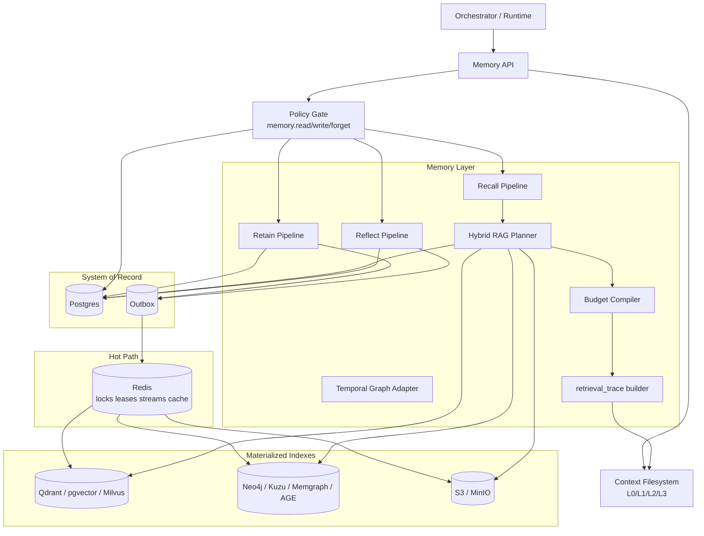

# Architecture — Memory Layer & State Store

Layered architecture for `kirakira-agent` memory: **Memory API** as the single ingress, **Policy** as mandatory gate, **Postgres** as system-of-record, **Redis** for hot-path coordination, and **materialized indexes** (vector, graph, blob) populated asynchronously.

Parent overview: [`../README.md`](../README.md) · Design note: [`../../kirakira-agent-memory.md`](../../kirakira-agent-memory.md).

---

## Layered stack

| Layer | Responsibility | Stores / components |
|-------|----------------|---------------------|
| **Memory API** | Eight `MemoryService` methods; protocol translation; budgeted `MemoryBundle` assembly | See [`../03-memory-api/`](../03-memory-api/) |
| **Policy Gate** | `memory.read`, `memory.write`, `memory.forget`, `checkpoint.restore`, export/redaction obligations | kirakira-agent Policy plane |
| **Retain / Recall / Reflect pipelines** | Retention pipeline (episode → facts → outbox); recall planner + four routes + fusion; reflect/consolidation jobs | `memory-service` + `memory-pipeline` |
| **System of record** | ACID truth for rows, tombstones, checkpoints, legal metadata | **Postgres** |
| **Hot path** | Streams, locks, cache; **not** authoritative | **Redis** (Streams, leases, cache) |
| **Materialized indexes** | Approximate search, graph navigation, large payloads | **Qdrant / pgvector**, **Neo4j / Kuzu**, **S3 / MinIO** |

---

## Memory API (eight methods)

| Method | Role |
|--------|------|
| `retain` | Ingest events → episodes / facts / artifacts; write Postgres + outbox; async indexing |
| `recall` | Multi-route retrieval → fusion → rerank → **L0–L3** `MemoryBundle` |
| `reflect` | Batch consolidate observations/beliefs with evidence linkage |
| `checkpoint` | Persist run/task step state + artifact manifest pointers |
| `restore` | Hydrate state from a `CheckpointRef` (+ blobs) |
| `forget` | Tombstone + index deletion + cache purge; legal holds respected |
| `export` | Subject-scoped or workspace export for portability / compliance |
| `explainRetrieval` | Return structured `RetrievalTrace` for a past or hypothetical recall |

Detailed specs: [`../03-memory-api/`](../03-memory-api/).

---

## Architecture diagram

This is the canonical control-plane view: **API → Policy → Pipelines → Storage backends**.

---

## Related topics

- Data movement and sequences: [`data-flow.md`](data-flow.md)
- Outbox, retries, idempotency, DR: [`consistency-model.md`](consistency-model.md)
- Entity fields and graph/vector layout: [`../02-data-model/`](../02-data-model/)
