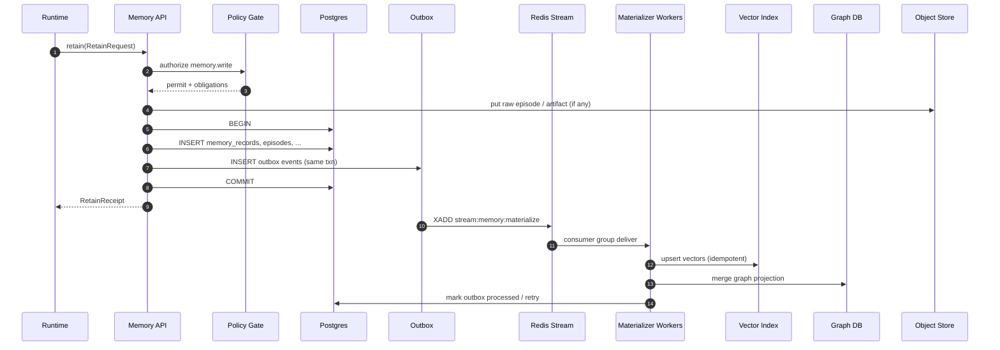
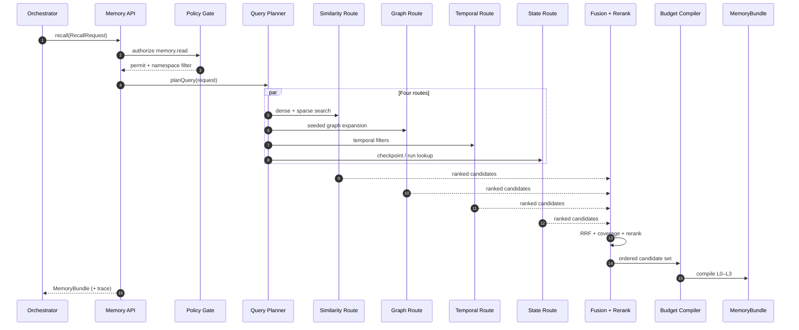

# Data flow — Retain, Recall, Reflect

End-to-end flows for the Memory Layer: how events become durable rows and materialized indexes, how queries become `MemoryBundle`s, and how background reflection consolidates evidence into higher-level memory.

See [`README.md`](README.md) for the architecture diagram.

---

## Retain flow

**Goal:** Accept a retention event (tool output, chat turn summary, file ingestion, policy decision, etc.), enforce policy, persist **authoritative** state in Postgres, then **schedule async work** to refresh vectors, graph projection, and blob-derived artifacts.

**Stages:**

1. **Event admission** — Normalize incoming payload to a retention candidate (episode span, artifact ref, structured fact candidate).
2. **Policy check** — `memory.write` (and namespace rules: `user` / `project` / `org` / `agent` / `shared`).
3. **PII / secret classification** — Tag `pii_level`, optional redaction before persistence; never bypass policy.
4. **Postgres write (single transaction)** — Insert/update `memory_records` (+ type-specific tables or JSONB), episode body pointers to blob, checkpoint rows if applicable; append **outbox** rows for each downstream materialization.
5. **Hot-path publish** — Fan out outbox to **Redis Stream** `stream:memory:materialize` (or equivalent) for workers.
6. **Async materializers** (workers):
   - **Embedding** — Batch embed text; **idempotent** upsert into vector collections.
   - **Graph** — Upsert nodes/edges with temporal properties; link `MENTIONS`, `DERIVED_FROM`, `CONTAINS`, etc.
   - **Blob** — Large raw payloads already in S3/MinIO; workers may run OCR, thumbnails, secondary formats, and register `ArtifactMeta`.

**Nemori-style selective retention:** Workers may apply **predict–calibrate** gating: if new content is already predicted from existing observations/beliefs with high confidence, retention may stay **episode-only** or low-weight; surprising or contradictory content triggers full fact/observation promotion.

### Retain sequence diagram

---

## Recall flow

**Goal:** Turn a natural-language or structured `RecallRequest` into a **token-budgeted** `MemoryBundle` plus optional **`retrieval_trace`**, using **four complementary routes** and global fusion.

**Stages:**

1. **Query planning** — Entity linking, namespace scoping, time expression parsing (valid-time vs transaction-time intent), run/task/checkpoint scope for state lookup.
2. **Parallel routes:**
   - **Similarity** — Dense + sparse (BM25 / SPLADE-style) hybrid; per-kind collections.
   - **Graph** — Seed nodes → bounded expansions; hierarchical clusters (`ConceptCluster`); Mnemis-style top-down coverage.
   - **Temporal** — Filter edges/nodes by `valid_*` and `tx_*` windows; point-in-time subgraphs.
   - **State** — Recent checkpoints, interrupt reasons, task status, manifest pointers (LangGraph-aligned).
3. **Fusion** — Route-local fusion (e.g., RRF on dense+sparse); then global merge with coverage and redundancy penalties.
4. **Rerank** — Cross-encoder or lightweight reranker; boost diversity and entity coverage.
5. **Budget compiler** — Map ranked candidates into **L0 / L1 / L2 / L3** layers per `RecallRequest.tokenBudget` and `level` cap.
6. **Output** — Assemble `MemoryBundle` (context filesystem layout + `bundle.json` metadata) and attach `retrieval_trace` (when `explain` or tracing policy requires it).

### Recall sequence diagram

---

## Reflect flow

**Goal:** Periodically or on demand compress **many grounded facts** into durable **observations** and update **beliefs** with explicit support/refute chains—without collapsing evidence into an un-auditable blob.

**Stages:**

1. **Facts accumulation** — Gather new/changed `Fact` records and linked episodes since last consolidation watermark.
2. **Observation consolidation** — Cluster compatible facts; produce summary `Observation` records with `evidenceIds`; maintain bi-temporal metadata when observations supersede prior versions.
3. **Belief update** — For each belief candidate statement, attach `supportedBy` / `refutedBy` fact and observation IDs; adjust `confidence` with calibrated rules (not raw LLM score dumps).
4. **Contradiction resolution** — When facts conflict in the same valid-time window, apply policy: newest authoritative source, human-approved resolution, or explicit “competing claims” belief state; **invalidate** or **close** old graph edges with `invalid_at` / `expired_at` as appropriate.
5. **Persist + outbox** — Write updates in Postgres **with outbox events** so vector/graph projections stay eventually consistent with the new observations/beliefs.

Reflect may be invoked via `reflect(ReflectRequest)` or scheduled **CQRS-style** after high-volume retain bursts.

---

## Cross-cutting concerns

| Concern | Handling |
|---------|----------|
| **Tracing** | Spans: `memory.recall.plan`, `route.semantic`, `route.graph`, `route.temporal`, `route.state`, `rerank`, `bundle` |
| **Audit** | Hash-chained events for retain/recall/forget/export/restore per kirakira-agent Tracing plane |
| **Cache** | `cache:recall:{tenant}:{hash}` invalidated on tombstone / relevant forget |

Further reading: [`consistency-model.md`](consistency-model.md), [`../02-data-model/`](../02-data-model/), [`../03-memory-api/`](../03-memory-api/).
