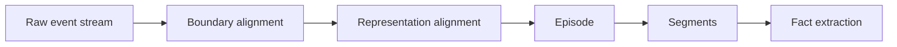

# `Episode` & `EpisodeSegment`

Episodes group raw interaction or ingestion into **semantically coherent spans** suitable for extraction, embedding, and graph attachment. Segmentation follows **Nemori**-style **boundary alignment** (where to cut) plus **representation alignment** (how to summarize/embed the span).

See [`README.md`](README.md).

---

## `Episode`

Physical interaction or ingestion unit stored as metadata in Postgres with **body** in object storage.

| Field | Type | Required | Description | Constraints |
|-------|------|----------|-------------|-------------|
| `id` | `uuid` | yes | Stable episode id | Matches `MemoryRecord.id` when header row exists |
| `sessionId` | `string` | no | Chat / REPL session correlation | |
| `sourceType` | `enum` | yes | `chat`, `tool`, `file`, `web`, `sandbox` | Drives extractors |
| `startAt` | `timestamptz` | yes | Span start (inclusive) | |
| `endAt` | `timestamptz` | yes | Span end (inclusive or exclusive per convention; document in service config) | Must be ≥ `startAt` |
| `bodyBlobUri` | `uri` | yes | Location of compressed JSON/MessagePack transcript or raw payload | Versioned per object-store layout |
| `segmentationScore` | `float` | yes | Confidence that boundaries are coherent | `0.0..1.0`; threshold triggers human review flag in `metadata` |

**TypeScript sketch:**

```ts
type EpisodeSourceType = "chat" | "tool" | "file" | "web" | "sandbox";

interface Episode {
  id: string;
  sessionId?: string;
  sourceType: EpisodeSourceType;
  startAt: string;
  endAt: string;
  bodyBlobUri: string;
  segmentationScore: number;
}
```

**Blob layout (illustrative):**

```text
s3://kirakira-agent/tenants/{tenant}/workspaces/{ws}/episodes/yyyy/mm/dd/{episode_id}.json.zst
```

---

## `EpisodeSegment`

Finer-grained slices **inside** an `Episode` used for extraction, partial embedding, and precise **fact provenance**. Segments may overlap (for sliding windows) or nest (utterance → turn → sub-dialog), depending on pipeline configuration.

| Field | Type | Required | Description |
|-------|------|----------|-------------|
| `id` | `uuid` | yes | Segment id (may become vector point id suffix) |
| `episodeId` | `uuid` | yes | Parent episode |
| `ordinal` | `int` | yes | Monotonic order within episode |
| `startOffset` | `int` | no | Byte offset in decoded body (if applicable) |
| `endOffset` | `int` | no | Byte offset end |
| `startTime` | `timestamptz` | no | Sub-span timestamp start |
| `endTime` | `timestamptz` | no | Sub-span timestamp end |
| `label` | `string` | no | Boundary reason: `tool_return`, `user_goal_shift`, `approval`, etc. |
| `text` | `string` | no | Materialized sub-text for extractors (may duplicate body slice) |
| `embeddingRef` | `string` | no | Points to vector store id if segment is individually embedded |

**TypeScript sketch:**

```ts
interface EpisodeSegment {
  id: string;
  episodeId: string;
  ordinal: number;
  startOffset?: number;
  endOffset?: number;
  startTime?: string;
  endTime?: string;
  label?: string;
  text?: string;
  embeddingRef?: string;
}
```

---

## Segmentation concepts



| Stage | Input | Output | Notes |
|-------|-------|--------|-------|
| **Boundary alignment** | Stream of turns / tool events | Proposed cut points | Uses topic shift, silence gaps, tool boundaries |
| **Representation alignment** | Candidate span | Embedding-friendly summary text | May drop boilerplate |
| **Episode commit** | Final span | `Episode` row + blob | `segmentationScore` aggregates boundary confidence |
| **Segment materialization** | Episode | `EpisodeSegment[]` | Optional; always created for long episodes |

**Predict–calibrate retention hook:** If a new segment’s information content is **predicted** by existing observations with low error, the pipeline may **skip promoting** every sentence to `fact`—while still storing the **episode** for audit.

---

## Graph linkage

Graph projections typically contain:

- `(:Episode {id})-[:CONTAINS]->(:Fact)` (implementation choice: fact as node vs edge reification)
- `(:Episode)-[:NEXT_EPISODE]->(:Episode)` for temporal continuity within a `sessionId`

Exact edge vocabulary: [`graph-schema.md`](graph-schema.md).

Related: [`memory-record.md`](memory-record.md) (episodes also have header rows), [`fact-belief-observation.md`](fact-belief-observation.md).
