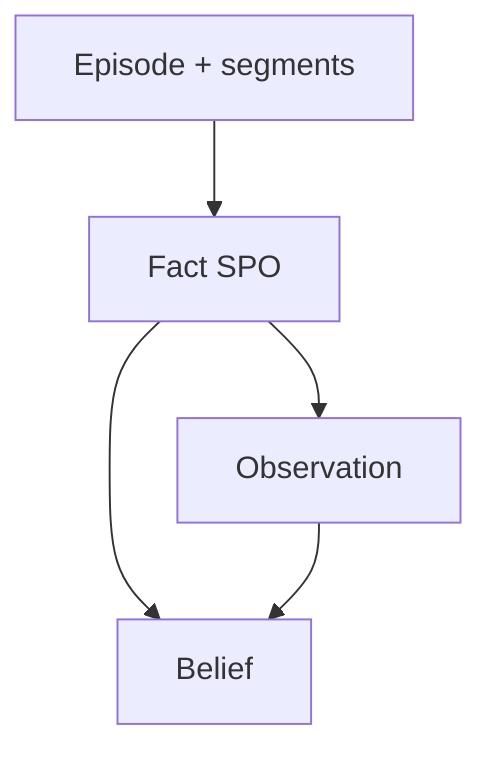

# Facts, beliefs, observations — Evidence & inference

This document defines the **evidence ladder**: how **facts** ground memory in verifiable sources, how **observations** compress facts into agent-usable summaries, and how **beliefs** represent **inference** with explicit argument structure.

See [`README.md`](README.md).

---

## Roles at a glance

| Kind | Ontological role | Mutability | Typical recall layer |
|------|------------------|------------|----------------------|
| **Fact** | Evidence (world-facing or document-facing) | Versioned via bi-temporal closure + new rows | L2 / L3 |
| **Observation** | Grounded summary | New versions supersede via `tx_to` | L1 / L2 |
| **Belief** | Inference with uncertainty | Confidence updates; support graph evolves | L1 / L2 (rarely L3 without caveats) |



---

## Fact

**Definition:** A **fact** is a structured evidentiary record, typically an **SPO triple** (`subject`, `predicate`, `object`) with a **canonical surface form** and a **`sourceEpisodeId`** proving provenance.

| Field | Type | Required | Description |
|-------|------|----------|-------------|
| `id` | `uuid` | yes | Fact id |
| `subject` | `string` | yes | Canonical subject entity id or label |
| `predicate` | `string` | yes | Relation type from controlled vocabulary |
| `object` | `string` | yes | Object entity id / literal / normalized value |
| `canonicalText` | `string` | yes | Single-string normalization for dedup & embedding |
| `sourceEpisodeId` | `uuid` | yes | Episode containing evidence span |

**Bi-temporal:** Facts inherit valid-time from the underlying phenomenon; **`valid_from` / `valid_to` on `MemoryRecord`** (or parallel columns) express when the triple holds. **Corrections** close old rows with `tx_to` and insert superseding facts—never silent overwrites.

**Dedup:** `(tenantId, namespace, subject, predicate, object, valid_from)` uniqueness (policy-tunable) prevents unbounded duplicate nodes.

**Example:**

```json
{
  "id": "b5f9...",
  "subject": "entity:issuer:XYZ",
  "predicate": "reported_revenue_usd",
  "object": "1.2e9",
  "canonicalText": "XYZ reported revenue USD 1.2B for FY2024Q3",
  "sourceEpisodeId": "f8c2..."
}
```

---

## Belief

**Definition:** A **belief** is an **inferential** statement with a calibrated `confidence` and explicit **`supportedBy`** / **`refutedBy`** lists of fact & observation ids.

| Field | Type | Required | Description |
|-------|------|----------|-------------|
| `id` | `uuid` | yes | Belief id |
| `statement` | `string` | yes | Natural-language or controlled statement |
| `confidence` | `float` | yes | `0.0..1.0` post-calibration |
| `supportedBy` | `uuid[]` | yes | Evidence reinforcing the belief |
| `refutedBy` | `uuid[]` | yes | Evidence against (may be empty) |

**Rules:**

- Any **confidence** change must append audit metadata (`metadata.calibrationRun`, model version).
- **Conflicting** high-support beliefs should spawn a `metadata.conflictGroup` for orchestrated human resolution.

**Graph:** Beliefs typically connect via `SUPPORTS` / `REFUTES` edges to facts; see [`graph-schema.md`](graph-schema.md).

---

## Observation

**Definition:** An **observation** is a **scoped summary derived from facts**, optimized for recall efficiency. Observations are **not** a license to invent facts—they must list `evidenceIds`.

| Field | Type | Required | Description |
|-------|------|----------|-------------|
| `id` | `uuid` | yes | Observation id |
| `scope` | `string` | yes | Human or canonical scope label (`workspace:fx`, `task:123`) |
| `summary` | `string` | yes | Token-efficient narrative |
| `evidenceIds` | `uuid[]` | yes | Facts (and optionally episodes) supporting the summary |
| `confidence` | `float` | no | Optional consolidation confidence |

**Bi-temporal:** observations carry **valid-time** for the *situation summarized* and **transaction-time** for consolidation versions (e.g., re-run extractors produced a richer summary).

**Recall:** Observations are preferred L1/L2 hits; facts provide L3 drill-down.

---

## Separation guarantees (for governance)

| Operation | Facts | Observations | Beliefs |
|-----------|-------|----------------|---------|
| **Delete mistaken inference** | untouched | may revise | retire / lower confidence |
| **Delete private evidence** | tombstone drives cascade | must drop or revise | revise support |
| **Legal hold on docs** | artifact frozen | summarize without protected literals | confidence floor |

Related: [`memory-record.md`](memory-record.md), [`graph-schema.md`](graph-schema.md), [`../03-memory-api/forget-export.md`](../03-memory-api/forget-export.md).
