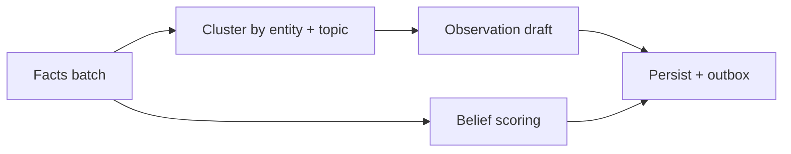

# API specification — `reflect`

`reflect` runs **consolidation jobs** that aggregate **facts** into **observations** and update **beliefs** with explicit support/refute graphs. It complements asynchronous workers but exposes a **synchronous job boundary** for orchestrators.

See [`README.md`](README.md).

---

## `ReflectRequest`

| Field | Type | Required | Description |
|-------|------|----------|-------------|
| `tenantId` | `string` | yes | Tenant |
| `workspaceId` | `string` | yes | Workspace |
| `actorId` | `string` | no | Caller |
| `namespace` | `string` | yes | Limit consolidation scope |
| `mode` | `enum` | yes | `incremental`, `full`, `repair` |
| `since` | `timestamptz` | no | Watermark for incremental |
| `targetBeliefs` | `uuid[]` | no | Restrict belief updates |
| `maxFacts` | `int` | no | Safety cap |
| `dryRun` | `boolean` | no | Plan without persisting |
| `clientMutationId` | `string` | no | Idempotency |

**`mode` semantics**

| Mode | Behavior |
|------|----------|
| `incremental` | Process facts with `tx_from > since` |
| `full` | Rebuild observations/beliefs in namespace (admin) |
| `repair` | Detect dangling evidence links + fix |

---

## `ReflectReceipt`

| Field | Type | Description |
|-------|------|-------------|
| `jobId` | `string` | Traceable job id |
| `factsScanned` | `int` | Input cardinality |
| `observationsCreated` | `int` | New/updated observations |
| `beliefsUpdated` | `int` | Belief rows touched |
| `contradictionsDetected` | `int` | Unresolved conflicts |
| `materializationQueued` | `boolean` | Outbox events emitted |
| `dryRunReport` | `object` | Present if `dryRun=true` |

---

## Consolidation behavior



1. **Load candidate facts** (filtered by namespace/time).
2. **Cluster** compatible triples share entities / predicates within valid-time tolerances.
3. **Draft observations** referencing `evidenceIds`.
4. **Update beliefs**:
   - Append supports/refutes.
   - Recompute calibrated `confidence` (deterministic policy + optional model assist).
5. **Contradiction detection**:
   - Overlapping valid-time for mutually exclusive predicates → open `conflictGroup`.
6. **Persist in Postgres transaction** + **outbox** for vector/graph refresh.

---

## Error conditions

| Code | When |
|------|------|
| `policy.denied` | `memory.write` / adminReflect not allowed |
| `scope.too_large` | `maxFacts` exceeded without elevated permission |
| `dry_run.only` | Production safety: `full` denied without flag |
| `storage.unavailable` | Postgres unavailable |

---

## Example

```http
POST /v1/memory/reflect
Content-Type: application/json
Idempotency-Key: 01J8REF...

{
  "tenantId": "acme-corp",
  "workspaceId": "fx-options-desk",
  "actorId": "user_123",
  "namespace": "project",
  "mode": "incremental",
  "since": "2025-05-01T00:00:00Z",
  "maxFacts": 5000,
  "dryRun": false
}
```

```json
{
  "jobId": "rfl_9001",
  "factsScanned": 812,
  "observationsCreated": 37,
  "beliefsUpdated": 12,
  "contradictionsDetected": 2,
  "materializationQueued": true
}
```

Related: [`../02-data-model/fact-belief-observation.md`](../02-data-model/fact-belief-observation.md).
