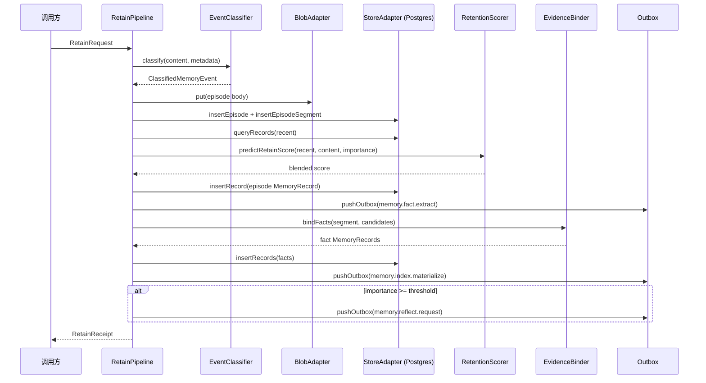

# Retain Pipeline — 概览

**Retain（留存）管道**在同步路径内将用户或系统产生的内容落地为 **Episode**、**EpisodeSegment** 与 **Fact** 等系统记录，写入 **Postgres** 与 **对象存储**，并通过 **Outbox** 触发异步的向量/图/反思任务。实现横跨 `memory-service`（编排与启发式）与 `memory-pipeline`（重型分段、LLM 抽取、批量打分）。

上级文档：[`../README.md`](../README.md) · 源码：`packages/memory-service/src/retain/`、`packages/memory-pipeline/src/kirakira_memory_pipeline/`。

---

## 设计目标

| 目标 | 说明 |
|------|------|
| **可审计的证据链** | Fact 通过 `evidenceIds` 绑定到 Episode 分段，便于合规与溯源。 |
| **选择性留存** | 结合分类启发式与 Nemori 风格的**新颖度**估计，高重要性内容可触发 `memory.reflect.request`。 |
| **与异步工人解耦** | 同步路径只负责权威行 + Outbox；嵌入与图投影由 `memory-pipeline` 消费。 |

---

## 六步留存流程（实现视角）

以下为与当前实现一致的六个阶段（名称兼顾概念与代码阶段）：

1. **事件分类** — `MemoryEventClassifier`：来源类型（chat/tool/file/web/sandbox）、实体提示、建议 `MemoryKind`、启发式重要性。
2. **Episode 与正文落盘** — Blob 写入 Markdown 正文；`insertEpisode`；条件允许时 `insertEpisodeSegment`。
3. **重要性再估计（predict–calibrate / Jaccard）** — `RetentionScorer.predictRetainScore`：用近期 `MemoryRecord` 文本组成语料，计算与当前内容的 Jaccard 新颖度并与分类重要性融合。
4. **Episode 级 MemoryRecord + Outbox** — 写入 `kind: "episode"` 的 `MemoryRecord`，并入队 `memory.fact.extract`（供管道深抽取）。
5. **候选事实与证据绑定** — 同步路径内 `extractCandidateFacts` + `EvidenceBinder.bindFacts` 生成 `kind: "fact"` 行；`evidenceIds` 指向 **分段 ID**。
6. **物化与反思调度** — `memory.index.materialize` Outbox；若综合重要性 ≥ 阈值则 `memory.reflect.request`。

---

## 序列图

---

## 子文档索引

| 文档 | 内容 |
|------|------|
| [`event-classification.md`](event-classification.md) | 事件类型映射、启发式规则、重要性估计 |
| [`episode-segmentation.md`](episode-segmentation.md) | 两步对齐分段（边界检测 + 表示对齐） |
| [`entity-fact-extraction.md`](entity-fact-extraction.md) | SPO 抽取、归一化与候选事实 |
| [`predict-calibrate.md`](predict-calibrate.md) | 预测–校准打分、Jaccard 新颖度、融合公式 |
| [`evidence-binding.md`](evidence-binding.md) | `evidenceIds` 与 Episode 分段的绑定规范 |