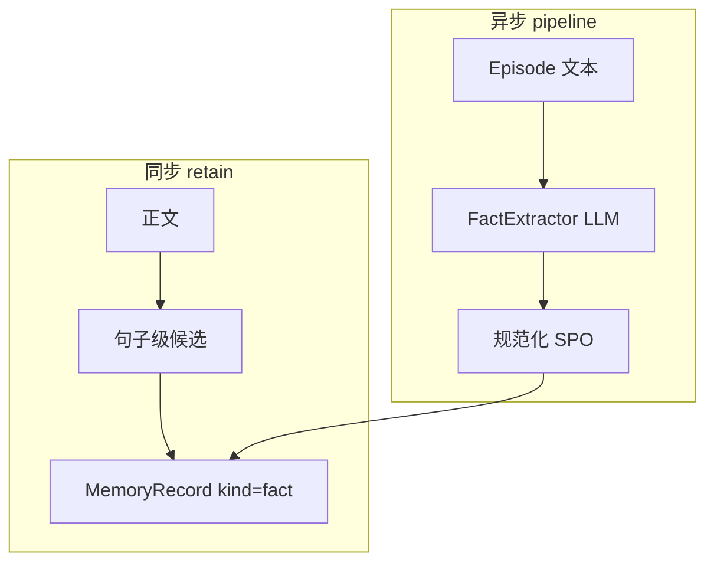

# 实体与事实抽取 — SPO、归一化与候选生成

本文描述两类事实生成路径：**同步路径**的轻量候选（`retain-pipeline`）与 **管道**内的结构化 SPO 抽取（`FactExtractor`）。返回上级：[`README.md`](README.md)。

---

## 1. 结构化 SPO 抽取（`FactExtractor`）

**位置**：`packages/memory-pipeline/src/kirakira_memory_pipeline/extraction/fact_extractor.py`。

使用 OpenAI **结构化输出**（`client.beta.chat.completions.parse` + Pydantic `FactsWrapper`）：

| 字段 | 约束 |
|------|------|
| `subject` / `predicate` / `object` | 非空字符串；`predicate` 建议规范化为英文动词形式（system prompt 约定）。 |
| `confidence` | \[0, 1\]，不确定时低于 1.0。 |

**配置**：`MemoryPipelineConfig` 提供 `llm_model`、`llm_api_key`（可回退到 `embedding_api_key`）。

适用场景：Outbox 工人拿到 Episode 正文后批量抽取高质量三元组，再写入 `MemoryRecord` 或图。

---

## 2. 同步候选事实（`extractCandidateFacts`）

**位置**：`packages/memory-service/src/retain/retain-pipeline.ts`。

无需 LLM，用于低延迟落地：

1. 按 `(?<=[.!?])\s+` 拆句，过滤过短（≤ 12 字符）。
2. 优先保留含 **声明性动词** 的句子：`is|are|was|were|means|defines|requires|always|never|must|should`。
3. 若无命中，退化为前 **3** 句；声明句最多 **8** 条。
4. 每条赋予 **`confidence = 0.65 + 0.05 * min(index, 3)`**。

这些候选直接进入 `EvidenceBinder`（见 [`evidence-binding.md`](evidence-binding.md)）。

---

## 3. 实体归一化（当前实现）

| 层级 | 行为 |
|------|------|
| **分类器** | `entityHints` 专名/引号/`@` 句柄（见 [`event-classification.md`](event-classification.md)）。 |
| **Fact 记录** | 同步路径生成的事实默认 **`entityIds: []`**；结构化抽取可在 `metadata.subject` 或管道后续步骤填充 `entityIds`。 |
| **`groupKeyForFact`（反思）** | 优先 `entityIds[0]`；否则 `metadata.subject`；否则 `topic:default`。 |

生产环境建议：**解析 SPO 后与实体目录对齐**（别名表、UUID、外部 ID），再写入 `entityIds`。

---

## 4. `ImportancePredictor`（信息增益启发）

**位置**：`scoring/importance_predictor.py`。

对 **新文本 n-gram** 相对 **历史语料** 的覆盖率做 surrogate：未见 n-gram 占比经 `tanh` 压缩到 \[0,1\]，用于 worker 侧补充重要性信号（与 embedding 版 predict–calibrate 可并存）。

---

## 数据流小结

---

## 扩展清单

- 在 `metadata` 中写入 `subject`、`predicate`、`object` 与审计用的 `model` / `prompt_version`。
- 对代码类 Episode 使用 AST/ diff 特征而非通用声明句规则。
