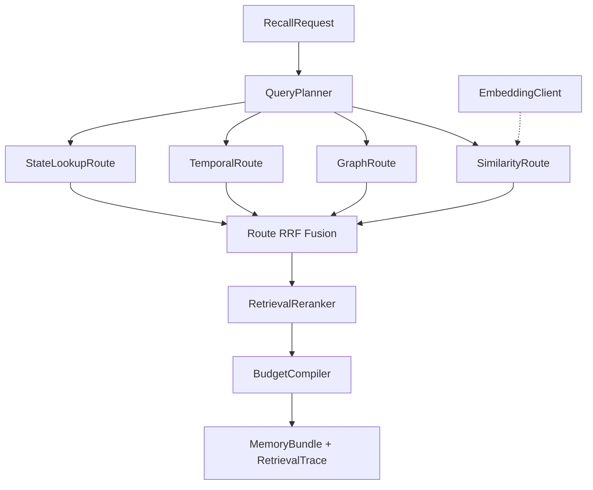

# Recall Pipeline — 概览

**Recall（召回）管道**将自然语言问题转化为 **查询计划**，并行执行最多四条 **检索路由**，经 **RRF 全局融合**、**覆盖度增强的重排序** 与 **L0–L3 预算编译**，产出 `MemoryBundle`。入口：`RecallPipeline.run`（`packages/memory-service/src/recall/recall-pipeline.ts`）。

上级文档：[`../README.md`](../README.md) · 源码：`packages/memory-service/src/recall/`。

---

## 四路召回架构

| 路由 | `name` | 何时激活 |
|------|--------|-----------|
| 相似度 | `similarity` | 默认；需有效查询向量 |
| 图 | `graph` | 默认；无起点实体时返回空 |
| 时间 | `temporal` | 仅当存在 `timeWindow` |
| 状态 | `state` | 有 `runId`/`sessionId` 或查询含 checkpoint/run 等关键词 |

各路由权重由注入的 `RecallRoute` 实例的 `weight` 字段决定（融合时作为 RRF 权重乘子）。

---

## 主流程（摘要）

1. `planRecallQuery` → `QueryPlan`（规范化查询、实体、时间窗、`perRouteLimit`）。
2. `embedding.embed([query])` → 查询向量。
3. 对每个激活路由：`execute` 返回带分数的 `MemoryRecord` 列表 + `RouteExplanation`。
4. `fuseRouteResults`：跨路由 **RRF**，`k=60`。
5. `RetrievalReranker.rerank`：可选 cross-encoder、覆盖度奖励、Jaccard 冗余惩罚。
6. `BudgetCompiler.compile`：按 token 预算降级 L3→L2→L1→L0，并组装 `ContextBundle`。
7. `buildRetrievalTrace` 写入可追溯结构。

---

## 子文档索引

| 文档 | 内容 |
|------|------|
| [`query-planner.md`](query-planner.md) | 实体抽取、时间表达式、路由开关 |
| [`similarity-route.md`](similarity-route.md) | 稠密 + 稀疏、路由内 RRF |
| [`graph-route.md`](graph-route.md) | BFS、实体定位、`sourceRecordId` 回填 |
| [`temporal-route.md`](temporal-route.md) | 时间过滤与 `validAt` 查询 |
| [`state-lookup-route.md`](state-lookup-route.md) | Run / Session / Checkpoint |
| [`fusion-rerank.md`](fusion-rerank.md) | 全局 RRF、重排、覆盖/冗余 |
| [`budget-compiler.md`](budget-compiler.md) | L0–L3 编译与降级 |
