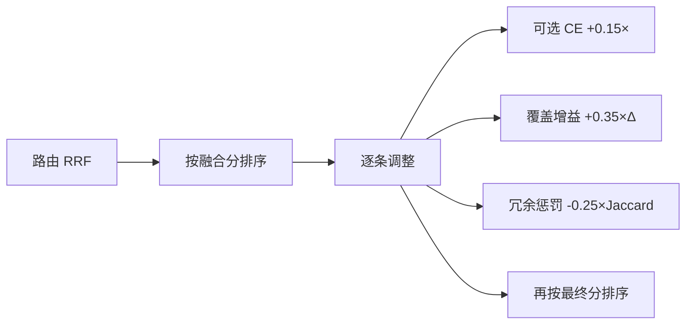

# 融合与重排序 — Fusion & Rerank

全局融合与重排将多路由的 **有序列表** 合并为单一相关度尺度，并在进入 budget 编译前做 **fine-tuning**。核心：`route-fusion.ts`、`reranker.ts`、`coverage-scorer.ts`。

返回上级：[`README.md`](README.md)。

---

## 1. 全局 RRF（Reciprocal Rank Fusion）

**文件**：`packages/memory-service/src/recall/fusion/route-fusion.ts`。

常数 **`RRF_K = 60`**（文献常用默认）。

对每条路由 `r` 提供的有序 ID 列表，排名 `rank`（从 1 开始）贡献：

\[
\Delta s(id) = \frac{w_r}{K + rank}
\]

同一 `id` 在多路由出现时分数累加，最后按总分降序。

`fuseRouteResults` 将各路由的 `rankedIds` 包装为 `WeightedRankedList` 调用 `reciprocalRankFusion`。

---

## 2. Cross-Encoder 重排（可选）

**类**：`RetrievalReranker`（`reranker.ts`）。

若 `RerankerOptions.crossEncoder` 提供 `Map<recordId, score>`：

\[
s \leftarrow s + 0.15 \cdot s_{ce}
\]

当前 `RecallPipeline` 默认 **不传** cross-encoder；可在服务层接入批量 CE 服务后注入。

---

## 3. 覆盖度增益（coverage gain）

**函数**：`coverageGainForRecord`（`coverage-scorer.ts`）。

维护已接受集合的 **三维覆盖**：

| 维度 | 度量 |
|------|------|
| 实体 | `entityIds` 去重数 |
| 时间桶 | `validFrom` 日期前缀 `YYYY-MM-DD` |
|证据/类型 | `evidenceIds` 与 `kind` 的集合 |

综合分：

\[
\text{coverageScore} = 0.4 \min(1,\frac{|E|}{8}) + 0.35 \min(1,\frac{|T|}{4}) + 0.25 \min(1,\frac{|Y|}{6})
\]

加入候选后 \(\Delta = \max(0, \text{after} - \text{before})\)，默认权重 **0.35** 乘入总分：

\[
s \leftarrow s + 0.35 \cdot \Delta
\]

**直觉**：鼓励单次 recall 覆盖 **多实体 / 多日期 / 多证据类型**，减少「全是同主题复述」。

---

## 4. 冗余惩罚（Jaccard）

对候选与**已接受**记录的内容 token 集（`text` + `summaryL0` + `overviewL1`）计算 **Jaccard 相似度**，取与已接受集合的 **最大 Jaccard** `maxJac`：

\[
s \leftarrow s - 0.25 \cdot maxJac
\]

默认权重 **0.25**。

**注意**：`rerank` 实现先按融合分排序再遍历；覆盖与冗余更新在顺序上基于「高分优先」；`accepted` 列表随遍历增长，模拟 **序列式 MMRR** 近似。

---

## 5. `reason` 字段

每条输出 `reason` 拼接片段，例如：

`fusion:0.0821; cross:0.9120; coverage+0.1204; redundancy-0.0800`

供 L2 card 的 `routeReason` 与追踪服务消费。

---

## 流程图

---

## 调参指南

| 旋钮 | 效果 |
|------|------|
| 提高 `coverageBonusWeight` | 更发散，可能引入噪音 |
| 提高 `redundancyPenaltyWeight` | 更去重，可能丢近重复但措辞不同的关键句 |
| 降低 CE 系数 | CE 故障时更健壮 |
