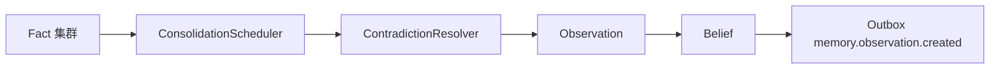

# Reflect Pipeline — 概览

**Reflect（反思 / 归纳）管道**将多条 **Fact** 异步整合为 **Observation** 与 **Belief**，处理 **矛盾对**，并通过 Outbox 通知下游索引刷新。由 `ReflectPipeline.run` 驱动（`packages/memory-service/src/reflect/reflect-pipeline.ts`）。

上级文档：[`../README.md`](../README.md) · 源码：`packages/memory-service/src/reflect/`；Python 侧补充：`packages/memory-pipeline/src/kirakira_memory_pipeline/reflect/`。

---

## 延迟归纳（Delayed induction）

Facts 先以**证据**形态进入系统；反思在 **批量**、**时限**或 **显式请求**下才升级为 **观察摘要** 与 **信念**，避免每次写入都触发昂贵合并。



---

## 触发条件（调度）

`ConsolidationScheduler.shouldConsolidate`：

- `groupSize < 2` → 否。
- `groupSize >= 5` → **立即**合并。
- 否则：最老 fact 距现在 **> 86_400_000 ms（24h）** 且 **≥2** 条 → 合并。

若请求显式带 `factIds`，则 **跳过** 时间门控（仍需 `groupSize >= 2` 才进入循环体之外？ 看代码 - if factIds && length > 0 in reflect - the condition is:

```
if (
  !this.scheduler.shouldConsolidate(...) &&
  !(req.factIds && req.factIds.length > 0)
) {
  continue;
}
```

So if factIds provided, it will consolidate even if shouldConsolidate is false. Good.

`maxGroupsPerRun`：`min(requested ?? 32, 256)`。

---

## 单轮处理流程

对每个满足条件的 **fact 集群**：

1. **`detectContradictions`** → 对矛盾对 **`resolvePair`**，败者 **`tombstoneRecord`**。
2. 生成 **Observation**（证据链 `evidenceIds = fact ids`，confidence 为事实置信均值）。
3. **`BeliefManager.createBeliefFromFacts`** → 插入 **Belief**。
4. **`pushOutbox`**：`memory.observation.created` payload 含 `observationId`, `beliefId`, `factIds`。

---

## 子文档索引

| 文档 | 内容 |
|------|------|
| [`observation-consolidation.md`](observation-consolidation.md) | 按实体/主题分簇与观察摘要 |
| [`belief-management.md`](belief-management.md) | 信念生成与置信更新公式 |
| [`contradiction-resolution.md`](contradiction-resolution.md) | 冲突检测与胜者对判定 |
