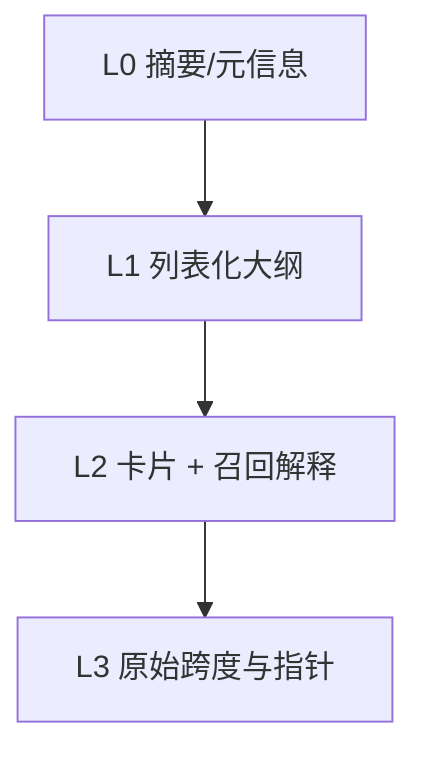

# 上下文文件系统 — 概览

**Context Filesystem（上下文文件系统）** 将召回结果组织为 **L0 → L3** 渐进级别：从**一行摘要**到**可审计证据指针**，适配 token 预算与可解释性需求（OpenViking 风格）。类型定义在 **`@kirakira/memory-core`**，装配逻辑在 **`memory-service`**。

上级文档：[`../README.md`](../README.md) · 源码：`packages/memory-core/src/types/context-fs.ts`、`packages/memory-service/src/context/context-fs.ts`、`packages/memory-service/src/recall/budget/budget-compiler.ts`。

---

## 级别总览

| 级别 | 消费者价值 | 典型 token 成本 |
|------|------------|-----------------|
| **L0** | 快速判断「召回是否命中主题」 | 极低 |
| **L1** | 事实/观察/状态的一句话列表 | 低 |
| **L2** | 模型可引用的结构化卡片 + 分数/路由原因 | 中 |
| **L3** | 溯源、引用、回放检查点状态 | 高 |

---

## 装配入口

| 组件 | 职责 |
|------|------|
| **`BudgetCompiler.compile`** | Recall 主路径：带 **降级** 的 L0–L3 与 `estimatedTokens` 累计 |
| **`ContextAssembler`** | 辅助构建：可用查询串重写 L0 `abstract`，仍委托 `BudgetCompiler` |

---

## 子文档

| 文档 | 内容 |
|------|------|
| [`format-spec.md`](format-spec.md) | L0–L3 字段规范与示例 |

---

## 与 `MemoryBundle`

`RecallPipeline` 返回的 `MemoryBundle.context` 即为 `ContextBundle`，并附带 `RetrievalTrace` 解释为何选中各卡片（L2 `routeReason`）。
