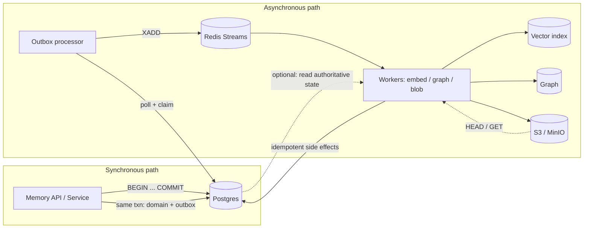

# Store layer overview

The **store layer** is the persistence and integration boundary for the Kirakira agent memory plane. It combines a relational **system of record**, an in-memory **hot path**, and an object **blob tier**, with a **transactional outbox** tying them together so asynchronous materializers never observe “index without row” inconsistencies.

Parent documentation: [`../README.md`](../README.md) · Package implementation: `packages/memory-store`.

---

## Postgres as system of record

Postgres holds authoritative rows for memory facts, episodes, checkpoints, artifact metadata, policy audit, retrieval traces, deletion jobs, and outbox events.

**Why Postgres (not the vector DB or graph DB)?**

- **ACID transactions** — Domain writes and outbox inserts commit atomically; workers can retry without corrupting truth.
- **Schema evolution** — Versioned SQL migrations with checksums in `_migrations`; additive changes and backfills are tractable.
- **Operational maturity** — Point-in-time recovery (PITR), replication, and backup/restore patterns are well understood for compliance and DR.
- **Bi-temporal modeling** — `valid_*` (business time) and `tx_*` (system time) support corrections and point-in-time queries without overloading approximate indexes.

Vectors and graphs are **materialized indexes**; Postgres remains the reconcilable source when rebuilding projections.

---

## Redis as hot path

Redis optimizes latency and throughput for work that must not block the synchronous retain path:

| Concern | Redis capability |
|--------|-------------------|
| **Async fan-out** | **Streams** (`XADD`, consumer groups) for materialize, forget, artifact indexing, reflect |
| **Coordination** | **Distributed locks / leases** (e.g. run-scoped, checkpoint-scoped) with TTL and compare-and-delete semantics |
| **Latency** | **Cache** for recall bundles, entity resolution, rerank intermediates |
| **Fairness** | **Rate limiting** (token bucket or sliding window) for embedding and model batching |

Redis is **not** the system of record. Persistence (RDB/AOF) and clustering are deployment choices; durable truth remains in Postgres plus object storage.

Canonical key/stream names are defined in `packages/memory-core` (`REDIS_KEY_PREFIX`, `REDIS_STREAMS`). The default outbox dispatcher in `memory-store` uses shorter stream names (`stream:memory:*`); **production configs should align** router mappings with the deployed stream keys.

---

## S3 / MinIO as blob layer

Large or binary payloads (episode bodies, checkpoints, exports, audit bundles) live in **object storage**—AWS S3, **MinIO**, or compatible APIs.

- **Versioning** — Artifact paths can include `v{n}` segments; immutable versions simplify rollback and forensic replay.
- **WORM retention** — **Compliance mode** (fixed retention, no early delete) vs **governance mode** (privileged override) maps to regulatory vs operational needs.
- **Legal hold** — Holds block deletion regardless of retention expiry until the hold is cleared; combine with `artifact_meta.worm` and policy for regulated classes.

See [`blob.md`](blob.md) for layout, adapters, and governance.

---

## Transactional outbox

Cross-store consistency uses the **transactional outbox** pattern:

1. In **one** database transaction, the service inserts or updates domain tables **and** one or more rows in `outbox`.
2. After commit, a **processor** polls `outbox`, claims rows, and publishes to Redis streams (`XADD`).
3. **Consumers** (materializers) process stream messages idempotently; failures retry with backoff; exhausted attempts become **`dead_letter`**.

This avoids dual-write races between Postgres and Redis: if the transaction rolls back, no outbox row exists; if it commits, eventual delivery can be retried.

Details: [`outbox.md`](outbox.md).

---

## Data flow (high level)

**Reading the diagram:** Clients hit the API, which writes **only** to Postgres (including outbox) in a single transaction. A separate processor moves committed outbox rows into Redis streams. Workers consume streams and update vectors, graph projections, and blobs; they may read Postgres again for truth and should tolerate duplicate messages.

---

## Document map

| File | Contents |
|------|----------|
| [`postgres.md`](postgres.md) | Tables, partitions, indexes, bi-temporal queries, migrations, `postgres.js` pooling |
| [`redis.md`](redis.md) | Key schema, streams, locks, cache, consumer groups |
| [`blob.md`](blob.md) | S3/MinIO adapter, paths, WORM, legal hold, local dev, versioning |
| [`outbox.md`](outbox.md) | Outbox pattern, processor, dispatcher, retries, dead letters, reconciler |
