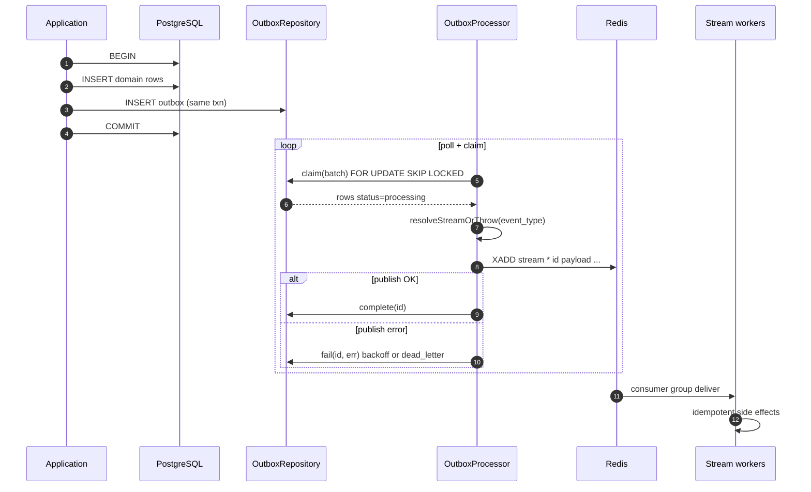

# Transactional outbox

The **transactional outbox** pattern ensures that **domain data** and **downstream work signals** commit atomically in Postgres. A separate **processor** publishes committed rows to **Redis Streams**; async workers never rely on “best effort” dual writes from the API thread.

Implementation: `packages/memory-store` (`src/postgres/repositories/outbox-repo.ts`, `src/outbox/*.ts`).

---

## Pattern: single Postgres transaction

Within one transaction:

1. Insert or update authoritative rows (`memory_records`, `episodes`, …).
2. Insert one or more **outbox** rows with `event_type`, `payload`, optional `tenant_id` / aggregate fields.
3. `COMMIT`.

If the transaction fails, **neither** the facts nor the outbox events exist—downstream never sees phantom work. If it succeeds, the outbox row is durably recorded even if Redis or workers are temporarily down.

Application code should not publish to Redis directly from the same request **before** commit; use the outbox as the bridge.

---

## Schema (summary)

| Column | Role |
|--------|------|
| `id` | `BIGSERIAL` primary key (stringified in stream messages) |
| `event_type` | Routes to a Redis stream |
| `payload` | `JSONB` consumer arguments |
| `status` | `pending` → `processing` → `completed`, or `failed` transitions, or `dead_letter` |
| `attempts`, `max_attempts` | Retry budget |
| `available_at` | Visibility time for exponential backoff |
| `last_error`, `updated_at` | Diagnostics |

Statuses used in code (`OutboxStatus`): `pending`, `processing`, `completed`, `failed`, `dead_letter`.

---

## Processor: polling, claiming, publishing

`OutboxProcessor` (`processor.ts`):

1. On an interval (default **500 ms**), calls `OutboxRepository.claim(batchSize)` (default **25**).
2. **Claim** uses `FOR UPDATE SKIP LOCKED` to prevent double processing across concurrent pollers.
3. For each row, resolves the **stream** from the dispatcher, runs `XADD` with `id`, `event_type`, `tenant_id`, `aggregate_id`, `payload`.
4. On success: `complete(id)` → `status = 'completed'`.
5. On failure: `fail(id, errorMessage)` → increments `attempts`, sets `last_error`, either schedules `available_at` with backoff or moves to `dead_letter` when `attempts >= max_attempts`.

Configurable: `pollIntervalMs`, `batchSize`, custom `OutboxRepository`, custom `StreamRouter`.

---

## Dispatcher: routing by `event_type`

`createDefaultDispatcher(extraRoutes)` returns a `StreamRouter`: `(eventType) => streamKey | undefined`.

Built-in routes:

| `event_type` | Redis stream (default) |
|--------------|-------------------------|
| `memory.retained` | `stream:memory:materialize` |
| `memory.forget` | `stream:memory:forget` |

`resolveStreamOrThrow` raises if no mapping exists—this surfaces misconfigurations early.

Extend at deploy time:

```typescript
import { createDefaultDispatcher } from "@kirakira/memory-store";

const router = createDefaultDispatcher({
  "artifact.index": "kirakira:stream:artifact:index",
  "memory.reflect": "kirakira:stream:memory:reflect",
});
```

Align these strings with consumer groups listening on the same keys (see [`redis.md`](redis.md)).

---

## Retry policy: exponential backoff with jitter

`calculateBackoffDelayMs` (`retry-policy.ts`) implements:

- Exponential growth from `baseDelayMs` (default **250 ms**), capped at `maxDelayMs` (default **60_000 ms**).
- **Jitter** proportional to `jitterFactor` (default **0.2**) to spread retries.

After a failure, `fail` increments `attempts` and sets `available_at = now() + delay` when under `max_attempts`. The claim query only selects rows with `status = 'pending'` **and** `available_at <= now()`, so delayed rows are invisible until their backoff elapses.

---

## Dead-letter handling

When `attempts` reaches `max_attempts` (default **10**), `fail` sets `status = 'dead_letter'` and leaves `available_at` unchanged (not eligible for normal claim).

Operational playbooks:

- **Inspect** — Query `outbox` where `status = 'dead_letter'` order by `updated_at`.
- **Root cause** — Fix consumer bugs, stream ACLs, payload schema drift, or dispatcher gaps.
- **Replay** — Use `deadLetter` helper sparingly; prefer a controlled requeue that resets `attempts`, `status`, and `available_at` in a migration or admin tool after fixing the consumer.

---

## Reconciler: stuck events and consistency checks

`OutboxReconciler` (`reconciler.ts`) provides recovery and diagnostics:

| Method | Purpose |
|--------|---------|
| `resetStuckProcessing()` | Rows in `processing` with `updated_at` older than `stuckProcessingMs` (default **60 s**) revert to `pending` |
| `findLongPending()` | If `pendingWarningMs` set, lists old `pending` rows for alerting |
| `verifyCompletedInRedisStream()` | Samples recent `completed` rows and checks whether `id` appears in the target stream via `XREVRANGE` (best-effort; trimming causes false negatives) |

Run `resetStuckProcessing` on a cron or liveness loop so crashed processors do not strand rows.

---

## Sequence diagram



---

## Code reference snippets

### Claim and update (behavioral summary)

The repository runs:

```sql
WITH cte AS (
  SELECT id FROM outbox
  WHERE status = 'pending' AND available_at <= now()
  ORDER BY id ASC
  FOR UPDATE SKIP LOCKED
  LIMIT $1
)
UPDATE outbox AS o SET status = 'processing', updated_at = now()
FROM cte WHERE o.id = cte.id
RETURNING o.*;
```

### Stream publish (fields)

`XADD` uses flat field–value pairs: `id`, `event_type`, `tenant_id`, `aggregate_id`, `payload` (JSON string).

---

## Related reading

- [`postgres.md`](postgres.md) — `outbox` DDL
- [`redis.md`](redis.md) — streams and consumer groups
- [`README.md`](README.md) — store layer overview
