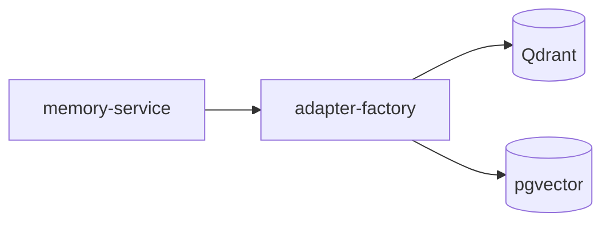

# 向量层 — 概览

**向量层**为记忆平面提供 **近似最近邻（ANN）** 检索能力，支撑 Recall 的 **相似度路由** 与 Retain 后 **异步嵌入**。`memory-vector` 包实现 **`VectorAdapter`** 的多个后端：**Qdrant**（命名稠密 + 稀疏向量、混合 RRF）与 **pgvector**（与 Postgres 共库的稠密检索）。

上级文档：[`../README.md`](../README.md) · 源码：`packages/memory-vector/src/`。

---

## 后端对比

| 维度 | Qdrant | pgvector（本仓库实现） |
|------|--------|-------------------------|
| **部署** | 独立向量服务 | 与业务 Postgres 同实例 / 同城 |
| **稀疏向量** | 原生 named sparse + **prefetch RRF** | **不支持**（仅稠密） |
| **过滤** | Payload index + `must/must_not` | JSONB `payload` + SQL `WHERE` |
| **距离** | Cosine（dense） | Cosine（`<=>` 转相似度 `1-distance`） |
| **索引** | HNSW（`m=16, ef_construct=100`） | **HNSW** `vector_cosine_ops` |
| **快照** | `createSnapshot` / `listSnapshots` | 显式 **不支持**（可用 PG 备份代替） |
| **适用场景** | 混合检索、低延迟大规模 ANN | 简化运维、中小规模、已有 PG 团队 |

---

## 公共契约（`@kirakira/memory-core`）

- **`HybridSearchParams`**：`denseVector`、`sparseIndices`/`sparseValues`（可选）、**`filter` 必含 `tenant_id`**、`limit`。
- **`VectorUpsertItem`**：点 ID、`source_record_id`、向量与 **payload**（租户、命名空间、种类、实体、时间、PII、tombstone 等）。
- **集合名**：白名单 **`MEMORY_COLLECTIONS`**；Recall 路由当前硬编码集合 **`kirakira_memory`**。

---

## 子文档

| 文档 | 内容 |
|------|------|
| [`qdrant.md`](qdrant.md) | 集合、命名向量、payload 索引、混合检索、快照 |
| [`pgvector.md`](pgvector.md) | 表结构、HNSW、余弦检索、过滤删除 |

