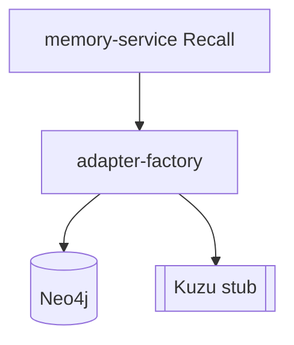

# 图数据层 — 概览

**图数据层**将记忆实体与关系 **物化** 为可遍历图，支撑 Recall **Graph 路由**、**时间 traversal** 与 **社群发现**。`memory-graph` 提供 **Neo4j** 完整适配与 **Kuzu** 占位实现。

上级文档：[`../README.md`](../README.md) · 源码：`packages/memory-graph/src/`。

---

## 选型

| 引擎 | 状态 | 典型用途 |
|------|------|-----------|
| **Neo4j** | 生产就绪 | 分布式图、GDS、Cypher、全文 |
| **Kuzu** | stub | 嵌入式单机（待实现） |

---

## 子文档

| 文档 | 内容 |
|------|------|
| [`neo4j.md`](neo4j.md) | 约束、全文索引、双时态边、MERGE、Louvain |
| [`kuzu.md`](kuzu.md) | 嵌入式定位与实现状态 |
