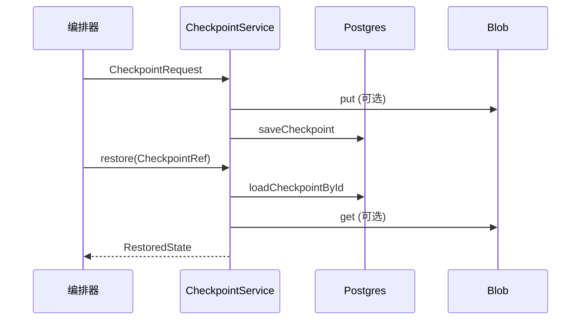

# Checkpoint 与恢复 — 概览

**Checkpoint** 将编排器 **运行态** 持久化到 Postgres，大负载溢出到 **对象存储**；**restore** 路径负责拉取元数据、解析 blob 指针并收集 artifact 引用。实现：`CheckpointService`、`StateHydrator`（`packages/memory-service/src/checkpoint/`）。

上级文档：[`../README.md`](../README.md)。

---

## 保存流程

1. **序列化** `CheckpointRequest.state`。
2. 若 JSON 串长度 **> 65536**（`INLINE_THRESHOLD`）：写入 `s3://{bucket}/tenants/{tenantId}/checkpoints/{id}.json`，`stateJson` 替换为 `{ __blobUri, __inline: false, __bytes }`。
3. **`store.saveCheckpoint`** 落表（与 `@kirakira/event-store` 共用 schema，见 [`compatibility.md`](compatibility.md)）。

---

## 恢复流程

1. `loadCheckpointById`。
2. 若 state 含 **`__blobUri`**：`blob.get` → `JSON.parse` 得真实 state。
3. 从 `artifact_manifest` 提取 **`artifactRefs`**（数组优先）。

---

## 水合扩展 — `StateHydrator`

在 `RestoredState` 基础上：

- 解析每个 artifact 的 **`ArtifactMeta`** 与 **二进制内容**。
- 构建最多 **16** 条 **`artifact_meta`** 形状 `MemoryRecord` 作为 **working memory 预览**。

---

## 子文档

| 文档 | 内容 |
|------|------|
| [`time-travel.md`](time-travel.md) | 双时态与时点调试 |
| [`compatibility.md`](compatibility.md) | `CheckpointRepository` 互操作 |

