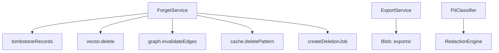

# 治理与合规 — 概览

**治理平面**覆盖 **被遗忘权、可携式导出、PII 分类与脱敏、WORM 留存与审计**。实现主要位于 `packages/memory-service/src/governance/`，对象留存元数据见 `memory-store` migrations（如 **`artifact_meta.worm`**）。

上级文档：[`../README.md`](../README.md)。

---

## 能力关系

---

## 子文档

| 文档 | 内容 |
|------|------|
| [`forget.md`](forget.md) | 遗忘：墓碑、索引、缓存、删除作业 |
| [`export.md`](export.md) | 主体导出 JSON/JSONL、字段剥离 |
| [`pii-redaction.md`](pii-redaction.md) | PII 级别与正则脱敏 |
| [`worm-audit.md`](worm-audit.md) | WORM、法务保全、审计链 |

---

## Policy 门

对外 API 须先经 **Policy**（`memory.forget`、`export` 等）授权；本文仅描述服务内部语义。
