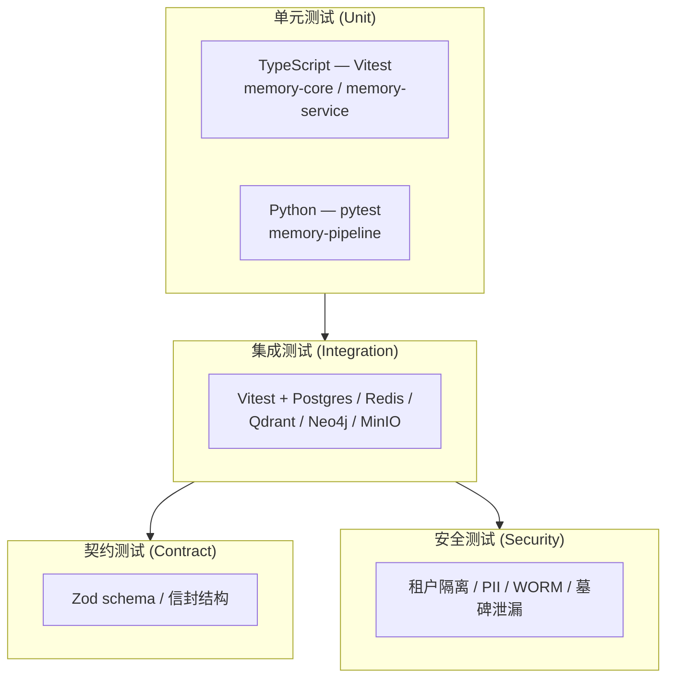

# 测试策略

本文档描述 **Kirakira Agent 记忆平面（Memory Layer）** 的分层测试体系：从纯逻辑单元测试到依赖真实中间件的集成测试，再到契约固化与安全回归，形成可重复、可 CI 化的质量闸门。

上级文档：[`../README.md`](../README.md) · 基础设施细节：[`infrastructure.md`](infrastructure.md) · 基准与评估：[`benchmarks.md`](benchmarks.md)。

---

## 目标与范围

| 维度 | 说明 |
|------|------|
| **覆盖对象** | `memory-core`、`memory-store`、`memory-service`、`memory-pipeline`（Python）及与其它平面交界处的 Memory API 契约 |
| **非目标** | 不替代上游 LLM/嵌入服务商的 SLA 测试；大规模压测见 [基准测试与评估](benchmarks.md) |
| **质量原则** | 快速反馈（单元为主）、环境可复现（Compose/Testcontainers）、失败可诊断（契约与安全用例带明确断言） |

---

## 测试金字塔（记忆平面）

记忆平面测试按 **单元 → 集成 → 契约 → 安全** 由下至上分层。底层用例数量多、执行快；上层用例少、依赖 Docker 或完整栈，用于防止回归与越权。

**阅读说明：** 契约与安全测试可与集成层共享同一套基础设施；契约测试强调 **序列化边界稳定**，安全测试强调 **策略与删除语义**。

---

## 按类别的用例规模（当前仓库）

下列统计基于记忆相关目录下 `it(`（Vitest）与 `def test_`（pytest）用例计数，反映 **记忆平面专属** 套件规模（不包含策略引擎、CLI 等其它包的用例）。

| 层级 | 路径 / 运行器 | 用例数（约） | 典型关注点 |
|------|----------------|-------------|------------|
| **单元（TS）** | `test/unit/memory-core/`、`test/unit/memory-service/` · Vitest | **131** | Schema、查询计划、路由融合、retain/recall/reflect/checkpoint 纯逻辑 |
| **单元（Python）** | `test/unit/memory-pipeline/` · pytest | **80** | 分段、抽取、嵌入批处理、worker 路由、物料化器 |
| **集成** | `test/integration/memory/` · Vitest | **12** | Outbox→物料化、多路召回、时点查询、checkpoint、forget 传播 |
| **契约** | `test/contract/memory/` · Vitest | **6** | Memory API DTO、checkpoint 信封、Context FS、outbox 事件、检索轨迹 |
| **安全** | `test/security/memory/` · Vitest | **7** | 命名空间隔离、PII、墓碑泄漏、WORM 完整性 |
| **合计（记忆平面）** | — | **236** | — |

> **注：** 根目录 `pnpm test` / `vitest run` 会执行整个 monorepo 的 `test/**/*.test.ts`，总数大于上表仅限记忆的子集。

---

## 如何运行测试

### TypeScript（Vitest）

| 命令 | 用途 |
|------|------|
| `pnpm test` | 运行全部 Vitest 用例（见根目录 [`package.json`](../../../../package.json) 中 `test` 脚本） |
| `pnpm test:integration` | 仅 `test/integration`（含策略等；记忆集成建议在 Docker 栈就绪后执行） |
| `vitest run test/unit/memory-service` | 仅 memory-service 单元测试 |
| `vitest run test/integration/memory` | 记忆集成测试（需数据库等，见下节） |

Vitest 配置：根目录 [`vitest.config.ts`](../../../../vitest.config.ts)（含 `globalSetup` 探测 Postgres）。

### Python（pytest）

记忆流水线测试由 `packages/memory-pipeline/pyproject.toml` 的 `[tool.pytest.ini_options]` 指向 `../../test/unit/memory-pipeline`。

| 步骤 | 命令 |
|------|------|
| 安装 dev 依赖 | 在 `packages/memory-pipeline` 下执行 `pip install -e ".[dev]"`（或等价 uv/poetry 工作流） |
| 运行 | `cd packages/memory-pipeline && pytest` |

实现包路径：`packages/memory-pipeline/src/kirakira_memory_pipeline/`。

---

## Docker Compose 与基础设施测试

记忆集成测试依赖 **Postgres（pgvector）、Redis、Qdrant、Neo4j、MinIO**。推荐通过 Compose 一键拉起，与 [`docker-compose.test.yml`](../../../../docker-compose.test.yml) 保持一致。

快速流程：

1. `docker compose -f docker-compose.test.yml up -d`
2. 待健康检查通过（详见 [infrastructure.md](infrastructure.md)）
3. `vitest run test/integration/memory`（或完整 `pnpm test`）

无 Docker 时，`memory-global-setup` 探测失败，集成类用例通过 `skipIfNoDocker()` 跳过（见 [`test/helpers/memory-containers.ts`](../../../../test/helpers/memory-containers.ts)）。

---

## 文档索引

| 文件 | 内容 |
|------|------|
| [`infrastructure.md`](infrastructure.md) | `docker-compose.test.yml` 服务、端口、健康检查、环境变量、跳过策略、CI 建议 |
| [`benchmarks.md`](benchmarks.md) | LoCoMo / LongMemEval、离线指标与 SLO、验收口径 |
