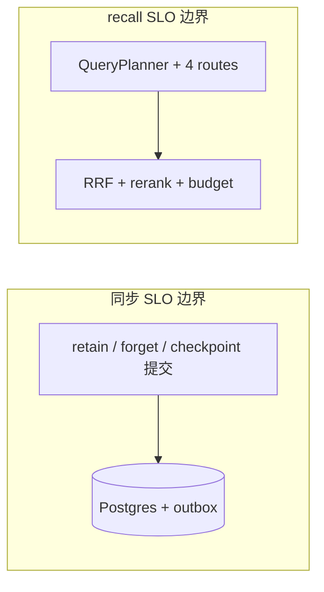

# 基准测试与评估

本文档说明记忆平面 **离线评估数据集**、**检索质量指标**、**延迟类指标** 以及与产品 **SLO（服务级别目标）** 的对齐方式。实现层面的默认常量另见 `packages/memory-core/src/constants.ts` 中的 `PERFORMANCE_TARGETS`（可与本文档目标收敛后统一演进）。

上级文档：[`README.md`](README.md)。

---

## 评估数据集

### LoCoMo（长对话回放）

**用途：** 模拟 **极长多轮会话** 中的记忆写入与跨会话回忆，检验 episode 分段、 Consolidation 与检索是否在上下文窗口外仍可用。

| 维度 | 说明 |
|------|------|
| **实验设计** | 将会话按时间顺序 **replay** 至 `retain`，固定间隔触发 `recall` 问题集 |
| **关注失败模式** | 早期轮次事实被后期噪声淹没、实体指代消解错误、时间线类问题答非所问 |
| **工程挂钩** | 管线：`packages/memory-service`（retain/recall）、`packages/memory-pipeline`（异步物料化）；存储：`packages/memory-store` |

### LongMemEval（长期记忆检索）

**用途：** 评测 **长期记忆检索准确率** —— 在给定大规模历史的情况下，召回列是否包含正确记忆项。

| 维度 | 说明 |
|------|------|
| **与前者的关系** | LoCoMo 偏重 **过程与稳定性**；LongMemEval 偏重 **top-k 命中率与排序质量** |
| **集成点** | 四路召回（`packages/memory-service/src/recall/`）、融合与重排（`fusion-rerank`、reranker 单测见 `test/unit/memory-service/recall/`） |

> **落地说明：** 具体数据文件与 runner 脚本可由 `benchmarks/` 或 `scripts/` 目录扩展；本文档定义 **口径**，便于 CI  nightly 或发布前门禁对齐。

---

## 质量指标

| 指标 | 定义（摘要） | 适用场景 |
|------|----------------|----------|
| **Recall@k** | 真相关记忆是否出现在融合后 Top-k | LongMemEval、路由消融 |
| **Precision@k** | Top-k 中相关项占比 | 控制误报噪声进入 L2/L3 |
| **MRR** | 首个相关项排名的倒数均值 | 强调「第一条就要对」的产品体验 |
| **Response latency** | 端到端 `recall` 延迟（p50/p95/p99） | SLO、与缓存/并行度调优 |

**路由级细分：** 可对 `similarity` / `graph` / `temporal` / `state` 各路由单独记录贡献度与耗时（与 `retrieval_traces` 表设计一致，见 [`08-store-layer/postgres.md`](../08-store-layer/postgres.md)）。

---

## 性能目标（SLO）

下列为记忆平面 **同步路径与关键操作** 的目标上限（p95，除非注明）。用于压测验收与告警阈值设计。

| 路径 / 操作 | SLO（p95） | 说明 |
|-------------|------------|------|
| **retain** | **< 100 ms** | 同步：**Postgres 提交 + outbox**；不含异步嵌入/图/向量完成时间 |
| **recall** | **< 200 ms** | **四路并行**（相似度 / 图 / 时间 / 状态）+ 融合前的主路径；强依赖缓存与索引预热时更易达标 |
| **checkpoint（inline）** | **< 50 ms** | 小状态、可直接写入 Postgres 行内 JSON 的场景 |
| **checkpoint（blob spill）** | **< 500 ms** | 大体状态溢出至 **S3/MinIO**（`artifact_meta` + blob） |
| **forget** | **< 300 ms** | 同步登记删除/墓碑 + outbox；物理擦除由 worker 异步完成 |

### 与代码常量对齐

| 文档 SLO | `PERFORMANCE_TARGETS`（当前代码，供对照） |
|----------|-------------------------------------------|
| retain p95 < 100 ms | `retainSyncP95Ms: 200` —— 可按产品要求下调并配套优化 |
| recall p95 < 200 ms | `recallMixedP95Ms: 800` / `recallFullP95Ms: 1500` —— 文档目标更激进，需依赖 **Redis 热缓存 + Qdrant 本地性** |
| checkpoint | `checkpointP95Ms: 150` —— 文档拆分为 inline / blob 两级更细 |

建议在发布前做一次 **常量与监控告警** 的对齐变更，避免「文档与仪表盘」两套口径。

---

## 执行与报告建议

| 环节 | 建议 |
|------|------|
| **环境** | 与生产拓扑同代的 Compose（[`docker-compose.test.yml`](../../../../docker-compose.test.yml)）或专用 perf 集群 |
| **负载模型** | 固定并发、预热后用 HDR Histogram / Prometheus 指标导出 p95 |
| **回归** | 数据集版本化；结果 JSON 归档到 CI artifact，对比 Recall@k 与 MRR 阈值 |
| **数据库** | 大库下验证 `memory_records` **月分区裁剪**（`partition-manager.ts`）与索引健康 |
