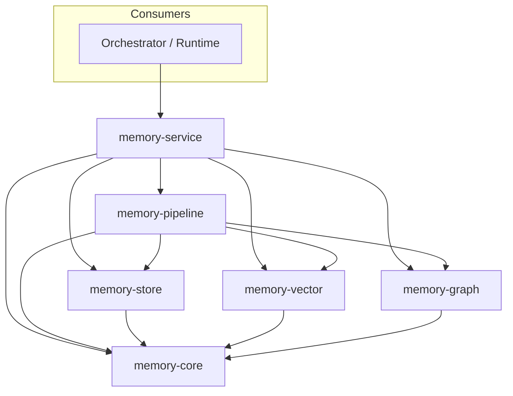

# kirakira-agent Memory Layer & State Store

Unified documentation for the **Memory Layer** and **State Store** that power **long-term memory**, **durable execution**, and **governed recall** for `kirakira-agent`. This plane complements the Policy Engine, Tracing & Audit, CLI, Gateway, and Registry subsystems.

See also the consolidated design note [`../kirakira-agent-memory.md`](../kirakira-agent-memory.md).

---

## Purpose

The Memory Layer and State Store together provide:

- **Cross-session knowledge** — retrievable facts, observations, beliefs, and preferences scoped by tenant, workspace, and namespace.
- **Temporal correctness** — bi-temporal modeling so recalls can answer “what was true then” and “what did we know then.”
- **Evidence vs. inference** — facts and episode evidence stay distinct from beliefs and consolidated observations, enabling safe redaction, contradiction handling, and explainable retrieval.
- **Durable execution** — checkpoints and artifact manifests align with LangGraph-style thread/run persistence for interrupt, resume, and replay.
- **Progressive context** — recall compiles token-budgeted **L0–L3** context (OpenViking-style context filesystem) instead of dumping opaque chunk lists into prompts.

**Orchestrators and runtimes MUST NOT** talk to vector, graph, or blob stores directly. All access goes through the **Memory API** (`MemoryService`), with Policy (`memory.read` / `memory.write` / `memory.forget` / `checkpoint.restore`, etc.) and tracing hooks applied at the boundary.

---

## Design principles

| Principle | Summary |
|-----------|---------|
| **Postgres as system-of-record** | Authoritative rows for `memory_records`, episodes, checkpoints, artifacts, policy decisions, deletion jobs, and audit references. Vector/graph/blob are **materialized indexes**. |
| **Async materialization** | Synchronous path commits **Postgres + transactional outbox**; workers embed, upsert vectors/edges, and write blobs **asynchronously** via Redis Streams (or equivalent). |
| **Transactional outbox** | A single database transaction writes domain rows **and** outbox events so downstream failures never create “index-without-row” ghosts. |
| **Bi-temporal data model** | **Valid time** (`valid_from` / `valid_to`) and **transaction time** (`tx_from` / `tx_to`) separate event history from ingestion and correction history (Zep/Graphiti-style temporal KG). |
| **Evidence / inference separation** | **Facts** are evidentiary (often SPO triples tied to episodes); **beliefs** are inferential with support/refute chains; **observations** bridge structured summaries of facts. |
| **L0–L3 context filesystem** | Recall output is structured as layered content (abstract → overview → evidence cards → raw pointers), not a single flat string. |

---

## Package architecture

Six packages implement the plane. Names are illustrative (`@kirakira/memory-*` or `packages/kirakira-memory-*`); align with the monorepo naming convention in use.

| Package | Role |
|---------|------|
| **`memory-core`** | Shared types: `MemoryRecord`, requests/receipts, `MemoryBundle`, retrieval traces, namespace/kind enums, policy-facing DTOs. **No** I/O implementations. |
| **`memory-store`** | Postgres system-of-record: `memory_records`, episodes, checkpoints, outbox, deletion jobs; migrations; advisory locks where needed. |
| **`memory-vector`** | Qdrant / pgvector (and optional Milvus) adapters: collections, named vectors (dense + sparse), payload indexes, idempotent upserts. |
| **`memory-graph`** | Neo4j / Kuzu / AGE adapters: node/edge upsert, temporal properties, Cypher (or equivalent) query surfaces for the recall planner. |
| **`memory-service`** | **`MemoryService` implementation**: Policy gate integration, orchestration of retain/recall/reflect/checkpoint/restore/forget/export/explainRetrieval. |
| **`memory-pipeline`** | Async workers: outbox consumers, embedding batching, graph materializers, blob post-processing, forget propagation, reconciliation jobs. |

### Package dependency graph

**Dependency rules:**

- **`memory-core`** depends on nothing memory-specific below it (only generic util/libs).
- **`memory-store`**, **`memory-vector`**, **`memory-graph`** each depend on **`memory-core`** only for types/protocols.
- **`memory-pipeline`** depends on **store + vector + graph + core** and must remain deployable as separate worker processes.
- **`memory-service`** is the **single entry** for synchronous API calls from the agent stack.

---

## Key references

These inform the API split, retrieval routes, retention policy, checkpointing, and temporal graph modeling:

| Source | Relevance |
|--------|-----------|
| **Hindsight** (retain / recall / reflect) | Minimal API surface: retain, recall, reflect; multi-strategy recall; traceability. |
| **Nemori** (predict–calibrate) | Episode segmentation and **selective retention** — prioritize material that violates predictions of current memory. |
| **Mnemis** (dual-route retrieval) | Pair **similarity** (System-1) with **global / hierarchical graph** selection (System-2). |
| **Zep / Graphiti** (temporal KG) | Episodes, facts, temporal validity on edges/nodes, point-in-time mental models. |
| **OpenViking** (context filesystem) | L0/L1/L2 progressive loading; “index holds references, content lives in a filesystem.” |
| **LangGraph** (checkpoint persistence) | Durable runs, thread IDs, checkpoint steps, interrupt/resume semantics. |

---

## Documentation map（章节索引）

| Chapter | Path | Topics |
|---------|------|--------|
| **01** | [`01-architecture/`](01-architecture/) | 分层架构、数据流、一致性 |
| **02** | [`02-data-model/`](02-data-model/) | `MemoryRecord`、Episode、事实/信念/观察、图与向量 schema |
| **03** | [`03-memory-api/`](03-memory-api/) | `MemoryService` 八大方法 |
| **04** | [`04-retain-pipeline/`](04-retain-pipeline/) | 留存管道、分类、分段、抽取、predict–calibrate、证据绑定 |
| **05** | [`05-recall-pipeline/`](05-recall-pipeline/) | 四路召回、融合重排、预算编译 |
| **06** | [`06-reflect-pipeline/`](06-reflect-pipeline/) | 反思、观察合并、信念、矛盾解决 |
| **07** | [`07-context-filesystem/`](07-context-filesystem/) | L0–L3 上下文文件系统 |
| **08** | [`08-store-layer/`](08-store-layer/) | Postgres、Redis、Blob、Outbox |
| **09** | [`09-vector-layer/`](09-vector-layer/) | Qdrant、pgvector |
| **10** | [`10-graph-layer/`](10-graph-layer/) | Neo4j、Kuzu |
| **11** | [`11-checkpoint-restore/`](11-checkpoint-restore/) | Checkpoint、restore、时点查询、event-store 兼容 |
| **12** | [`12-governance/`](12-governance/) | forget、export、PII、WORM 审计 |
| **13** | [`13-testing/`](13-testing/) | 测试策略、Compose 基础设施、基准与 SLO |
| **14** | [`14-performance/`](14-performance/) | 性能目标、容量规划、扩展策略 |

