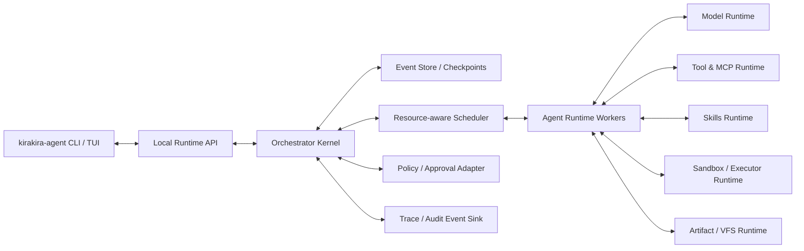

# kirakira-agent Orchestrator Kernel 与 Agent Runtime 完整落地方案

## 研究结论

你给出的方向基本正确，但要把它从“概念正确”推进到“工程可落地、能和顶尖 CLI 对齐”的产品级体系，最关键的不是继续往单一 agent loop 上堆功能，而是把 **Orchestrator Kernel** 做成“可恢复的任务图内核”，把 **Agent Runtime** 做成“事件化、可中断、可复用的执行层”。原因很直接：当前一线实现已经同时证明了四件事——复杂任务需要 durable execution 与 interrupt/resume；subagent 的核心价值是上下文隔离与并行；长会话必须靠工具检索、技能渐进加载和上下文裁剪控制 token；真正能用于生产的 agent 需要把沙箱、状态、审批和事件流做成运行时原语，而不是外围补丁。这个方向分别可以从 LangGraph 的 durable state graph/interrupt/subgraph、OpenAI Agents SDK 的 run/handoffs/sandbox/HITL、Claude Agent SDK 的 subagents 与 tool-context 管理、GitHub Copilot CLI 的 `/fleet` 与 steering/queueing、Codex 的 subagents/skills/approval overlay、Cursor 的 subagents 与 cloud agents、OpenCode 的 agents/skills、以及 AutoGen Core 与 OpenHands SDK 的 actor/event-sourced 设计中得到非常一致的印证。citeturn16view0turn16view1turn16view2turn16view3turn16view8turn16view9turn16view10turn16view11turn17view0turn17view4turn17view5turn17view7turn17view8turn17view9turn20view1turn21search1turn21search5turn23view0

因此，最终推荐形态不是“一个会调工具的大模型”，而是下面这个组合：

**结论一句话**：kirakira-agent 应把 Kernel 做成 **LangGraph-compatible 的任务图+checkpoint 语义**，把状态落地为 **OpenHands 风格的 event-sourced run log**，把调度做成 **AutoGen 风格的 actor-style async bus**，把执行做成 **ReAct-style turn loop + sandbox/tool/skills/model/artifact/interrupt primitives**；subagent 必须默认是**运行时动态生成的 ephemeral worker**，而不是预设角色清单。citeturn16view0turn16view1turn17view9turn20view1turn7search0turn32view0

## 设计基线与外部参照

现代 agent 编排并不是“单轮推理 + 下一个工具”的简单递归。ReAct 证明了 reasoning 与 acting 的交错循环是 agent 的基础形态；Plan-and-Solve 与 Tree of Thoughts 进一步说明，复杂任务需要显式规划、分解、分支选择与回溯；LLMCompiler 则把这种分解推进到了工程可执行的层次：Planner 生成带依赖关系的任务 DAG，Task Fetching Unit 在依赖就绪时把任务送入 Executor 并并发执行；AFlow 又把“工作流生成”本身视为搜索问题，说明 task graph 不只是实现方式，也是可优化对象。对 kirakira-agent 来说，这意味着 **Runtime 可以保留 ReAct 作为单个 worker 的局部执行语义，但 Kernel 必须采用 task graph 作为全局执行语义**。citeturn7search0turn7search1turn7search2turn30view0turn31view0

从产品侧看，顶尖 CLI 已经收敛到同一方向。GitHub Copilot CLI 的 `/fleet` 明确由主 agent 分解计划、判断依赖并让 subagent 并发执行；OpenAI Agents SDK 同时支持 handoff 与 agents-as-tools 两类编排模式；Claude Agent SDK、Codex、Cursor 都把 subagent 作为上下文隔离和并行处理的基础能力；Cursor 又进一步把长时任务放到隔离 VM 中异步运行；Copilot SDK 则把 mid-turn steering 与 FIFO queueing 做成了正式会话语义。也就是说，kirakira-agent 若要“对齐顶尖 CLI”，必须原生支持 **前台同步、同会话排队、后台异步、远程委托** 四种运行模式，而不是只做 blocking 的前台 loop。citeturn17view0turn16view10turn16view8turn17view4turn21search1turn21search5turn23view0turn18view8turn18view10

另一个关键基线是“尽量单 agent，必要时再拆分”。OpenAI 的官方实践指南建议先最大化单 agent 能力，只有当 prompts 复杂到难维护、工具过载、或工具选择稳定性不足时，再引入多 agent；这与多 agent 综述论文对复杂度、通信与评测难度的总结基本一致。kirakira-agent 因而不应该把“多 agent”做成默认人格剧场，而要把它做成 **由 Kernel 在任务图层面按需触发的结构化优化手段**。citeturn32view0turn30view2

## Orchestrator Kernel

Orchestrator Kernel 的职责不是“替模型思考”，而是把 **用户目标编译成一个可恢复、可审核、可资源调度、可增量重规划的运行图**。这个图至少要覆盖六类节点：`plan`、`subagent`、`tool/mcp`、`skill-load`、`approval/interrupt`、`merge/synthesize`。边则至少要区分 `depends_on`、`fanout`、`join`、`blocks_on_approval`、`supersedes`、`artifact_flow` 六种语义。这样设计是因为 LangGraph 已经证明 subgraph 是构建多 agent 系统、复用节点群和分团队开发的自然抽象；LLMCompiler 证明 DAG 依赖与占位符替换适合自然语言任务分解；OpenAI 的 manager pattern 与 handoff pattern 证明“中央协调”和“转移所有权”必须在图层上同时建模，而不是只在 prompt 里隐式完成。citeturn16view3turn30view0turn16view10turn18view0turn32view0

Kernel 内部建议拆成以下原生模块，而不是一团 while-loop 逻辑。**Goal Compiler** 负责把 prompt、workspace、已知 artifacts、历史中断点编译成初始 `RunPlan`；**Plan Normalizer** 把自然语言计划压成结构化 `TaskGraph IR`；**Dependency Resolver** 做 artifact binding、占位符解析和 join barrier 构造；**Policy Preflight** 在真正执行前预判哪些边会产生审批；**Scheduler** 维护 ready queue、resource budget 和 backpressure；**Checkpoint Manager** 在 superstep 边界保存状态；**Merge Engine** 把子任务结果合并为父任务的结构化摘要、patch proposal 或 artifact refs；**Control Inbox** 接收来自 CLI 的 steer、queue、approve、reject、cancel、drain、resume。这个切法同时吸收了 LangGraph 的 graph/checkpointer/interrupt 语义、Copilot 的 steering/queueing 语义、以及 OpenHands 把核心 agent logic 与 CLI/Web/API 分离的经验。citeturn16view1turn16view2turn23view0turn20view0turn20view1

最重要的实现选择，是把 **图语义** 与 **状态持久化语义** 分开：图层面采用 LangGraph 风格的 `StateGraph + subgraph + interrupt` 思想；状态层面采用 OpenHands V1 论文明确主张的 **event-sourced state model with deterministic replay**。这样做有两个直接收益。第一，CLI、Web、API 共享同一条事件流，前端只需要回放 run log 就能恢复时间线；第二，Kernel 可以把“物化状态”视为 event projection，把“恢复”视为 replay，而不是把数据库中的散乱状态拼回内存对象，这对 crash recovery、审计、diff review、resume 都更稳定。citeturn20view1turn20view0turn16view1turn16view2

Kernel 的 checkpoint 语义建议也直接借鉴 LangGraph 的分级 durability：`exit`、`async`、`sync` 三档。对 kirakira-agent 来说，建议默认不是最激进的 `sync`，而是 **对读密集任务用 `async`，对高风险写操作所在 superstep 强制提升到 `sync`**。这样能兼顾性能与一致性；同时所有可能重试的 side effects 必须带 idempotency key，因为 LangGraph 的文档明确指出 side-effecting operations 需要幂等设计，而且 interrupt 恢复时节点会从中断所在节点起点重新执行。citeturn24view0turn24view1turn25view1

Kernel 还应该支持 **cooperative drain**，而不是把 cancel 设计成粗暴 kill。LangGraph 的 drain 语义是在 superstep 之间生效、不抢占已在执行的节点；这类设计非常适合 CLI：用户按下 stop 时，系统先设置 `drain_requested`，等待当前最小安全边界结束，再形成可恢复 checkpoint。对 runner、sandbox 和 MCP 连接的资源清理也更可控。kirakira-agent 的 `/stop`、批量 cancel、退出 TUI、进程 SIGTERM 都应该统一走 drain path。citeturn24view1

## Dynamic Subagent 与资源调度

subagent 设计必须严格遵守你前面定下的原则：**模板可以存在，运行中的 subagent 不能是预设死角色，而必须是任务驱动的动态实例**。这一点在产品和框架两边都有支撑。Claude Agent SDK 允许在 query 时动态构造 AgentDefinition，并根据运行时风险级别切换 prompt、tools 和 model；Cursor 把 subagents 定义为“独立处理父任务离散部分的并行 agent”，具有独立上下文、tool access 和 model；Codex 则把 subagent workflow 视为可并发生成与汇总结果的机制。对 kirakira-agent 来说，这意味着 `.kirakira/agents/templates/` 只能提供 profile hint，真正落地时必须由 **Subagent Factory** 产出 `EphemeralAgentSpec`。citeturn26view1turn21search2turn21search5turn17view4

正确的父子边界应该是“默认隔离、显式注入、结构化回传”。Claude 的 subagent 文档明确写到：每个 subagent 都在自己的 fresh conversation 中运行，父会话不会把完整上下文直接塞给它，中间工具调用与结果留在子上下文里，父只拿到最终消息；Deep Agents 也把 subagents 的核心价值定义为 context quarantine，并强调主 agent 应只接收简洁结果而不是所有中间工具输出。kirakira-agent 应把这条原则升级成运行时契约：**父传给子的只有 task brief、必要 file/artifact refs、明确 decisions、授权后的 tool/skill/model scope；子回给父的只有 typed summary、artifact refs、patch proposal、审计元数据**。citeturn26view3turn27view0turn27view3

subagent 继承规则建议如下。默认继承 `workspace boundary`、`sandbox policy ceiling`、`trace context`、`run lineage`；不默认继承完整 transcript、已加载 skills、全部 MCP servers、全部工具定义。Claude 和 Deep Agents 都支持给不同子 agent 配不同 model/tools/skills/MCP servers，而 Codex 又表明 subagents 至少应继承当前 sandbox policy。最稳妥的落地是：**安全上限继承，能力集合重选**。也就是父的 sandbox ceiling 与 policy ceiling 是上限，但子能拿到的工具、MCP、skills、模型要重新经 Kernel 筛选。citeturn26view1turn26view3turn27view3turn17view4

调度器不要只做 FIFO，而要做 **resource-aware, dependency-aware, user-visible priority-aware scheduling**。来自当前产品和论文的启发很一致：LLMCompiler 的 Executor 适合在依赖就绪后并发执行独立任务；Copilot `/fleet` 由主 agent 评估可并行性并管理依赖；Cursor Cloud Agents 说明真正长时并行任务应放入独立环境；OpenAI Background mode 说明 reasoning tasks 可能持续数分钟，需要异步可靠地跑完。kirakira-agent 因此建议至少维护四类 budget：`model_budget`、`sandbox_slot_budget`、`mcp_qps_budget`、`artifact_io_budget`，再叠加 `interactive_priority`。排队规则应优先保证当前用户可见的前台任务，再调度后台子任务；join barrier 前的关键路径任务优先高于可延迟的旁路线任务。citeturn30view0turn17view0turn21search1turn18view2

运行模式建议统一成一个 `RunMode`，但分成四条执行 lane。**Foreground lane** 用于主线程可见迭代；**Queued lane** 用于同 session 的 follow-up tasks；**Background lane** 用于本机继续运行但不阻塞当前对话；**Delegated lane** 用于远程工作区或云端 runner。这里直接对应了 Copilot SDK 的 steering/queueing、Copilot CLI 的 autopilot 与 `/delegate`、OpenAI 的 Background mode、Cursor 的 cloud agents。这样一来，kirakira-agent 后续无论做本地 worktree 还是远程 subagent，都不需要重新发明 run model，只是换一个 worker backend。citeturn23view0turn18view8turn18view10turn18view2turn21search1turn21search3

用户与运行中任务的交互也必须是内核级能力，而不是 UI 小技巧。GitHub Copilot SDK 已经把 “immediate steering” 与 “enqueue queueing” 做成会话 API；Codex 则允许在当前任务运行时队列化 slash command；LangGraph 又提供了 interrupt/resume 和 cooperative drain。kirakira-agent 的 control plane 应因此统一暴露三种控制消息：`steer_now`、`enqueue_for_next_turn`、`request_drain`。审批、用户纠偏、附加约束、补充文件、提前终止，都只是在这三类消息上叠不同 payload，而不是额外做十套流程。citeturn23view0turn17view5turn24view1turn25view1

## Agent Runtime

Agent Runtime 负责“每个 worker 具体怎么跑”，因此它适合保留 **ReAct-style 的局部闭环**，但必须把工具、技能、模型、MCP、沙箱、artifact、interrupt/resume 都做成显式运行时原语。OpenAI 官方指南把 run 定义为“一个循环，直到 final output、无工具调用、错误或 turn limit 之类的退出条件”；ReAct 说明 reasoning 与 acting 交替是 agent 的有效基础。因此 kirakira-agent Runtime 最合理的 turn 结构是：**assemble working set → deliberate → choose action kind → execute → observe → compress → either continue or yield control**。这个 loop 发生在单个 worker 内，而不是整个系统层。citeturn32view0turn7search0

Runtime 的第一层是 **Context Assembler**。它不应该再把全部工具 schema、全部技能正文、全部历史 tool results 都塞进模型上下文。Anthropic 的官方工具上下文指南已经给出很清晰的生产建议：大工具集用 tool search，把 definitions 延迟到需要时再加载；能批处理的多步工具链改成 programmatic tool calling，在沙箱里一次脚本执行，避免多轮 `tool_use`/`tool_result` 往返；长会话要启用 context editing 去裁掉过时结果。kirakira-agent 应把这些做成 Runtime 内建策略，而不是用户手工优化项。citeturn18view4

因此，工具运行时建议采用 **two-stage tool access**。第一阶段只给模型一个 `tool_search`/`capability_search` 接口，以及小规模 top-k capability 卡片；第二阶段当模型或 Kernel 决定某个能力可用时，再把对应 schema、approval hint、风险标签、MCP route 注入当前 turn。由于 MCP 规范明确把 tools 定义为模型可发现、可调用的 schema 化能力，而交互界面并无强制规定，这种做法完全符合协议，也最适合大型企业工具池。对 kirakira-agent 来说，`top-k schema injection + policy-filtered capability search` 应该是默认值。citeturn17view11turn22search4turn22search7

技能运行时更应该坚定采用 **progressive disclosure**。Microsoft、Claude、Codex、OpenCode 的官方文档都已经收敛到同一设计：启动时只读取 skill 的元数据或极短描述；匹配到时才读取完整 `SKILL.md`；再需要时才访问脚本、references 与 assets。Codex 甚至明确给出初始 skill 列表预算大约为上下文窗口的 2% 或 8,000 字符上限。kirakira-agent Runtime 因而应内置三层 skill 状态：`advertised`、`loaded`、`materialized`。其中 `advertised` 只进 skill index，不进主上下文正文；`loaded` 只拉 `SKILL.md`；`materialized` 才允许脚本、dependency 和 resource 真正执行。citeturn18view5turn18view6turn29view0turn29view1turn29view2turn17view8

模型运行时不应只做 provider passthrough，而应显式区分 supervisor、planner、executor、reviewer、summarizer、router 六类 workload。OpenAI 的实践指南明确建议先用强模型建立准确率基线，再逐步把简单工作替换成更小更快的模型；Claude 和 Deep Agents 的 subagent 配置也都支持 per-agent model override。对 kirakira-agent，这意味着主 supervisor/merge/review 可以用强模型，fan-out 的检索型、分类型、初步分析型 worker 可以用快模型，必要时再在 merge/review 阶段升级。这样既贴合当前主流产品，也更方便后续接本地模型与企业私有模型。citeturn32view0turn26view1turn27view3

沙箱运行时建议采用 **harness-outside / workspace-inside** 的清晰边界。OpenAI 的 Sandbox Agents 文档明确把 agent harness 与 provider-specific sandbox compute 分开：harness 在你自己的基础设施里做编排，sandbox 负责有状态执行；OpenHands Runtime 则把 Docker runtime 明确成安全执行 agent actions 的核心组件；SWE-agent 论文进一步说明，agent-computer interface 本身会显著影响性能。kirakira-agent Runtime 因而应把 shell、package install、browser/computer use、服务端口、文件系统写入都视为 `WorkspaceExecutor` 的职责，而不让模型 SDK 直接接管本机环境。citeturn16view11turn17view10turn33view0

Artifact/VFS 运行时要与对话上下文严格解耦。中间草稿、CSV、JSONL、截图、diff、生成网页、测试日志、图谱提案都应该优先落成 artifact，再由 Runtime 将其索引成 `artifact_ref`，而不是把原文塞回聊天上下文。OpenAI 的 Sandbox guide 明确指出，当任务依赖目录、文件写入、可复查 artifacts、端口暴露、或暂停后继续在同一 workspace 中恢复时，应进入 sandbox/workspace 模式；OpenHands 也把 workspace 抽象视为让同一 agent 在本地原型与远程容器中切换的关键。对 kirakira-agent 来说，“artifact first, prompt second” 会比“prompt 吞一切”稳定得多。citeturn16view11turn20view0turn28view2

interrupt/resume 则必须被 Runtime 当作一级能力。LangGraph 的中断语义很适合直接借鉴：中断点提交 checkpoint，`thread_id` 是持续性指针，中断 payload 必须 JSON-serializable，恢复时节点从中断所在节点起点重跑；OpenAI HITL 也把 sensitive tool call 的审批实现成可序列化的 RunState interruption。落到 kirakira-agent，就是所有审批、人工修改、外部 webhook 回调、配额等待、云端子任务回收都统一表示成 `InterruptToken + ResumePayload`，而不是各写一套特殊状态机。citeturn25view0turn25view1turn25view2turn18view1

这也直接决定了写操作语义：kirakira-agent 不应承诺“神奇的 exactly-once”，而应做 **intent log + idempotency key + side-effect taskification**。因为一旦恢复时节点会重跑，任何把副作用与推理揉在一起的节点都可能重复触发外部写入。LangGraph 官方明确建议把可能产生副作用的操作做成幂等、并用 task 结构化，写操作要么提前检查 receipt，要么外部系统支持幂等键。kirakira-agent Runtime 应把 file patch、database mutation、graph write、ticket create、PR create 这类动作全部包成 `CommittedAction`，执行前先写 intent，执行后回填 receipt。citeturn24view0turn25view1

## 前后端连通与会话协议

为了真正做到“前后端连通”，kirakira-agent 不应把 CLI 和编排/执行塞进同一进程的共享内存玩具，而应采用 **local runtime daemon + typed event stream + typed control channel**。OpenHands 的 SDK/CLI/GUI 分层和共享基础件的做法、GitHub Copilot SDK 的 session events/steering/queueing、以及 LangGraph/OpenAI 的可序列化 run state 共同说明：前端最稳的角色是 **纯渲染与控制器**，后端最稳的角色是 **run owner**。因此 CLI/TUI 最好通过 UDS 上的 gRPC 或 WebSocket/SSE 连接本地 `kirakira-agentd`。citeturn20view0turn20view1turn23view0turn23view1turn18view1

事件协议建议做到完全可回放。最小事件集应包括：`run.started`、`plan.compiled`、`graph.normalized`、`task.ready`、`task.started`、`subagent.spawned`、`tool.search.requested`、`tool.selected`、`tool.call.started`、`tool.call.completed`、`skill.advertised`、`skill.loaded`、`sandbox.session.opened`、`artifact.created`、`approval.requested`、`approval.resolved`、`interrupt.raised`、`checkpoint.saved`、`merge.proposed`、`merge.applied`、`run.completed`、`run.failed`、`run.drained`。TUI 的 timeline、subagent tree、approval overlay、cost 面板、resume 历史，本质都只是这些事件的不同 projection。这个思路与 OpenHands 的 event-sourced state、Copilot 的 session event 模型、LangGraph 的 checkpoint/replay 是一致的。citeturn20view1turn23view1turn16view1turn25view0

控制协议则建议只保留少数高价值消息：`submit_prompt`、`steer_now`、`enqueue_prompt`、`approve`、`reject`、`provide_input`、`request_drain`、`cancel_hard`、`resume_run`、`inspect_thread`。其中 `steer_now` 与 `enqueue_prompt` 直接对齐 Copilot SDK 的 immediate/enqueue 两种语义；`approve/reject/provide_input` 对齐 HITL/interrupt；`request_drain` 对齐 cooperative stop；`inspect_thread` 对齐 Codex 中从 approval overlay 跳到对应 agent thread 的体验。这样 CLI 的 `/stop`、`/tasks`、审批 UI、后台任务列表都能落在统一的 API 表面。citeturn23view0turn18view1turn17view4

前端展示上，Kernel 和 Runtime 的联动应当是可解释而不是“黑盒跑完再吐结果”。顶尖 CLI 已经给出了很明确的交互基线：Copilot 把 `/fleet`、autopilot 和 steering 暴露为 session-visible 模式；Codex 在运行中允许排队 slash commands，并能从 approval overlay 回到具体 subagent thread；Cursor 把 subagents 与 cloud agents 作为并行任务窗口；OpenCode 允许主 agent 与 subagent 直接切换；Claude/Deep Agents 把子任务作为独立上下文执行。kirakira-agent TUI 因而应该把 **任务图、运行队列、子 agent lineage、审批来源、artifact/diff、checkpoint 恢复点** 全部可视化，而不是只显示聊天气泡。citeturn17view0turn17view5turn17view4turn21search5turn17view7turn16view8turn27view0

## 实施路线与验收标准

落地顺序上，建议先做 **单 supervisor 的 durable runtime**，再做 task graph，再做动态 subagent，再做远程/云端 lane，最后优化 workflow search。

你需要保证四个硬能力：`RunState + Checkpoint`、`Interrupt/Resume`、`sandboxed file/bash/artifact runtime`、`tool search + skill progressive disclosure`。只要这四个能力做对，kirakira-agent 就已经超过大多数“prompt 套壳型 agent”。然后需要把 Plan Compiler 与 `TaskGraph IR` 接上，并引入 ready queue、fan-out/join、结果合并器。然后进一步加入动态 subagent factory、background/delegated lane、资源调度和 lineage UI。然后引入更先进的 workflow optimization，例如把 AFlow 的自动工作流搜索当成离线 eval 或 planner fine-tuning 工具。citeturn18view4turn29view0turn29view3turn30view0turn31view0

验收标准不应该只看“能不能跑通一个 demo”，而必须覆盖恢复、一致性、安全和资源效率。建议至少跟踪这些指标：**checkpoint 恢复成功率**、**重复副作用率**、**前台 steer 生效延迟**、**队列任务 FIFO 正确率**、**subagent 上下文污染率**、**artifact 可追溯率**、**审批后恢复成功率**、**平均工具 schema 注入 token 占比**、**skill 初始广告区 token 占比**、**sandbox 启动成功率**。其中安全方面，至少应持续用 AgentDojo 做 prompt-injection 与 untrusted tool-data 测试，用 ToolEmu 补足长尾高风险工具情境，用 SWE-agent/OpenHands 风格的软件工程任务评估真实执行质量。citeturn30view4turn30view5turn33view0turn20view1

最终推荐的落地判断可以概括为：**Kernel 选“任务图 + 事件溯源 + actor 调度”，Runtime 选“ReAct worker + tool search + skill progressive disclosure + sandbox workspace + interrupt/resume”，subagent 选“动态生成、隔离上下文、结构化回传”，前后端选“runtime daemon + typed event/control protocol”**。这套方案与 LangGraph、OpenAI Agents SDK、Claude Agent SDK、GitHub Copilot CLI/SDK、Codex、Cursor、OpenCode、AutoGen、OpenHands 以及近两年的核心论文所共同指向的方向是一致的，同时也最符合你对 kirakira-agent “上接 CLI、下接 registry/gateway/config/policy/trace、未来可自然扩展到并行或异步 subagent”的总体目标。citeturn16view0turn16view2turn16view8turn16view10turn17view0turn17view4turn17view5turn17view7turn17view9turn20view1turn21search1turn21search5turn23view0turn30view0turn31view0