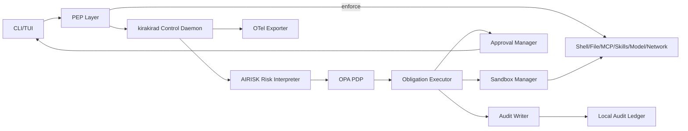
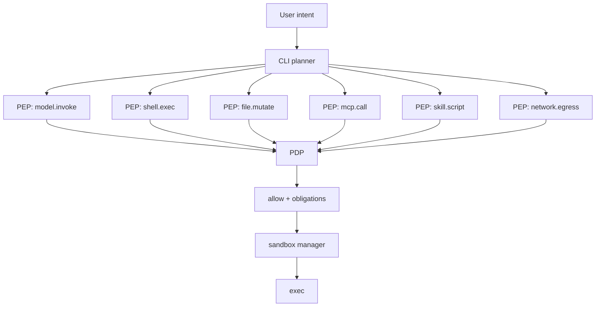
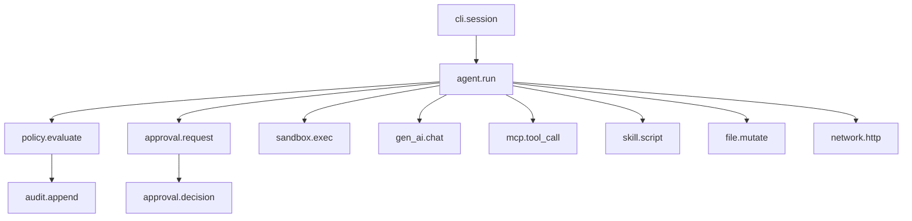
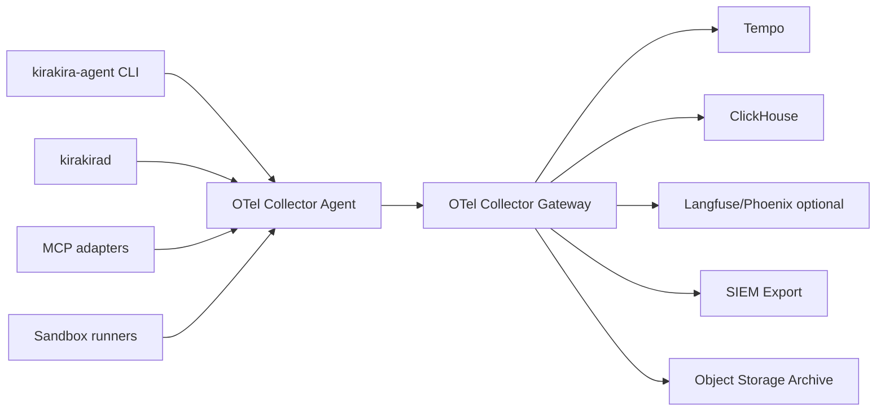

# kirakira-agent CLI 的 Policy Engine 与 Tracing & Audit 落地方案

## 执行摘要

面向企业级 CLI 代理，**Policy Engine** 和 **Tracing & Audit** 不应被做成“附属功能”，而应成为 `kirakira-agent` 的本地控制中枢：前者负责“这一步能不能做、要不要审批、必须在什么沙箱里做、做完还要补哪些义务”；后者负责“这一步是谁发起的、依据什么被允许/拒绝、执行路径是什么、产生了哪些副作用、如何被复盘与对账”。当前主流 CLI/Agent 产品已经把这些控制做成一等能力：GitHub Copilot CLI 有工具可见性与 allow/deny 控制、会话内审批与 `/allow-all`/`/reset-allowed-tools`；Claude Agent SDK 明确了 hooks → deny → permission mode → allow → runtime callback 的权限判定顺序；Codex 默认采用工作区写入 + 关闭网络的 OS 级沙箱，并对越界写入、联网和带副作用的 app/MCP 工具做 on-request 审批；Gemini CLI 提供“sandbox expansion”，即在单次运行中按需扩大权限；OpenAI Agents SDK 与 Copilot SDK 则把 HITL 中断、状态恢复与 OpenTelemetry tracing 做成了标准能力。citeturn21view0turn21view1turn21view2turn30view0turn35view1turn34view0

本方案建议 `kirakira-agent` 采用**双层控制闭环**：CLI 进程内布置多个 **PEP**（Policy Enforcement Point，执法点），包括 shell、文件系统、MCP、skills 脚本、model 调用、网络出口、包安装等；本机启动一个轻量守护进程 `kirakirad` 作为 **控制代理**，内部包含 **AIRISK**（AI Risk Interpreter，AI 风险解释器）、**OPA PDP**（Policy Decision Point）、**Approval Manager**、**Sandbox Manager**、**Obligation Executor** 与 **Audit Ledger Writer**。所有高风险行为先被标准化为统一动作模型，再送入 AIRISK 做风险语义解释，再送入 OPA 做最终裁决；OPA 输出必须包含 effect、reason、obligations、approval requirements、sandbox profile、cacheability 等字段，CLI 只能执行经过 PDP 明确允许且义务已落地的动作。`kirakira-agent` 的默认姿态应是**deny-by-default、fail-closed、least-privilege、trace-by-default、content-capture-opt-in**。citeturn14search12turn14search23turn22view0turn22view1turn26view2

对 Tracing & Audit，方案建议采用 **OTel-first**：CLI、守护进程、MCP 适配层、skills 执行器、sandbox、审批流全部产出 OTLP traces/logs/metrics；资源属性与 span 属性优先采用 OpenTelemetry 语义约定与 GenAI 语义约定，必要时补充 `kirakira.*` 自定义命名空间；同时在本地维护一套**只追加审计账本**，以 JSON Lines + BLAKE3 哈希链 + 周期性 checkpoint 的方式形成不可篡改的本地事实源。观测后端支持两条路线：**LangSmith 路线**适合交付速度与 AI 运维体验优先；**自托管路线**建议使用 OTel Collector + Tempo + ClickHouse + Grafana，并根据需要叠加 Langfuse 或 Phoenix 用于 LLM/Agent 语义视图。LangSmith 已支持 OTel tracing 和自托管部署；Langfuse 是 OTel-native 且自托管架构明晰；Phoenix 提供 UI 与 OTLP collector；Jaeger 与 Tempo 都支持 OTel 生态，其中 Jaeger v2 已基于 OTel Collector 框架，Tempo 面向高规模 trace 存储更自然。citeturn22view7turn21view3turn25view0turn25view1turn25view4turn6search2turn6search7

最终落地结论很明确：`kirakira-agent` 不应该把“审批”“沙箱”“审计”“Tracing”拆成若干零散开关，而应把它们统一为**策略决定 + 义务执行 + 可验证审计**的一个完整控制面。这样做既能对齐 Codex / Copilot / Claude / Gemini 这些领先 CLI 的安全与交互模式，又能把 MCP、skills、包安装、模型调用、未来并行/异步 subagent 全部纳入同一治理框架。citeturn21view0turn21view1turn21view2turn30view0turn35view0turn35view1

## 设计目标与威胁模型

### 设计目标

本方案只覆盖 **CLI 层及其直接相邻的本地控制服务**，不扩展到更大范围的编排内核。设计目标是：

1. **企业级最小权限默认值**：工作区内读写、网络、MCP 副作用、外部文件访问、包安装、技能脚本执行必须分别受控，而不是一个 `--yolo` 风格总开关。当前主流 CLI 都已经把权限拆到工具、路径、网络和审批层面。citeturn21view0turn21view2turn30view0  
2. **规则式政策与 AI 语义解释协同**：Rego/OPA 负责可审计、稳定、确定性的最终裁决；AIRISK 负责把“看似不同、实则等价”的请求压缩成稳定语义输入，降低纯规则系统面对自然语言与工具参数时的脆弱性。OPA 本身就是为结构化输入的策略推理而设计。citeturn14search23turn14search12  
3. **端到端可追溯**：不仅要知道调用了哪个工具，还要知道判定输入是什么、风险解释是什么、审批内容是什么、最终副作用是什么。OpenAI Agents SDK、Copilot SDK、LangSmith 和 OTel 都已经把这类执行路径打通成可追踪对象。citeturn27search0turn34view0turn22view7turn5search3  
4. **MCP / skills / registry / model gateway 一体治理**：MCP 授权、skills 脚本、包源信任、模型与网络出口都必须进入同一 PDP，而不是各自散落在配置文件里。MCP 规范已把授权与 token audience 绑定、安全边界和 token passthrough 禁令写得很明确；skills 官方文档也强调它们应被当作第三方依赖来审查。citeturn22view3turn22view4turn10search2turn21view4

### 核心威胁面

针对 `kirakira-agent`，高优先级威胁面不是传统 CLI 的“命令输入错误”，而是**代理链路上的跨层复合风险**：

| 威胁面 | 典型入口 | 风险结果 | 首选控制 |
|---|---|---|---|
| Prompt injection / 受污染上下文 | Web 搜索结果、MCP 响应、skills 引用文档、README、issue、PR 评论 | 诱导工具滥用、越权写文件、外传数据 | AIRISK 风险解释、内容不可信标签、审批前展示来源、模型/工具隔离 |
| MCP token passthrough / audience 混淆 | MCP server 作为代理转发 OAuth token | 审计主体错位、控制绕过、数据外传 | audience 绑定校验、resource 参数、server-only tokens |
| 工具与脚本副作用滥用 | shell、apply_patch、skills 脚本、MCP write tools | 删除文件、推送代码、联网拉包、修改系统配置 | PDP + obligation + sandbox |
| 沙箱逃逸或边界失配 | bubblewrap 参数错误、宿主挂载过宽、网络未隔离 | 读取宿主敏感文件、横向移动 | 明确 profile、强制挂载策略、默认 network off、高危升级到 gVisor / microVM |
| 审批疲劳与“总是允许” | 高频重复请求、上下文不清晰 | 人工批准错误，策略名存实亡 | 指纹缓存、模板审批、风险摘要、到期撤销 |
| 供应链与配置篡改 | policy bundle、skills 包、MCP 配置、registry 包 | 策略被替换、能力被植入后门 | bundle 签名校验、SLSA provenance、审计账本校验 |
| 审计链被删改 | 本地日志可改写、trace 后端可删数据 | 无法追责与合规举证 | 本地 append-only ledger + checkpoint + 远端锚定 |

AgentDojo 证明了工具型代理容易被来自外部工具输出的 prompt injection 劫持；ToolEmu 进一步表明，长尾高风险失败在工具增强代理中是可量化且真实存在的。MCP 官方安全最佳实践明确禁止 token passthrough，并强调 token audience 校验与责任归属问题。gVisor 的安全模型指出，不同客户工作负载应运行在不同 sandboxes 中，而 bubblewrap 官方也明确说明它只是构造沙箱的低层工具，本身**不是**完整的安全策略。citeturn7search0turn7search5turn22view4turn22view3turn32view2turn32view0

### 总体威胁模型结论

`kirakira-agent` 的 Policy Engine 需要明确区分三类不可信对象：**不可信内容**（prompt / 文档 / 工具输出）、**不可信能力**（第三方 MCP / skills / shell 脚本）、**不可信执行环境**（包安装、联网、宿主文件系统）。任何一个维度超出当前会话信任边界，都不应由模型直接推进，而应通过 PDP 输出强制义务：切换沙箱、升级审批、压缩权限、只读预览、或直接拒绝。citeturn22view4turn10search2turn30view0turn21view2

## Policy Engine 设计

### 总体架构

推荐采用以下本地控制架构：



这里的关键是把执行路径拆成五个阶段：

1. **Normalize**：把 shell、MCP、skills、registry、model 调用规范化为统一动作模型。  
2. **Interpret**：AIRISK 结合工具注解、路径、网络域名、模型、资源类型做风险语义解释。  
3. **Decide**：OPA 用 Rego 对规范化输入做最终裁决。OPA 支持通过 bundles 下发策略与数据、通过 decision logs 记录决策、通过 signatures 验证 bundle 完整性。citeturn12search6turn22view1turn22view0  
4. **Obligate**：执行 OPA 输出的义务，比如“必须进 sandbox:workspace-write-net”“必须人工审批”“trace 仅保留 metadata”“审计中隐藏某些字段”。  
5. **Enforce**：PEP 才真正调用 shell / MCP / skills / model gateway，且只接受带 `permit` 的决定。

### PEP / PDP / AIRISK 的职责边界

**PEP** 只做三件事：拦截、提交、执行。它不能绕过 PDP 做本地“智能判定”。  
**PDP** 只做基于结构化输入的确定性判定。它不直接跑模型。  
**AIRISK** 不是“第二个审批器”，也不是“另一个 policy engine”；它的角色是把自然语言和复杂参数压缩成**可被 Rego 消化的稳定语义特征**，例如：

- “`npm install`” → `action_class=package_install`, `needs_network=true`, `writes=node_modules`, `supply_chain_risk=medium`
- “MCP tool `delete_issue_comment`” → `resource=github.comment`, `side_effect=true`, `destructive=true`
- “shell: `curl https://example.com/install.sh | bash`” → `network_fetch=true`, `pipe_to_interpreter=true`, `approval_floor=human`

这与 Claude 的 `canUseTool` 回调、OpenAI tools `needs_approval`、Gemini 的 sandbox expansion、Codex 的 on-request approvals 形成了统一抽象：模型可以提议动作，但控制系统必须先把动作转成稳定的审批/策略输入，再完成判定。citeturn35view0turn35view1turn30view0turn21view2

### 统一数据模型

下面给出建议的核心模型。它们不是外部标准，而是 `kirakira-agent` 应当采用的**内核契约**。

#### Policy input schema

```yaml
version: "kirakira.policyinput.v1"
request_id: "req_01JV..."
session_id: "sess_01JV..."
trace_id: "7d8f9b5ef4c8a0d1..."
timestamp: "2026-05-04T18:12:41.384Z"

principal:
  user_id: "u_123"
  org_id: "org_acme"
  roles: ["developer", "repo_writer"]
  groups: ["platform", "oncall"]
  authn_method: "sso"
  device_trust: "managed"
  interactive: true

workspace:
  workspace_id: "ws_abc"
  root: "/repo"
  vcs:
    provider: "git"
    branch: "feature/x"
    dirty: true
  labels:
    data_classification: "internal"
    repo_trust: "trusted"

action:
  kind: "tool.call"            # tool.call | file.write | shell.exec | model.invoke | package.install | network.request
  tool_type: "shell"           # shell | mcp | skill-script | file | model | registry
  tool_name: "bash"
  operation: "exec"
  raw:
    command: "npm install"
  normalized:
    command_ast_hash: "blake3:..."
    command_base: "npm"
    flags: ["install"]
    write_paths: ["/repo/node_modules", "/repo/package-lock.json"]
    read_paths: ["/repo/package.json"]
    network:
      required: true
      domains: ["registry.npmjs.org"]
      protocol: "https"

target:
  resource_type: "workspace.dependency"
  resources:
    - id: "/repo/package.json"
      owner: "org_acme"
      classification: "internal"

context:
  source: "interactive"
  invoker: "main-agent"
  subagent_id: null
  mcp_server:
    id: null
    issuer: null
    trust_tier: null
  skill:
    id: null
    version: null
    fingerprint: null
  model:
    provider: "openai"
    model: "gpt-5.2-codex"
  prior_decisions:
    fingerprint_hit: false
    approval_template_hit: false

risk:
  interpreter_summary: null
  signals: []
```

#### AIRISK structured output schema

```json
{
  "version": "kirakira.airisk.v1",
  "request_id": "req_01JV...",
  "classification": {
    "action_family": "package_install",
    "side_effect_level": "medium",
    "destructive": false,
    "network_required": true,
    "external_content_dependency": true,
    "secret_exposure_risk": "low",
    "workspace_escape_risk": "low",
    "supply_chain_risk": "medium"
  },
  "claims": [
    {
      "code": "PKG_INSTALL_WRITES_LOCKFILE",
      "severity": "low",
      "confidence": 0.99,
      "evidence": ["command_base=npm", "flag=install"]
    },
    {
      "code": "REQUIRES_NETWORK_EGRESS",
      "severity": "medium",
      "confidence": 0.97,
      "evidence": ["domains=registry.npmjs.org"]
    }
  ],
  "recommended_obligations": [
    "sandbox:workspace-write-net",
    "approval:human_if_untrusted_repo",
    "trace:redact_command_env"
  ],
  "canonical_fingerprint_material": {
    "action_family": "package_install",
    "write_paths": ["/repo/node_modules", "/repo/package-lock.json"],
    "network_domains": ["registry.npmjs.org"],
    "tool_type": "shell"
  }
}
```

AIRISK 的输出必须是**结构化 JSON**，不允许自由文本直接进入 Rego。它可以附带自然语言摘要给用户看，但进入 PDP 的必须是稳定字段。

#### Policy decision schema

```json
{
  "version": "kirakira.decision.v1",
  "decision_id": "dec_01JV...",
  "request_id": "req_01JV...",
  "effect": "allow", 
  "reason_codes": [
    "ROLE_REPO_WRITER",
    "PKG_INSTALL_ALLOWED_IN_TRUSTED_WORKSPACE"
  ],
  "policy": {
    "bundle_id": "bundle-2026-05-04.1",
    "revision": "sha256:...",
    "package": "kirakira.authz.main"
  },
  "approval": {
    "required": false,
    "mode": "none",
    "template_id": null,
    "cacheable": true,
    "ttl_seconds": 3600
  },
  "obligations": [
    {"type": "sandbox", "profile": "workspace-write-net"},
    {"type": "trace_redaction", "policy": "default_metadata_only"},
    {"type": "audit_append", "channel": "local-ledger"}
  ],
  "explain": {
    "summary": "Trusted repo dependency install allowed with network only to registry allowlist.",
    "matched_rules": ["kirakira.authz.allow.package_install_trusted"]
  }
}
```

#### Approval record schema

```yaml
version: "kirakira.approval.v1"
approval_id: "apr_01JV..."
status: "pending"              # pending | approved | denied | expired | revoked
scope: "session"               # once | session | workspace | policy-window
requested_at: "2026-05-04T18:12:44.000Z"
resolved_at: null
principal:
  user_id: "u_123"
  interactive: true
decision_id: "dec_01JV..."
fingerprint:
  exact: "b3:8c1f..."
  template: "b3:7ad1..."
request_summary:
  title: "允许 npm install 访问 npm registry 并写入 node_modules？"
  risk: "medium"
  requested_permissions:
    - "sandbox profile upgrade: workspace-write -> workspace-write-net"
    - "network domain: registry.npmjs.org"
resolution:
  outcome: null
  reviewer: null
  comment: null
```

#### Sandbox profile schema

```yaml
version: "kirakira.sandbox.v1"
name: "workspace-write-net"
platforms: ["linux", "macos", "windows"]
filesystem:
  root_mode: "workspace"
  read_only_mounts:
    - "/usr"
    - "/etc/ssl/certs"
  read_write_mounts:
    - "/repo"
    - "/tmp/kirakira"
  deny_paths:
    - "~/.ssh"
    - "~/.aws"
network:
  mode: "allowlist"
  domains:
    - "registry.npmjs.org"
    - "api.openai.com"
process:
  seccomp: "default-deny"
  max_cpu_seconds: 300
  max_memory_mb: 2048
  allow_exec:
    - "node"
    - "npm"
    - "python3"
secrets:
  exposed: []
egress_proxy: "http://127.0.0.1:18080"
copyout:
  require_post_review: true
```

### RBAC + ABAC 的推荐做法

权限模型不要只做角色，必须做 **RBAC + ABAC** 叠加：

- **RBAC** 负责粗粒度能力边界：`viewer`、`developer`、`repo_writer`、`security_reviewer`、`org_admin`。
- **ABAC** 负责动作上下文：仓库信任级别、数据分类、是否在工作区内、是否联网、MCP server 信任级别、skills 来源、模型提供方、时间窗口、交互/非交互、设备信任度。

OPA 天然适合结构化输入上的 ABAC；Cedar/Verified Permissions 也公开强调 RBAC 与 ABAC 可以组合，但在 `kirakira-agent` 本地 CLI 的实现上，OPA 的 bundle、decision log、masking、REST/Go SDK 与 CLI 生态适配更成熟，因此应以 OPA 为主。citeturn12search4turn12search1turn14search12

建议的授权矩阵：

| 维度 | 例子 | 用途 |
|---|---|---|
| Principal roles | `developer`, `security_reviewer` | 粗粒度允许项 |
| Workspace attrs | `repo_trust=trusted`, `classification=restricted` | 决定写入/外传门槛 |
| Tool attrs | `tool_type=mcp`, `destructive=true` | 强制审批 |
| Origin attrs | `skill.source=external`, `mcp.trust_tier=community` | 降低默认权限 |
| Environment attrs | `interactive=false`, `device_trust=unmanaged` | 非交互 fail-closed |
| Time / state attrs | `oncall=true`, `break_glass=false` | 运行时例外 |

### Rego bundle 组织方式

OPA bundles 是最适合 `kirakira-agent` 的策略分发单位；OPA 官方支持 remote bundles、decision logs、status 报告与 bundle 签名验证。citeturn12search2turn12search6turn22view0turn28search10

建议的 bundle 目录：

```text
kirakira-policy-bundle.tar.gz
├── .manifest
├── .signatures.json
├── /policy
│   ├── main.rego
│   ├── approvals.rego
│   ├── sandbox.rego
│   ├── obligations.rego
│   ├── logging.rego
│   └── masking.rego
├── /data
│   ├── roles.json
│   ├── repo_trust.json
│   ├── mcp_trust.json
│   ├── model_policies.json
│   ├── package_sources.json
│   └── org_defaults.json
├── /schemas
│   ├── policy_input.schema.json
│   └── decision.schema.json
├── /tests
│   ├── allow_shell_test.rego
│   └── deny_external_write_test.rego
└── /attestations
    ├── cosign.bundle.json
    └── slsa-provenance.json
```

这里建议做**双重完整性保护**：

- **OPA 原生签名**：使用 `.signatures.json`，由 OPA 在 bundle 激活前验证；验证失败时 OPA 会继续使用现有 bundle，并上报 activation failure。citeturn22view0  
- **供应链签名与 provenance**：对 bundle 本体使用 Sigstore/Cosign 签名，并提供 Sigstore bundle 与 SLSA provenance，确保“谁构建、谁签名、产物是否被替换”可验。Sigstore bundle 文档与 Cosign verify 已给出标准验证流程；SLSA 则给出供应链完整性等级框架。citeturn3search0turn3search7turn3search16turn3search1

### 示例 Rego

下面是建议的核心判定风格：**deny-first + obligations**。

```rego
package kirakira.authz.main

import rego.v1

default permit := false
default approval_required := false
default sandbox_profile := "read-only"
default reason_codes := []

# Destructive MCP tools always require approval.
approval_required if {
  input.action.tool_type == "mcp"
  input.action.normalized.destructive == true
}

# Default workspace shell install flow.
permit if {
  input.principal.interactive == true
  "developer" in input.principal.roles
  input.workspace.labels.repo_trust == "trusted"
  input.action.kind == "tool.call"
  input.action.tool_type == "shell"
  input.action.normalized.command_base == "npm"
  input.action.normalized.network.required == true
  every d in input.action.normalized.network.domains {
    d in data.package_sources.npm_allowlist
  }
}

sandbox_profile := "workspace-write-net" if {
  permit
  input.action.normalized.network.required == true
}

reason_codes := [
  "ROLE_DEVELOPER",
  "TRUSTED_REPO",
  "NPM_ALLOWLIST_DOMAIN"
] if permit

decision := {
  "effect": iff(permit, "allow", "deny"),
  "approval_required": approval_required,
  "sandbox_profile": sandbox_profile,
  "reason_codes": reason_codes,
  "obligations": [
    {"type": "trace_redaction", "policy": "default_metadata_only"},
    {"type": "audit_append", "channel": "local-ledger"}
  ]
}
```

OPA 也支持在 decision logs 上传前对敏感字段做 masking，官方约定使用 `data.system.log.mask` 返回 JSON Pointer 集合。这个能力应被直接用于本地/远端 decision log 的二次脱敏。citeturn22view1

```rego
package system.log

import rego.v1

mask contains "/input/action/raw/env" if true
mask contains "/input/action/raw/secrets" if true
mask contains "/result/explain/raw_prompt" if true
```

### 审批 UX 与命令设计

审批体验必须同时满足三点：**足够快、足够清晰、可撤销可复用**。参考 Copilot 的“本次允许 / 会话允许”、Claude 的 runtime callback、OpenAI HITL 的可暂停与恢复、Gemini 的 sandbox expansion、Codex 的 `/permissions`，建议 `kirakira-agent` 采用统一审批卡片。citeturn21view0turn35view0turn35view1turn30view0turn21view2

#### TUI 审批卡片

```text
┌ Pending Approval ──────────────────────────────────────────────────────────┐
│ Action      shell.exec                                                    │
│ Command     npm install                                                   │
│ Risk        MEDIUM  •  network egress • supply chain write                │
│ Sandbox     workspace-write  ->  workspace-write-net                      │
│ Targets     /repo/node_modules, /repo/package-lock.json                   │
│ Domains     registry.npmjs.org                                            │
│ Why         Trusted repo + developer role; requires network allowlist     │
│ Policy      bundle-2026-05-04.1 / kirakira.authz.allow.package_install_trusted │
│ Trace       7d8f9b5ef4c8a0d1                                               │
│                                                                         │
│ [y] once  [a] this session  [w] this workspace  [n] deny  [e] edit msg    │
│ [p] policy diff  [s] sandbox detail  [t] trace preview  [r] reason        │
└────────────────────────────────────────────────────────────────────────────┘
```

#### CLI 命令建议

```bash
# 评估一个动作，不执行
kirakira policy eval --tool shell --cmd 'npm install' --json

# 显示当前 bundle、签名与校验状态
kirakira policy status
kirakira policy verify-bundle

# 查看待审批项
kirakira approval ls --pending
kirakira approval show apr_01JV...

# 审批 / 拒绝
kirakira approval approve apr_01JV... --once
kirakira approval approve apr_01JV... --session
kirakira approval approve apr_01JV... --workspace
kirakira approval deny apr_01JV... --reason "改用 pnpm，并且不要联网到非 allowlist 域名"

# 撤销缓存审批
kirakira approval revoke --fingerprint b3:8c1f...
kirakira approval prune --expired

# 解释为什么允许/拒绝
kirakira policy why --decision dec_01JV...
kirakira policy replay --audit-event evt_01JV...
```

### 审批缓存与指纹算法

审批缓存不能按“原始命令字符串”做哈希，否则既不稳定，也很容易被绕过。推荐双哈希：

- **exact fingerprint**：精确动作，用于 `--once`
- **template fingerprint**：去掉临时值后的审批模板，用于 `--session` / `--workspace`

#### 指纹算法

```text
1. 输入动作标准化为 Canonical Action IR
2. 路径一律 canonicalize：
   - 绝对路径
   - 解析 symlink
   - workspace 内路径转相对根
3. shell 命令解析为 AST：
   - command_base
   - subcommands
   - flags
   - pipeline / redirection / heredoc / subshell
   - interpreter handoff (curl|bash, python -c 等)
4. 提取 policy-salient features：
   - tool_type / action_family
   - read_paths / write_paths / network_domains
   - destructive / package_install / vcs_push / secret_touch
   - sandbox_profile_requested
   - principal role-set
   - workspace trust tier
5. 删除易变字段：
   - request_id / timestamp / nonce / temp filename
   - 日志行号 / span_id / trace_id
6. 采用 RFC 8785 风格 canonical JSON 序列化
7. exact = BLAKE3-256(full_canonical_json)
8. template = BLAKE3-256(canonical_json_without_ephemeral_and_low_risk_literals)
```

#### 缓存策略

| 范围 | 命中条件 | 典型用途 |
|---|---|---|
| once | exact 完全匹配 | 单次联网、单次删除 |
| session | template 匹配 + 相同 principal + 相同 workspace | 本次会话重复测试 |
| workspace | template 匹配 + 相同 principal/group + 相同 repo trust | 受控仓库内重复构建 |
| none | destructive/high-risk | 删除、push、外部写入、未知 MCP |

Approval sticky decision 的实现方式可以参考 OpenAI HITL 对 run-state 的持久化做法：审批决定可以与运行状态一起序列化与恢复，但必须限定在同一 run / scope 内，而不能无界扩散。citeturn35view1

### Sandbox profiles 与执法点

#### 推荐 profile

| Profile | 用途 | FS | Network | 适用动作 | 默认审批 |
|---|---|---|---|---|---|
| `plan-only` | 纯分析/解释 | 只读 workspace | off | read/glob/grep/model plan | none |
| `read-only` | 安全默认 | 只读 workspace + temp | off | 大多数问答、代码理解 | none |
| `workspace-write` | 工作区内改写 | RW workspace | off | edit/apply_patch/test without fetch | on-request for out-of-workspace |
| `workspace-write-net` | 依赖安装/联网测试 | RW workspace | allowlist | npm/pip/cargo install, API calls | on-request |
| `mcp-read` | 读取型 MCP | no local write | per server policy | issues/list/search | none / auto |
| `mcp-write` | 带副作用 MCP | constrained | per server policy | create/update/delete remote state | always human |
| `microvm-highrisk` | 高危不可信执行 | copy-in/copy-out only | strict allowlist or off | third-party code, malware triage, unknown skills | always human |

Codex 当前默认就是工作区写入 + 无网络，越界写入和联网会触发审批；Gemini 把“单次放宽沙箱权限”产品化为 sandbox expansion；Claude 将 permission mode、deny/allow rules 与 callback 分层；Copilot 允许通过 available/excluded/allow/deny 将“模型看到什么工具”和“真正允许什么工具”分开控制。`kirakira-agent` 应当吸收这些模式，但做得更一致：**sandbox profile 必须由 PDP 返回，PEP 不可自行切换**。citeturn21view2turn30view0turn21view1turn21view0

#### enforcement points



#### 底层实现推荐

- **Linux 默认**：`nsjail` 或容器 runtime + `seccomp` + `cgroups` + mount allowlist。`nsjail` 明确提供 namespaces、rlimits 与 seccomp-bpf；bubblewrap 适合做轻量本地 namespace 组装，但官方已说明它不是完整安全策略，因此不应直接暴露为“profile 语义”的来源。citeturn32view1turn32view0  
- **高危 Linux**：`gVisor/runsc`。Gemini 已将 runsc 作为“最强隔离”选项；gVisor 文档说明其通过用户态内核拦截 syscalls，并强调不同客户工作负载应运行在不同 sandbox。citeturn30view0turn32view2  
- **极高危 / 多租户**：`Firecracker` microVM。Firecracker 的设计目标就是让不同客户工作负载安全共存，同步提供最小内存开销与高创建吞吐；但它更适合 v2 或远端执行池，不宜作为 v0 本地默认。citeturn32view3turn4search15  
- **macOS**：优先用系统 seatbelt / sandbox-exec 风格 profile，Gemini 的做法可作为体验参考。citeturn30view1

### 义务执行器

Policy Engine 不是只返回 `allow/deny`。它必须返回**义务**，并由引擎强制执行。建议义务类型：

| obligation.type | 示例 | 执行者 |
|---|---|---|
| `sandbox` | `workspace-write-net` | Sandbox Manager |
| `approval` | `human(required=true, scope=session)` | Approval Manager |
| `trace_redaction` | `default_metadata_only` | Tracing pipeline |
| `audit_append` | `local-ledger` | Audit Writer |
| `reason_required` | `min_length=8` | CLI/TUI |
| `copyout_review` | `true` | Sandbox Manager |
| `network_allowlist` | `["registry.npmjs.org"]` | Proxy/Egress PEP |
| `secret_projection` | `none` | Secret Injector |
| `notify` | `slack://sec-approvals` | Notification Hook |

这能把“决定”与“落实”分离开：OPA 负责判，控制面负责**做对**。

### 决策日志、bundle 签名校验与 fail-closed

OPA decision logs 天然适合做**策略侧事实记录**，而 `kirakira-agent` 还需要在此之上追加更贴近 CLI 的 enriched audit event。OPA 官方已支持 decision logs、敏感字段 masking、bundle 签名与 status reporting。citeturn22view1turn22view0turn28search10

建议 fail-closed 规则如下：

| 场景 | 处理 |
|---|---|
| PDP 不可用 | 仅允许 `plan-only` / `read-only`；一切写入、联网、MCP 副作用、skills 脚本全部拒绝 |
| bundle 过期或签名校验失败 | 继续使用最后一个已验证 bundle；若无已验证 bundle，则降级为只读 |
| AIRISK 超时 | 不自动 allow；进入保守规则集，提高审批等级 |
| Approval Manager 不可用 | 所有需审批动作拒绝 |
| Audit Ledger 写入失败 | 默认拒绝高风险动作；低风险只读动作继续但标记 degraded |
| Trace backend 不可用 | 本地 ledger 继续；远端 exporter 进入缓冲重试 |

这与 OPA 对 bundle 激活失败时继续保留现有 bundle 的行为一致，也是企业合规系统最稳妥的默认路径。citeturn22view0

## Tracing 与 Audit 设计

### 设计原则

Tracing 与 Audit 在 `kirakira-agent` 中必须分成两层：

- **Tracing**：用于调试、性能、行为理解、开发与运营观测。  
- **Audit**：用于责任归属、取证、合规与不可抵赖。  

二者会共享 `trace_id` / `decision_id` / `approval_id`，但**不能等价**。OTel traces 可以采样、脱敏、导出、TTL；Audit ledger 必须 append-only、强完整性、低采样甚至不采样。OpenAI Agents SDK、Copilot SDK、LangSmith、Langfuse、Phoenix 都把 tracing 做成核心能力，但真正的合规账本仍然需要你自己控制。citeturn27search0turn34view0turn22view7turn25view0turn25view4

### OTel span taxonomy

主张采用 **OTel resource + GenAI semconv + kirakira custom attrs** 的混合模型。OpenTelemetry 官方定义了通用语义约定与 GenAI span / event / metric 约定，并建议使用 `OTEL_SEMCONV_STABILITY_OPT_IN` 针对最新的 GenAI 约定版本做显式 opt-in。citeturn24view2turn23view0turn23view1turn24view0turn24view1

#### 建议 span 层级



#### 推荐 span 名称

| Span name | kind | 说明 |
|---|---|---|
| `cli.command interactive` | SERVER | 一次用户交互入口 |
| `agent.run main-agent` | INTERNAL | 一次 agent 运行 |
| `policy.evaluate shell.exec` | INTERNAL | 一次 PDP 判定 |
| `approval.request shell.exec` | INTERNAL | 发起审批 |
| `approval.decision shell.exec` | INTERNAL | 审批结果写回 |
| `sandbox.exec npm` | CLIENT | 在沙箱中执行命令 |
| `chat gpt-5.2-codex` | CLIENT | 模型推理 |
| `mcp.call issues.create` | CLIENT | MCP 工具请求 |
| `skill.script validate.py` | INTERNAL | skill script 运行 |
| `audit.append decision` | INTERNAL | 本地账本追加 |

#### 核心属性

必须保留的标准属性：

- `service.name`, `service.instance.id`, `telemetry.sdk.*`, `error.type`, `server.address`, `server.port` 等 OTel 保留字段。citeturn24view2  
- `gen_ai.operation.name`, `gen_ai.provider.name`, `gen_ai.request.model`，以及 token usage 相关 metrics。citeturn23view1turn23view2turn24view0  

建议增加的 `kirakira.*` 自定义属性：

```yaml
kirakira.session.id
kirakira.workspace.id
kirakira.policy.bundle_id
kirakira.policy.decision_id
kirakira.approval.id
kirakira.approval.scope
kirakira.sandbox.profile
kirakira.sandbox.network_mode
kirakira.mcp.server_id
kirakira.skill.id
kirakira.skill.version
kirakira.registry.package
kirakira.registry.source
kirakira.risk.level
kirakira.risk.claims_count
kirakira.audit.event_id
kirakira.audit.chain_prev
```

#### 示例 span

```json
{
  "trace_id": "7d8f9b5ef4c8a0d15f4d2b3a1c9e76aa",
  "span_id": "f14e4bc18bc7a301",
  "parent_span_id": "4dc266b1ef77d92a",
  "name": "policy.evaluate shell.exec",
  "kind": "INTERNAL",
  "start_time": "2026-05-04T18:12:41.401Z",
  "end_time": "2026-05-04T18:12:41.438Z",
  "attributes": {
    "service.name": "kirakira-agent",
    "gen_ai.operation.name": "chat",
    "kirakira.policy.decision_id": "dec_01JV...",
    "kirakira.workspace.id": "ws_abc",
    "kirakira.risk.level": "medium",
    "kirakira.approval.required": false,
    "kirakira.sandbox.profile": "workspace-write-net",
    "kirakira.tool.type": "shell",
    "kirakira.tool.name": "bash",
    "kirakira.command.base": "npm"
  },
  "status": {"code": "OK"}
}
```

### 采样与脱敏

#### 默认原则

- **默认记录 metadata，不记录内容**。Copilot 的 OTel 监控默认不捕获 prompt、response、tool args，只有显式开启时才采集完整内容；`kirakira-agent` 应沿用这一路径。citeturn26view2  
- **所有错误 / deny / destructive / sandbox expansion / external MCP write 一律全量保留**。OTel tail sampling 正是为“按照 trace 结果决定保留什么”设计的，适合确保错误 trace 不丢。citeturn22view6turn6search4  
- **低风险成功路径做头采样或尾采样**；高风险或异常路径强制采样。  
- **内容采集要按 policy obligation 逐跳控制**，而不是全局开关。

#### 推荐采样策略

| 类别 | 策略 |
|---|---|
| `effect=deny` | 100% |
| `approval.required=true` | 100% |
| `error.type != null` | 100% |
| `sandbox.profile in (workspace-write-net,microvm-highrisk)` | 100% |
| `mcp.tool.destructive=true` | 100% |
| `gen_ai.latency_ms > 4000` | 50% |
| 普通 read-only 成功路径 | 1–5% |

#### OTel Collector redaction / filter

OpenTelemetry Collector 明确按 receivers / processors / exporters / connectors 组织；`redactionprocessor` 可以基于 allow-list 保留字段并基于 blocked values 做 masking，且其 `allowed_keys` 是**fail closed** 设计；`filterprocessor` 则基于 OTTL 丢弃不需要的 telemetry。citeturn22view5turn23view3turn23view4

推荐配置思路：

```yaml
processors:
  redaction/kirakira:
    allow_all_keys: false
    allowed_keys:
      - service.name
      - service.instance.id
      - gen_ai.operation.name
      - gen_ai.provider.name
      - gen_ai.request.model
      - kirakira.policy.decision_id
      - kirakira.approval.id
      - kirakira.sandbox.profile
      - error.type
    blocked_key_patterns:
      - ".*token.*"
      - ".*api[_-]?key.*"
      - ".*secret.*"
      - ".*authorization.*"
    blocked_values:
      - "(?i)bearer\\s+[A-Za-z0-9._-]+"
  filter/kirakira:
    error_mode: propagate
    trace_conditions:
      - 'attributes["kirakira.capture.content"] == false and name == "gen_ai.client.inference.operation.details"'
```

### 本地 append-only 审计账本

这部分是整个方案的关键差异点。Tracing 后端可以换，但**本地审计事实源不能缺**。

#### 存储结构

```text
~/.kirakira-agent/audit/
├── ledger/
│   ├── 2026-05-04-0001.jsonl.zst
│   ├── 2026-05-04-0002.jsonl.zst
│   └── ...
├── checkpoints/
│   ├── 2026-05-04-0001.checkpoint.json
│   └── ...
├── index.sqlite
└── keys/
    ├── device-ed25519.pub
    └── device-ed25519.key
```

#### entry 哈希链

```text
entry_hash = BLAKE3-256(
  ledger_version || segment_id || prev_hash || canonical_json(event_without_hashes)
)
```

每条 event 包含：

```json
{
  "version": "kirakira.audit.v1",
  "event_id": "evt_01JV...",
  "ts": "2026-05-04T18:12:41.441Z",
  "segment": "2026-05-04-0001",
  "prev_hash": "b3:3f0e...",
  "entry_hash": "b3:b21c...",
  "trace_id": "7d8f9b5ef4c8a0d1...",
  "decision_id": "dec_01JV...",
  "kind": "policy.decision",
  "actor": {
    "user_id": "u_123",
    "interactive": true
  },
  "subject": {
    "tool_type": "shell",
    "command_base": "npm"
  },
  "result": {
    "effect": "allow",
    "approval_required": false,
    "sandbox_profile": "workspace-write-net"
  },
  "integrity": {
    "bundle_id": "bundle-2026-05-04.1",
    "bundle_digest": "sha256:..."
  }
}
```

#### checkpoint

每 N 条或每 M 分钟生成一次 checkpoint：

```json
{
  "version": "kirakira.audit.checkpoint.v1",
  "segment": "2026-05-04-0001",
  "first_event_id": "evt_...",
  "last_event_id": "evt_...",
  "entries": 5000,
  "root_hash": "b3:9a1d...",
  "signed_at": "2026-05-04T19:00:00Z",
  "signer": {
    "type": "ed25519",
    "key_id": "device-01"
  },
  "signature": "base64:..."
}
```

企业版建议再做一层**远端锚定**：

- 每日 checkpoint root 通过 Cosign/Sigstore 签名；
- 上传到对象存储与企业 SIEM；
- 如需更强证据链，可将 checkpoint bundle 写入 Rekor 或内部透明日志服务。Sigstore bundle 的目标正是“把验证签名所需材料打包成一个可验证工件”。citeturn3search0turn3search7turn3search10

#### 账本与索引的边界

- `JSONL.zst` 是**事实源**。  
- `index.sqlite` 只做查询加速，不做真相来源。  
- 任何导出到 LangSmith / ClickHouse / SIEM 的数据都不替代本地账本。  

### LangSmith 与自托管栈的取舍

LangSmith 已支持 OTel tracing、自托管、TTL 与数据保留；LangSmith Self-Hosted 的 observability/evaluation 方案使用 PostgreSQL、Redis、ClickHouse。LangSmith 官方还提供 collector-proxy，专门针对高并发大规模 trace 做批量压缩与 bulk upload。另一方面，Langfuse 是 OTel-native，自托管架构清晰，组件包括 Postgres、ClickHouse、Redis/Valkey、S3/Blob；Phoenix 则是更轻量的开源 tracing UI + OTLP collector；Tempo 与 Jaeger 则分别适合作为生产与开发的 trace backend。citeturn21view3turn23view5turn22view7turn26view0turn25view0turn25view1turn25view4turn6search7turn6search2

| 方案 | 优点 | 缺点 | 适合阶段 |
|---|---|---|---|
| LangSmith SaaS | 最快落地；AI/agent 视图强；评测与运维体验成熟 | 数据外发；企业合规要求高时受限 | v0–v1 快速交付 |
| LangSmith Self-Hosted | 保留 LangSmith 体验；数据驻留私有环境 | Enterprise/add-on；运维与许可复杂度更高 | v1 企业专属 |
| OTel + Tempo + ClickHouse + Grafana | 完全可控；供应商中立；最易接 SIEM | 需要自己建设 AI 语义视图与 UX | v1–v2 稳态生产 |
| OTel + Langfuse | OTel-native，LLM/agent 语义强，自托管成熟 | UI/工作流风格与 LangSmith 不同 | v1–v2 开源优先 |
| OTel + Phoenix | 本地/团队轻量快速；接入简单 | 更偏 tracing/debug，不是完整企业控制平台 | dev / team sandbox |

**推荐路线**：

- **v0**：开发机与试点团队默认 `OTel Collector + Jaeger all-in-one` 或 `LangSmith SaaS`。  
- **v1**：生产建议 `OTel Collector Gateway + Tempo + ClickHouse + Grafana`，必要时叠加 Langfuse 作为 AI 语义前端。  
- **v2**：对“需要 LangSmith 体验但不能出域”的客户，支持 LangSmith Self-Hosted。  

### 推荐的 self-host 拓扑



Collector 必须承担三类工作：

1. **Redaction / Filter / Sampling**  
2. **Fan-out export** 到 tracing backend、log analytics、SIEM  
3. **Schema translation**（如 OpenInference ↔︎ OTel GenAI ↔︎ backend 私有语义）

OpenInference 本身就是“补充 OTel 的 AI tracing 约定”，Langfuse 也明确说明其 SDK 是 OTel-native；Phoenix 则能把 OpenInference / OTel GenAI / 其他约定做转换显示。citeturn24view3turn25view0turn11search15

### SIEM 映射、规则与留存

Elastic ECS 明确提供了统一字段模型，用于跨日志/指标/安全分析协同；Microsoft Sentinel 支持通过 Syslog/CEF via AMA 收集日志，并提供 CEF→CommonSecurityLog 的字段映射；Splunk 则支持通过 OTLP receiver 和 Splunk Distribution of the OTel Collector 接收 traces/logs/metrics。citeturn33view0turn33view1turn33view2turn33view3turn33view4turn33view5

#### ECS 映射建议

| `kirakira-agent` 字段 | ECS / Sentinel / Splunk 对应 |
|---|---|
| `ts` | `@timestamp` |
| `kind=policy.decision` | `event.category=configuration`, `event.action=policy_decision` |
| `effect=deny` | `event.outcome=failure` |
| `principal.user_id` | `user.id`, `user.name` |
| `workspace.root` | `file.directory` |
| `action.normalized.command_base` | `process.name` |
| `action.raw.command` | `process.command_line` |
| `network.domains[]` | `url.domain`, `destination.domain` |
| `trace_id` | `trace.id` |
| `decision_id` | `labels.kirakira.policy_decision_id` |
| `approval_id` | `labels.kirakira.approval_id` |
| `bundle_digest` | `code_signature.digest` 或 `labels.kirakira.bundle_digest` |
| `mcp.server_id` | `labels.kirakira.mcp_server_id` |
| `skill.id` | `labels.kirakira.skill_id` |
| `model.provider/model` | `labels.kirakira.model_provider`, `labels.kirakira.model_name` |

#### 检测规则建议

| 规则 | 逻辑 |
|---|---|
| 审批后置执行 | 出现 `tool.exec` 但不存在对应 `approval.decision=approved` |
| 审批被拒后仍发生副作用 | `approval.decision=deny` 后同 `trace_id` 出现 file/network/mcp write |
| MCP token passthrough 企图 | `mcp.call` 带 client-origin token 且 audience 不匹配 |
| 非 allowlist 域名外联 | `sandbox.profile` 禁网/allowlist，但出现 `destination.domain` 非白名单 |
| skills / MCP 未签名来源执行 | `trust_tier=unknown` 且 `effect=allow` |
| 高危 profile 异常升级 | 同一会话内短时间多次 `sandbox_profile` 升级 |
| 审批模板滥用 | 同一 template fingerprint 被不同 principal 高频复用 |
| 审计链断裂 | `prev_hash` 不连续或 checkpoint 校验失败 |
| 内容采集在生产被开启 | `kirakira.capture.content=true` 且 `env=prod` |
| 模型路由违规 | `model.provider` 不在 org policy allowlist |

#### KQL / ECS 风格示例

```text
event.action:"policy_decision" and event.outcome:"failure" and labels.kirakira.reason_codes:*DESTRUCTIVE*
```

```text
event.action:"sandbox_exec" and destination.domain:* and not destination.domain:(registry.npmjs.org or api.openai.com)
```

#### 留存策略建议

| 对象 | 建议留存 |
|---|---|
| 本地账本原文 | 90–365 天，安全团队可配置更长 |
| checkpoint 摘要 | 1–7 年 |
| 远端 trace metadata | 30–90 天 |
| 完整内容 capture | 1–7 天，仅限受控项目 |
| deny / approval / destructive traces | 180–365 天 |
| 冷存档对象存储 | 按合规要求 1–7 年 |

LangSmith Self-Hosted 已支持 TTL / data retention；Langfuse 也支持 data retention 与 blob export；Phoenix 支持默认 retention policies。具体天数应由组织政策决定，但机制要从 v0 就设计进去。citeturn23view5turn25view2turn25view4

## CLI / TUI 集成与运维命令

### 命令面设计

建议把控制面命令分成六组：

```bash
# Policy
kirakira policy status
kirakira policy eval --tool shell --cmd 'git status'
kirakira policy why --decision dec_...
kirakira policy verify-bundle
kirakira policy test ./policy/tests

# Approval
kirakira approval ls --pending
kirakira approval show apr_...
kirakira approval approve apr_... --once
kirakira approval approve apr_... --session
kirakira approval deny apr_... --reason "改为只读方案"
kirakira approval revoke --fingerprint b3:...

# Sandbox
kirakira sandbox ls
kirakira sandbox show workspace-write-net
kirakira sandbox diff read-only workspace-write-net
kirakira sandbox doctor
kirakira sandbox run --profile microvm-highrisk -- echo hello

# Trace
kirakira trace tail --live
kirakira trace show --trace 7d8f...
kirakira trace export --trace 7d8f... --format otlp-json
kirakira trace open --backend langsmith
kirakira trace open --backend grafana

# Audit
kirakira audit tail
kirakira audit show evt_...
kirakira audit verify --segment 2026-05-04-0001
kirakira audit checkpoint sign
kirakira audit export --format ecs-json --since 24h

# SIEM
kirakira siem test-rule suspicious-egress
kirakira siem export --target splunk-hec
kirakira siem export --target sentinel-cef
```

### TUI 视图建议

#### Policy 面板

```text
┌ Policy Status ─────────────────────────────────────────────┐
│ Active bundle   bundle-2026-05-04.1                       │
│ Signature       verified (OPA + Cosign)                   │
│ Mode            fail-closed                               │
│ PDP             healthy                                   │
│ AIRISK            healthy   p50=38ms                        │
│ Approvals       1 pending / 17 cached                     │
│ Sandbox         workspace-write                           │
└────────────────────────────────────────────────────────────┘
```

#### Trace 时间线

```text
18:12:41 cli.command interactive
18:12:41 ├─ agent.run main-agent
18:12:41 │  ├─ policy.evaluate shell.exec  OK
18:12:41 │  ├─ sandbox.exec npm            OK
18:12:43 │  ├─ gen_ai.chat gpt-5.2-codex   OK
18:12:44 │  └─ audit.append decision       OK
```

#### Audit 校验视图

```text
┌ Audit Ledger Verify ──────────────────────────────────────┐
│ Segment      2026-05-04-0001                              │
│ Entries      5,000                                        │
│ Chain        OK                                           │
│ Checkpoint   signed by device-01                          │
│ Remote anchor uploaded                                    │
│ Drift         none                                        │
└────────────────────────────────────────────────────────────┘
```

### 与 registry / MCP / skills / model gateway 的集成点

| 模块 | 进入 Policy Engine 的动作 | Trace / Audit 关注点 |
|---|---|---|
| Private Package Registry | `package.install`, `package.publish`, `package.verify` | 包源、签名、域名、lockfile 改动 |
| MCP Gateway | `mcp.call`, `mcp.auth`, `mcp.session.init` | server trust、audience、tool args 哈希、destructive hint |
| Skills Registry | `skill.load`, `skill.exec`, `skill.update` | skill 来源、版本、脚本 digest、引用资源 |
| Workspace Config | `config.change`, `policy.override`, `bundle.switch` | 谁改了 policy/config、何时生效 |
| Model Gateway | `model.invoke`, `provider.route`, `cost.cap.check` | provider/model、token、latency、是否捕获内容 |

MCP 层一定要带入规范的授权边界：MCP 使用 JSON-RPC，支持 stdio 与 streamable HTTP，且连接生命周期与能力协商是协议一部分；对 HTTP transport 上的授权，官方要求 `resource` 参数与 audience 绑定，并明确禁止 token passthrough。skills 则应按开放的 Agent Skills 目录结构做元数据识别和按需加载，但所有脚本仍要按第三方依赖治理。citeturn13search14turn13search0turn13search3turn22view3turn22view4turn21view4turn16search1turn18search3

## 实施路线图与技术选型

### 技术栈建议

| 组件 | 推荐实现 | 原因 |
|---|---|---|
| CLI / TUI | Rust (`clap`, `ratatui`, `crossterm`, `tokio`, `serde`) | 终端体验、并发与可分发性好 |
| 本地控制守护进程 `kirakirad` | Go + OPA v1 SDK / OPA subprocess | OPA 原生生态与嵌入支持成熟 citeturn28search9turn28search7 |
| Shell 归一化 | `mvdan.cc/sh/v3` 或等价 AST 解析器 | 指纹稳定化 |
| 策略引擎 | OPA / Rego | bundles、decision logs、signing、testing 完整 citeturn22view0turn22view1turn28search3 |
| Telemetry | OpenTelemetry SDK + OTLP | 行业中立；LangSmith / Tempo / Jaeger / Langfuse 均兼容 citeturn5search3turn22view7turn6search7 |
| Collector | `otelcol-contrib` | redaction/filter/tail sampling 丰富 citeturn22view5turn23view3turn23view4turn6search4 |
| 本地账本索引 | SQLite | 轻量可靠，适合本地查询 |
| 账本原文 | JSONL.zst + BLAKE3 | 便于追加、压缩与校验 |
| 签名 | Ed25519 + Cosign/Sigstore | 本地快签 + 远端透明验证 citeturn3search0turn3search7 |
| 开发 trace backend | Jaeger all-in-one | 上手快 citeturn26view2turn17search7 |
| 生产 trace backend | Tempo + ClickHouse + Grafana | 横向扩展与 SIEM 友好 citeturn6search7turn33view0 |

### 里程碑

保证本地 OPA bundle、基础 Rego、审批卡片、`read-only/workspace-write/workspace-write-net` 三个 profile、OTLP traces、本地 hash-chain audit ledger、`kirakira policy/approval/trace/audit` 命令、AIRISK、sticky approval cache、bundle 签名校验、Collector redaction + tail sampling、SIEM ECS/CEF 导出、LangSmith/Tempo 二选一接入、MCP destructive hint 治理、gVisor/microVM profile、自动 reviewer agent、policy simulation/replay、checkpoint 远端锚定、组织级 retention/control plane、批量异步 subagent 治理 |

## 优先参考资料

下面是 `kirakira-agent` 这两部分最值得优先查阅、并应纳入实现评审清单的**主来源**：

### 权限、审批、沙箱

- OPA 官方：Policy Language、Bundles、Decision Logs、Policy Testing、REST API、Performance。citeturn14search12turn14search23turn22view0turn22view1turn28search3turn14search1turn28search2  
- Codex 官方：Agent approvals & security、sandbox、rules、slash commands。citeturn21view2turn19search1turn19search3turn19search15  
- GitHub Copilot CLI / SDK：tool controls、approval flows、OTel propagation。citeturn21view0turn20search2turn34view0  
- Claude Agent SDK：permissions 与 `canUseTool` / hooks / defer-resume 流程。citeturn21view1turn35view0  
- Gemini CLI：sandboxing、gVisor/runsc、tool sandboxing、sandbox expansion。citeturn30view0turn30view1  
- MCP 官方：basic spec、lifecycle、authorization、安全最佳实践。citeturn13search3turn13search0turn22view3turn22view4  
- Agent Skills 官方：spec、client implementation、GitHub / Codex / Microsoft 生态中的可移植用法。citeturn9search2turn9search13turn16search1turn18search3turn21view4  
- 沙箱实现：gVisor、bubblewrap、nsjail、Firecracker。citeturn32view2turn32view0turn32view1turn32view3  

### Tracing、审计、SIEM

- OpenTelemetry 官方：Collector 配置、Semantic Conventions、GenAI spans/events/metrics、sampling。citeturn22view5turn24view2turn23view1turn24view1turn24view0turn22view6  
- OTel Collector contrib：redactionprocessor、filterprocessor、tailsamplingprocessor。citeturn23view3turn23view4turn6search4  
- LangSmith 官方：trace with OTel、自托管、TTL、自托管数据栈、collector telemetry。citeturn22view7turn21view3turn23view5turn26view1  
- LangSmith collector-proxy：高并发 bulk upload 与压缩。citeturn26view0  
- Langfuse / Phoenix / OpenInference：OTel-native、self-host、retention、OTLP collector、AI tracing conventions。citeturn25view0turn25view1turn25view2turn25view4turn24view3  
- ECS / Sentinel / Splunk：ECS field model、CEF/AMA、OTLP receiver、Splunk OTel Collector。citeturn33view0turn33view1turn33view2turn33view3turn33view4turn33view5  

### 供应链与完整性

- Sigstore bundle / Cosign verify / Sigstore overview。citeturn3search0turn3search7turn3search16  
- SLSA。citeturn3search1  

### 研究论文与评测

- AgentDojo：prompt injection 与工具代理安全评测。citeturn7search0turn7search4  
- ToolEmu：工具增强代理的高风险失败识别。citeturn7search5turn7search13  

### GitHub 主题页与代表性项目

- `mcp-tools`、`agent-skills`、`agents`、`agent-workspace` 主题页。citeturn8search0turn9search0turn8search2turn9search1  
- 代表性官方项目：`modelcontextprotocol/*`、`agentskills/agentskills`、`langfuse/langfuse`、`open-telemetry/semantic-conventions`。citeturn16search4turn16search1turn16search2turn16search3  

## 开放问题与限制

本方案已经足够进入实现，但仍有几项应在立项时补充确认：

1. **AIRISK 的模型选择**：是本地小模型、云模型，还是规则增强 + 模型兜底；这会直接影响延迟、隐私与稳定性。  
2. **Windows 沙箱实现**：本报告给出的是统一控制抽象，但 Windows 原生隔离后端还需要结合你们实际选型进一步约束。Codex 官方对 Windows 只给出了“full access 风险高”的管理建议，未形成一个像 Linux/gVisor 那样统一的强隔离路线。citeturn19search4turn19search9  
3. **LangSmith 与自托管的最终路线**：如果你们已有企业观测平台与 SIEM，通常更推荐 OTel + 自托管；如果现阶段以更快形成 Agent 运维能力为优先，LangSmith SaaS / Self-Hosted 会更省产品化成本。citeturn21view3turn22view7turn25view1  
4. **高危 profile 的本地还是远端执行**：Firecracker/microVM 作为 v2 更合适；如果一开始就要求多租户高危代码执行，建议单独做远端执行平面，而不是把本地 CLI 做成重型 hypervisor 宿主。citeturn32view3turn4search15

总体上，这些都不阻碍现在开始实现。真正必须先定下来的只有一句话：**`kirakira-agent` 的每一个副作用，都必须先变成可判定、可审批、可追踪、可验账的统一控制对象。**