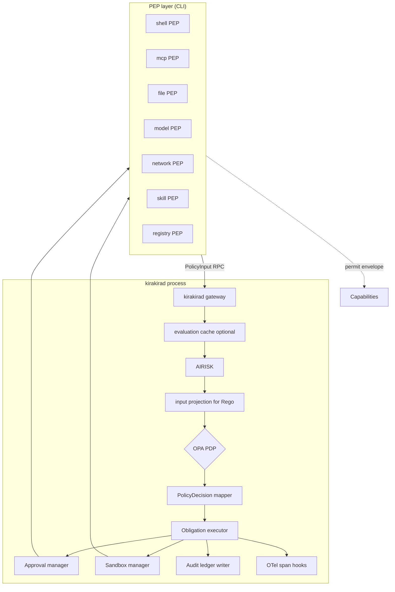
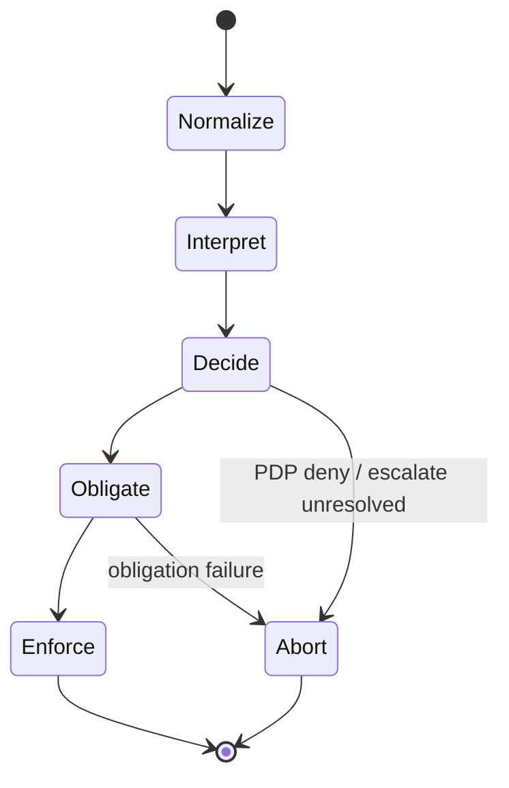
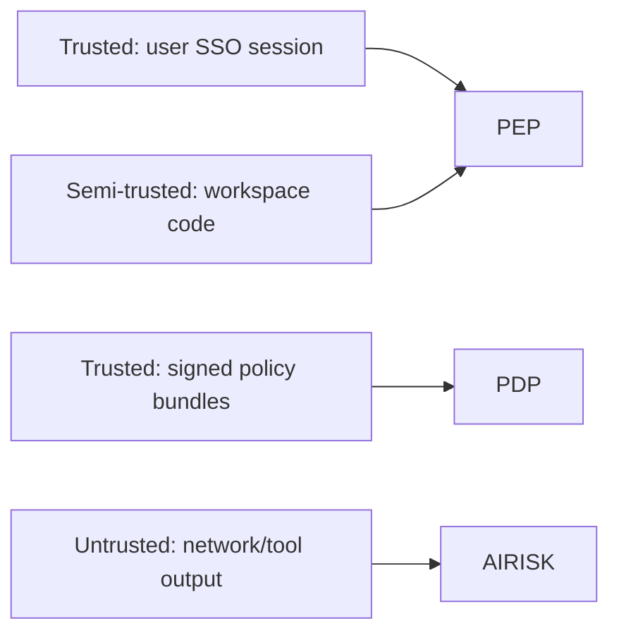

# Architecture — Policy Engine Components

Relationships among **PEPs**, **`kirakirad`**, **AIRISK**, **OPA (PDP)**, obligation services, sandbox managers, approval managers, and audit writers. Operational guidance for choosing **embedded WASM PDP** versus **IPC-isolated PDP**.

See also [`../README.md`](../README.md) (five-stage overview) and the plane synopsis [`../../kirakira-agent-policy.md`](../../kirakira-agent-policy.md).

---

## PEP / PDP / AIRISK / kirakirad / OPA

| Component | Responsibility | Forbidden behavior |
|-----------|----------------|--------------------|
| **PEP** | Intercept, normalize to [`PolicyInput`](../03-data-model/policy-input.md), block until PDP response, invoke capability **only** on successful obligations | Locally “guess allow” via heuristics that skip `kirakirad` |
| **AIRISK** ([`../06-airisk`](../06-airisk)) | Emit [`AiriskOutput`](../03-data-model/airisk-output.md): structured claims + scores for Rego input | Produce binding authorization bypassing PDP |
| **PDP (OPA)** ([`../05-pdp-opa`](../05-pdp-opa)) | Deterministic verdict [`PolicyDecision`](../03-data-model/policy-decision.md); reference signed bundles only | Embed live network lookups inside Rego bundles (policy choice; discourage) |
| **kirakirad** | Own long-lived services: PDP runtime, interpreters, caches, approvals, sandbox forks | Trust direct tool calls skipping PEP serialization |
| **Obligation executor** ([`../09-obligation`](../09-obligation)) | Order obligations, reconcile abort semantics | Silently downgrade obligations |

**OPA** may run **in-process Wasm** (`@open-policy-agent/opa-wasm/sdk`) for latency, or **`opa eval` subprocess** / sidecar socket for isolation. Both modes MUST load the **same bundle contract** documented in [`../05-pdp-opa/bundle-structure.md`](../05-pdp-opa/bundle-structure.md).

---

## Five-stage execution flow (architecture view)

Detailed schema mapping: [`../03-data-model/README.md`](../03-data-model/README.md).

| Stage | Active modules | Persisted artifacts |
| ----- | -------------- | ------------------- |
| Normalize | PEP + client validator | spans, optional PDP prefetch cache misses |
| Interpret | AIRISK | `kirakira.airisk` span attributes |
| Decide | OPA PDP | Decision log (`../05-pdp-opa/decision-log.md`) |
| Obligate | Approval mgr, Sandbox mgr | [`ApprovalRecord`](../03-data-model/approval-record.md), ledger segments |
| Enforce | PEP + OS sandbox | syscall-level audit (platform), trace child spans |

---

## Component boundaries

### Trust domains

- **Trusted policy** artifacts are verified prior to PDP load (`../05-pdp-opa/bundle-signing.md`).
- **Semi-trusted workspace** executes only inside declared sandbox profiles.
- **Untrusted network/tools** NEVER flow into Rego as raw blobs—only summarized features.

---

## Packages map (`@kirakira/policy-engine`, `@kirakira/audit-ledger`, `packages/kirakirad`)

| Symbol | Path / package | Responsibility |
| ------ | ---------------- | -------------- |
| `@kirakira/policy-engine` | TypeScript/Java client glue | PEP SDK: build `PolicyInput`, await `PolicyDecision`, render CLI errors, **`kirakira policy replay`** assist |
| `@kirakira/audit-ledger` | Shared library used by PEP + exporters | BLAKE3 chain, checkpoints, SIEM ECS mapping adapters ([`../../kirakira-agent-tracing/04-audit-ledger`](../../kirakira-agent-tracing/04-audit-ledger)) |
| `packages/kirakirad` | Rust/Go/TBD service host | PDP runtime selection, watchers for bundle reload, systemd/launchd unit samples (distro-specific READMEs TBD) |
| `@kirakira/core` (schemas) | `packages/core/src/schemas/policy.ts` | Zod schemas: canonical field names referenced across languages (`../03-data-model/cross-language-alignment.md`) |

Consumers embed **`@kirakira/policy-engine`** in CLI adapters; **`@kirakira/audit-ledger`** also ships to SIEM forwarding jobs.

---

## Deployment topologies

| Mode | PDP location | Upside | Tradeoff |
| ---- | ------------- | ------- | --------- |
| **Colocated Wasm** | Inside `kirakirad` | Lowest latency | Larger blast radius if Wasm host compromised |
| **IPC / socket** | Child `opa` or remote PDP proxy | Blast radius shrinking | Serialization & startup costs |
| **Split approval** | Human inbox service off-host | SSO integration | Offline session limitations |

Hybrid is allowed: PDP Wasm + **approval** delegated to SaaS—as long as `PolicyDecision` remains the single authority PEP honors.

---

## Related documents

- Threat assumptions: [`../01-threat-model/README.md`](../01-threat-model/README.md)
- PEP catalog: [`../04-pep-layer/README.md`](../04-pep-layer/README.md)
- Tracing linkage: [`../../kirakira-agent-tracing/README.md`](../../kirakira-agent-tracing/README.md)
