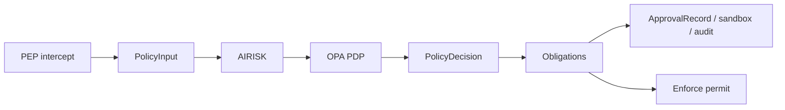

# Kirakira Agent Policy — Data Model

Technical reference for JSON-shaped artifacts exchanged between PEPs (Policy Enforcement Points), AIRISK (AI Risk Interpreter), the OPA PDP, obligation executors, and audit surfaces.

## Overview

Six core schemas structure the lifecycle:

| Schema | Role |
| ------ | ---- |
| **PolicyInput** | Unified normalization of intercepted actions (shell, MCP, writes, installs, networking, models). PEPs emit this envelope before PDP evaluation. |
| **AiriskOutput** | Stable risk semantics over the normalized action: classifications, weighted claims, optional fingerprint material feeding Rego inputs. Produced in the **Interpret** stage. |
| **PolicyDecision** | Authoritative PDP result: effect, bundled policy provenance, approval requirements, human-readable explanations, and an **obligations** array specifying post-decision harness behavior. Produced in **Decide**. |
| **Obligation** | Typed constraint attached to an `allow` (or escalate) outcome (sandbox profile name, approvals, audits, notifications, etc.). Consumed during **Obligate** before **Enforce**. |
| **ApprovalRecord** | Durable lifecycle of a human/auto approval keyed by fingerprint and PDP `decision_id`. |
| **SandboxProfile** | Machine-readable sandbox contract (filesystem, network, process, secrets, copyout), referenced by sandbox obligations or configuration. |

### Five-stage pipeline

Schemas align with policy engine execution (`docs/plane/kirakira-agent-policy.md`):

1. **Normalize** — Raw tool invocations → `PolicyInput.action` (+ workspace, principal, targets, optional context/risk hints).
2. **Interpret** — `PolicyInput` → `AiriskOutput` (classification + claims → PDP inputs).
3. **Decide** — PDP (Rego over structured input including AIRISK) → `PolicyDecision`.
4. **Obligate** — Executors consume `PolicyDecision.obligations` (+ approval manager, sandbox manager) before execution.
5. **Enforce** — PEP invokes the underlying capability only after obligations succeed; outcomes feed **ApprovalRecord** updates and audit.

`Obligation` payloads are nested inside `PolicyDecision`; `SandboxProfile` and `ApprovalRecord` are typically persisted or selected by profile name alongside the flowing request.

## Schema versions

Document-level `version` defaults are defined with the Zod schemas.

| Logical schema | `version` string |
| -------------- | ---------------- |
| PolicyInput | `kirakira.policyinput.v1` |
| AiriskOutput | `kirakira.airisk.v1` |
| PolicyDecision | `kirakira.decision.v1` |
| ApprovalRecord | `kirakira.approval.v1` |
| SandboxProfile | `kirakira.sandbox.v1` |

**Obligation** has no standalone envelope version; each obligation is an element of `PolicyDecision.obligations` validated by `obligationSchema`.

## Documents in this section

| Document | Contents |
| -------- | --------- |
| [policy-input.md](./policy-input.md) | Unified action model (`PolicyInput`). |
| [airisk-output.md](./airisk-output.md) | AIRISK classification output. |
| [policy-decision.md](./policy-decision.md) | PDP decision response (`PolicyDecision`), obligation types; includes `AiriskOutput` reference. |
| [approval-record.md](./approval-record.md) | Approval lifecycle record. |
| [sandbox-profile.md](./sandbox-profile.md) | Sandbox profile specification. |
| [cross-language-alignment.md](./cross-language-alignment.md) | Cross-language type generation (placeholder; milestone M5). |

## Data flow



ASCII equivalent:

```
PolicyInput ──► AIRISK (AiriskOutput)
                    │
                    ▼
                 OPA PDP
                    │
                    ▼
             PolicyDecision
                    │
        ┌───────────┼───────────┐
        ▼           ▼           ▼
   Obligations  ApprovalRecord  Sandbox / audit /
   (executor)   (lifecycle)     trace hooks
                         │
                         ▼
                    PEP enforcement
```

## Source of truth

Canonical TypeScript/Zod definitions live in:

- `packages/core/src/schemas/policy.ts` — `policyInputSchema`, `airiskOutputSchema`, `policyDecisionSchema`, `approvalRecordSchema`, `sandboxProfileSchema`, `obligationSchema`, enums for effects, approvals, scopes, and sandbox modes.
- `packages/core/src/schemas/audit.ts` — audit event envelopes referencing decision and approval semantics (`kirakira.audit.v1`), not replicated in table above.

Regenerate inferred types by importing these schemas into application code rather than diverging handwritten JSON contracts.
