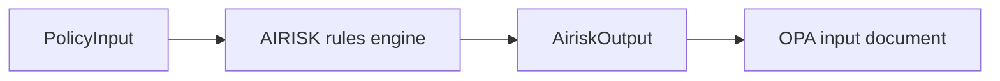

# AiriskOutput (`kirakira.airisk.v1`)

`AiriskOutput` is the deterministic **risk interpretation artifact** bridging [`PolicyInput`](./policy-input.md) narratives and PDP Rego data. Produced exclusively in the **Interpret** stage. Consumers treat AIRISK signals as **`input.*` facets** alongside raw policy data—not as authoritative allow/deny (that remains PDP).

Canonical schema: `airiskOutputSchema` in `packages/core/src/schemas/policy.ts`.

---

## Role in the pipeline



Regos SHOULD reference AIRISK-derived facts under predictable keys—for example:

```yaml
input:
  airisk:
    classifications: [...]
    claims:
      destructive: true
```

---

## Root fields

| Field | Type | Required | Description |
| ----- | ---- | --------- | ----------- |
| `version` | `string` | yes | **`kirakira.airisk.v1`** (default) |
| `request_id` | `string` | yes | Mirrors `PolicyInput.request_id`. |
| `trace_id` | `string` | yes | Mirrors OTel trace id for correlated spans. |
| `classifications` | `string[]` | yes | Stable machine labels from AIRISK catalog ([`../06-airisk/README.md`](../06-airisk/README.md)). |
| `claims` | `object` | yes | Structured boolean/numeric predicates used by PDP; keys namespaced loosely (`destructive`, `needs_network`, …). |
| `scores` | `object` | optional | Bounded numeric dimensions (e.g. `supply_chain`: 0–1). |
| `evidence` | `object[]` | optional | Lightweight references to matched rules—not raw payloads. |
| `fingerprint_material` | `object` | optional | Fields intended for hashing/approval caching (mirrors sanitized `PolicyInput.normalized`). |

---

## `classifications` semantics

Each value MUST map to rule identifiers documented in **`06-airisk`**. PDP bundles typically:

- **`deny`** when `destructive_critical` ∪ privileged shell patterns intersect policy prohibitions.
- **`escalate`** when classifications disagree or confidence < configured floor.
- Attach obligations when classifications imply sandbox upgrades (e.g. `network egress probable`).

### Example

```json
{
  "version": "kirakira.airisk.v1",
  "request_id": "req_0123abcd",
  "trace_id": "4bf92f3577b34da6a3ce929d0e0e4736",
  "classifications": [
    "shell.pipe_to_shell",
    "shell.network_fetch",
    "supply_chain.package_install"
  ],
  "claims": {
    "destructive": false,
    "needs_network": true,
    "needs_write_workspace": true,
    "elevated_permission_pattern": false
  },
  "scores": {
    "injection_pressure": 0.37,
    "supply_chain": 0.62
  }
}
```

---

## Field interplay with PDP

| Airisk facet | Typical Rego predicate | PDP outcome knobs |
| -------------- | ---------------------- | ----------------- |
| `classifications[]` membership | `data.kirakira.shell.deny_pipe_to_interpreter` | `deny` |
| `claims.destructive` | escalate if truthy outside sandbox profile | obligations + approvals |
| `scores.injection_pressure` | threshold approvals | obligation `approval` |
| `fingerprint_material` | hash stable subset | approval cache TTL |

Avoid duplicating PEP-local heuristics: when both PEP `risk.*` hints and AIRISK disagree, PDP defaults to **`escalate`** unless bundle expressly picks precedence (`../policy-decision.md`).

---

## Evidence & privacy

The `evidence` array SHOULD contain `{ "rule_id": "...", "span_id": "..." }` stubs referencing structured logs rather than verbatim model text. Sensitive substrings MUST be hashed or omitted (see tracing redaction docs).

---

## Versioning policy

Breaking changes increment `kirakira.airisk.v2` with changelog entry in `./README.md`. During migration, PDP bundles may simultaneously read `.v1` and `.v2` keys guarded by existence checks until sunset.

---

## Cross-links

- Rule catalog numbering: [`../06-airisk/README.md`](../06-airisk/README.md)
- PDP decision embedding: [`./policy-decision.md`](./policy-decision.md)
- Policy-input hints: [`./policy-input.md`](./policy-input.md)
