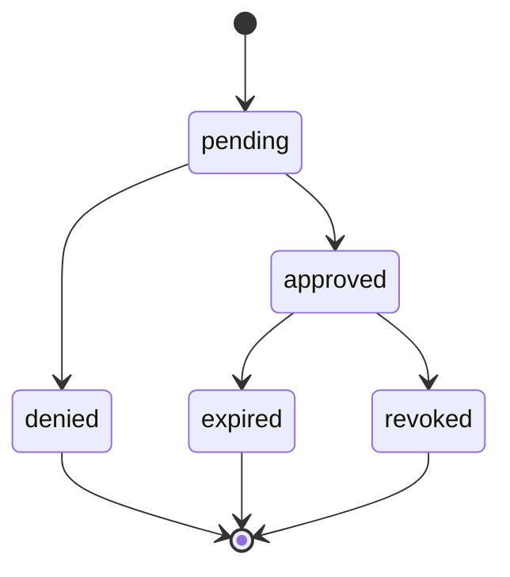

# ApprovalRecord (`kirakira.approval.v1`)

Persistent artifact capturing **approval lifecycle transitions** correlated to a PDP **`decision_id`**, PEP **`request_id`**, and cryptographic **fingerprints** of normalized actions.

Canonical schema: `approvalRecordSchema` in `packages/core/src/schemas/policy.ts`.

Operational guides:

- Lifecycle UX: [`../07-approval/README.md`](../07-approval/README.md)
- Fingerprint math: [`../07-approval/fingerprint-algorithm.md`](../07-approval/fingerprint-algorithm.md)
- Cache scopes & TTL alignment: [`../07-approval/cache-strategy.md`](../07-approval/cache-strategy.md)

---

## Purpose

Approval records reconcile three needs:

| Need | ApprovalRecord satisfies by |
| ---- | ---------------------------- |
| **Non-replay** | Unique record id + monotonic timestamps |
| **Audit defensibility** | Stores fingerprint hashes + PDP provenance echoes |
| **Operator ergonomics** | Surfaces summaries for CLI/TUI approval cards |

---

## Root fields

| Field | Type | Required | Description |
| ----- | ---- | --------- | ----------- |
| `version` | `string` | yes | **`kirakira.approval.v1`**. |
| `approval_id` | `string` | yes | Unique row id stable across retries. |
| `decision_id` | `string` | yes | Echo of `PolicyDecision.decision_id`. |
| `request_id` | `string` | yes | Original `PolicyInput.request_id`. |
| `workspace_id` | `string` | yes | Mirrors workspace scope for revocation sweeps. |
| `principal_id` | `string` | yes | Approver actor (human SSO id OR `auto-agent` sentinel). |
| `status` | enum | yes | `pending`, `approved`, `denied`, `expired`, `revoked`. |
| `mode` | enum | yes | Mirrors PDP `approval.mode`: `human`, `auto`, `template`, `none` (immutable echo). |
| `scope` | enum | yes | `once`, `session`, `workspace`, `policy-window` — cache stickiness semantics. |
| `template_id` | `string` | optional | For template-mode sticky grants. |
| `fingerprints` | object | yes | See [fingerprints](#fingerprints-object). |
| `created_at`, `resolved_at`, `expires_at` | ISO8601 | mixed | Temporal bounds (`expires_at` optional if scope implicit). |
| `reason` | `string` | optional | Free-text rationale (NOT security input downstream). |

---

## `fingerprints` object

| Field | Type | Purpose |
| ----- | ---- | ------- |
| `exact` | `string` | Hex/base64 BLAKE3 of canonical JSON (**RFC 8785**) over full normalized action (excluding ephemeral telemetry). |
| `template` | `string` | BLAKE3 of canonical JSON with volatile fields stripped per template grammar. |
| `algorithm` | `string` | e.g. `blake3-rfc8785-v1`. |

Fingerprints MUST be computed locally by PEP + approval client using the pipeline in [`../07-approval/fingerprint-algorithm.md`](../07-approval/fingerprint-algorithm.md).

---

## Status semantics

| Status | PEP behavior | Obligation executor |
| ------ | ----------- | ------------------- |
| `pending` | Block invoking protected capability | Wait / render UI (`../07-approval/ux-card-spec.md`). |
| `approved` | Allow when within TTL & scope match | Consume before sandbox transition if ordering demands. |
| `denied` | Abort with reason codes | Obligation failure → fail-closed. |
| `expired` | Treat as absent; re-evaluate PDP | Invalidate cache entry. |
| `revoked` | Hard deny continuation | Ledger append revocation event (`../../kirakira-agent-tracing/04-audit-ledger/README.md`). |

---

## PDP alignment

Approval records NEVER replace `PolicyDecision`. They certify that **interactive or automated adjudication matched** PDP expectations:

- PDP `approval.required === true`
- PDP obligations include `approval` type with coherent `required`/`scope`.

Mismatch (e.g. approval exists but PDP revision rotated) ⇒ **invalidate** approvals for that fingerprint family.

---

## Storage & confidentiality

Prefer encrypted SQLite/colocated KV with workspace-scoped ACL. Sensitive columns (`reason`) may replicate to SIEM mapped as `ecs.event.reason` AFTER redaction.

---

## Migration notes (`kirakira.approval.v2`)

Future versions MAY embed multi-party approvals (`reviewers[]`). Clients must ignore unknown keys per JSON parsing rules outlined in `./README.md`.

---

## Cross-links

- Obligation executor ordering: [`../09-obligation/README.md`](../09-obligation/README.md)
- PDP approval object mirror: [`./policy-decision.md`](./policy-decision.md)
- Sandbox obligations still apply post-approval: [`./sandbox-profile.md`](./sandbox-profile.md)
