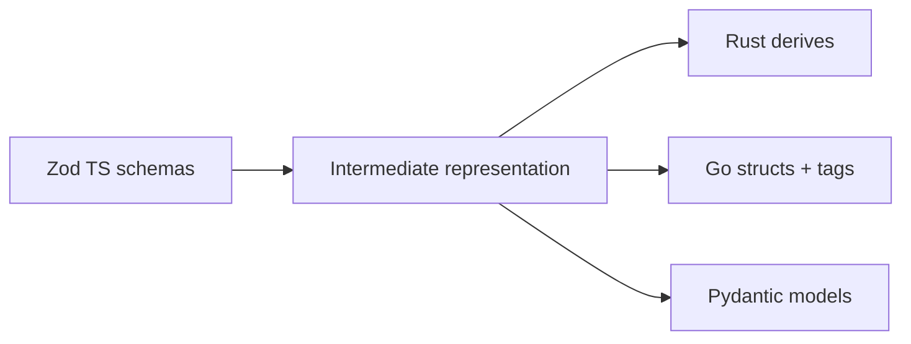

# Cross-language type generation (placeholder — Milestone M5)

This document is a **staging area** for engineering work that will mechanically derive **Rust / Go / Python / Java** structs (and protobuf/JSON-schema artifacts) from the canonical **`packages/core` Zod schemas** referenced throughout [`README.md`](./README.md).

**Status:** *Not implemented in this milestone.* Consume TypeScript typings only until codegen ships.

---

## Goals (M5)

| Goal | Outcome |
| ---- | ------- |
| **Single source of truth** | `policyInputSchema`, `airiskOutputSchema`, `policyDecisionSchema`, `approvalRecordSchema`, `sandboxProfileSchema`, `obligationSchema` drive all language bindings. |
| **Breaking change signaling** | `version` enums (`kirakira.policyinput.v1`, …) align with semver’d npm crate + Go module tags. |
| **Safe evolution** | Allow unknown-fields tolerance policy per language FFI boundary. |

---

## Planned pipeline (sketch)

Tooling candidates (pick during M5 spike): **`zod-to-json-schema`** → **`jsonschema2pydantic`**, **`typify`** for Rust, hand-written Go structs via **`quicktype`**—final choice TBD.

---

## Field naming rules for generated code

| JSON / TS field | Rust | Go | Python |
| ----------------| ---- | -- | ------ |
| `snake_case` preserved | ✅ `serde` rename optional | ✅ struct tags `json:` | ✅ `alias=` if needed |

Enumerations MUST stringify to **stable literal values** consumed by PDP tests (`allow`, `deny`, `sandbox`, …).

---

## FFI & IPC considerations

When `kirakirad` written in Rust/Go:

1. PEP clients embed generated structs rather than loosely typed maps.
2. Unknown fields SHOULD round-trip untouched (forward compatibility testing harness).
3. Golden vectors live under `testdata/policy_engine/` (**to be authored in M5**).

---

## Test matrix expectations

Golden fixtures per schema version verifying:

| Case | Validates |
| ---- | --------- |
| minimal valid object | parsers accept baseline |
| full optional expansion | cardinality + defaults |
| negative: wrong enum | hard error clients + PDP ingestion guard |

---

## Documentation dependencies

Upon M5 completion, update links:

- `./README.md` — replace placeholder note with codegen command + crate coordinates.
- `../05-pdp-opa/rego-style-guide.md` — reference emitted JSON-schema for `input.doc` scaffolding.
- CLI docs `../11-cli-commands/README.md` — note multi-language FFI debug flags.

---

## Contact / tracking

Coordinate implementation via engineering epic **FG-M5-CODEGEN** (placeholder epic id).

Until then:

- Consumers MUST import TypeScript schemas from **`packages/core/src/schemas/policy.ts`**.
- Do **not** hand-maintain divergent protobuf `.proto` files without automated sync.

