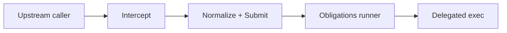

# PEP Layer Overview

Policy **Enforcement Points (PEPs)** sit at capability boundaries (`shell.exec`, MCP tool calls, `file.write`, `model.invoke`, `network.request`, `skill` scripts, registry installs). They **intercept**, **normalize** into [`PolicyInput`](../03-data-model/policy-input.md), **submit** to `kirakirad`, **await obligations**, then **enforce** PDP outcomes.

Design rule: PEPs NEVER grant execution based solely on locally cached policy without revalidation semantics defined in PDP (`../05-pdp-opa/decision-log.md`).

---

## What every PEP MUST do

| Step | Requirement |
| ---- | ----------- |
| **Intercept** | Hook earliest stable layer (syscall wrappers, MCP middleware, filesystem VFS, HTTP proxy). |
| **Normalize** | Populate `PolicyInput.action` `{ kind, tool_type, tool_name, operation, raw, normalized }` plus `risk` hints. |
| **Submit** | Call `kirakirad` synchronously unless streaming preview path explicitly allowed (still terminal-gated). |
| **Honor obligations** | Run sandbox/profile transitions, approvals, audit append sequencing (`../09-obligation`). |
| **Enforce / deny** | On `deny`, present structured error with `reason_codes`. On `allow`, forward only post-obligation sanitized args. |

---

## PEP catalog — seven enforcement points & action kinds

| PEP | Markdown | `tool_type` | Representative `action.kind` values |
| --- | -------- | ----------- | ------------------------------------ |
| **Shell PEP** | [shell-pep.md](./shell-pep.md) | `shell` | `shell.exec` |
| **MCP PEP** | [mcp-pep.md](./mcp-pep.md) | `mcp` (or `shell` when routed via shell shim—see MCP doc) | **`tool.call`** |
| **File PEP** | [file-pep.md](./file-pep.md) | `file` | `file.write` |
| **Model PEP** | [model-pep.md](./model-pep.md) | `model` | `model.invoke` |
| **Network PEP** | [network-pep.md](./network-pep.md) | `network` surfaced via interceptor | **`network.request`** (even if originated by shell—network PEP may still classify) |
| **Skill PEP** | [skill-pep.md](./skill-pep.md) | `skill-script` | `tool.call` / `shell.exec` (skill-specific `operation`) |
| **Registry PEP** | [registry-pep.md](./registry-pep.md) | `registry` | **`package.install`** |

> **Note.** Some actions appear through multiple PEPs (e.g. shell triggers network). PEP coordination MUST choose a **canonical owning PEP** first (usually earliest interception) while still emitting correlated **child spans** (see tracing taxonomy).

Detailed channel docs:

- [shell-pep.md](./shell-pep.md)
- [mcp-pep.md](./mcp-pep.md)
- [file-pep.md](./file-pep.md)
- [model-pep.md](./model-pep.md)
- [network-pep.md](./network-pep.md)
- [skill-pep.md](./skill-pep.md)
- [registry-pep.md](./registry-pep.md)

---

## Cross-cutting PEP concerns

| Concern | Reference |
| ------- | --------- |
| Trust tiers & destructive detection | individual PEP docs |
| PDP latency SLAs | `../02-architecture/README.md` |
| Fail-closed behavior | `../10-fail-closed/README.md` |
| Telemetry attributes | [`../../kirakira-agent-tracing/02-span-taxonomy/kirakira-custom-attributes.md`](../../kirakira-agent-tracing/02-span-taxonomy/kirakira-custom-attributes.md) |

---

## Security invariants

1. PEP arguments reaching tools MUST mirror **`PolicyInput`** post-sanitization—no silent expansions (`~` rewriting must be observable in `normalized`).
2. Approvals keyed on fingerprints MUST include fields material to risk (paths, URLs) — references [`../07-approval/fingerprint-algorithm.md`](../07-approval/fingerprint-algorithm.md).
3. **Registry** installs default to **`deny`** until trust metadata resolved.
