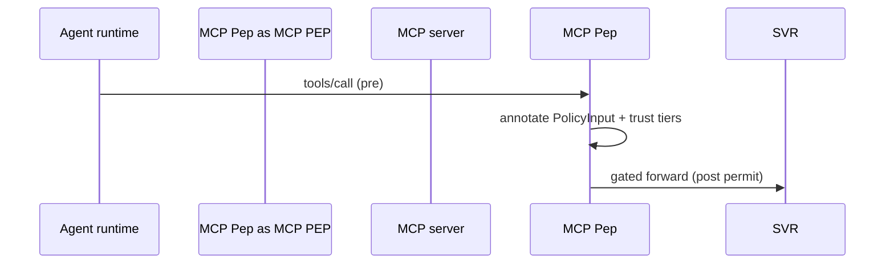

# MCP PEP

Mediates **`tool.call`** invocations per Model Context Protocol (MCP): JSON-RPC payloads, OAuth token flows, filesystem roots, elevated tools (GitHub/GitLab/issue editors). Emits MCP-enriched **`PolicyInput.context`** referencing server id + tool descriptor hash.

Upstream context: [`README.md`](./README.md).

---

## Interception lifecycle

| Stage | Action |
| ----- | ------- |
| **Pre-call** | Map tool name → static metadata (capabilities, risk class). Attach server trust tier (`official`, `community`, `local_dev`). |
| **Schema validation** | Reject malformed args before PDP (fail-fast). |
| **Post-call** | Optional response scanning hooks (tracing only; PDP does not ingest raw MCP bodies by default). |

---

## Trust tier evaluation

| Tier | Description | PDP default bias |
| ---- | ----------- | ---------------- |
| **`official`** | Vendor-signed MCP allowlist bundle | Permit low-risk verbs under narrow obligations |
| **`community`** | Installed marketplace / OSS | Sandbox + approvals for mutating verbs |
| **`local_dev`** | Loopback prototyping | Highest friction outside dev profiles |

Promotion/demotion occurs via organizational registry manifests (see [`../../kirakira-agent-registry/README.md`](../../kirakira-agent-registry/README.md) when aligning installs with registry posture).

---

## Destructive detection

Static labeling table (illustrative; extend centrally):

| Pattern | Signals |
| ------- | ------- |
| Verb contains `delete`, `drop`, `revoke`, `force_push` | `claims.destructive=true` downstream |
| Resource type `scm.ref` mutations | Obligation **`approval`** default |
| Exfil primitives (`upload_file`, outbound webhook) | Network PEP coordination |

Destructive ⇒ AIRISK classifications like `mcp.destructive_verb`; PDP maps to **`deny`** or **`sandbox+approval`**.

---

## Token & audience controls

Honor MCP security posture:

- ❌ Silent cross-server token forwarding (flag PDP violation if configs attempt).
- ✅ Bind tokens to MCP `aud` / scopes where IdP integrates.

Failures emit `reason_codes: ["mcp.token_scope_mismatch"]`.

---

## Correlation IDs

Populate:

- `context.mcp.server_id`
- `context.mcp.connection_id`

These fields feed [`../../kirakira-agent-tracing/02-span-taxonomy/kirakira-custom-attributes.md`](../../kirakira-agent-tracing/02-span-taxonomy/kirakira-custom-attributes.md) via OTel bridging.

---

## Testing guidance

Synthetic fixtures SHOULD include benign read tools, narrowly scoped writes, destructive deletes, OAuth handshake patterns.

---

## See also

- File writes via MCP roots: complement [`file-pep.md`](./file-pep.md)
- Network callbacks: [`network-pep.md`](./network-pep.md)
