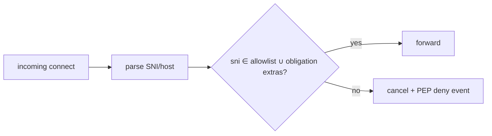

# Network PEP

Intercept **outbound TCP/UDP** initiated by harness or child sandboxes (**`network.request`**). Provides domain resolution outcomes, evaluates **explicit allowlists** from PDP obligations, emits structured denials BEFORE packets leave controlled namespaces.

Upstream context: [`README.md`](./README.md).

---

## Placement variants

| Variant | Mechanics |
| ------- | --------- |
| **Transparent proxy** | HTTP CONNECT / TLS MITM discouraged; prefer SNI-based filtering for TLS |
| **eBPF / iptables nft** | Linux namespace enforcement |
| **macOS sandbox network extension** *(future)* | Entitlement gated |

Prefer integrating with sandbox profile **baseline** deny-all (`../08-sandbox/profile-catalog.md`).

---

## Domain allowlisting flow

Obligations may append ephemeral domains for one execution via **`network_allowlist`** (`../09-obligation/README.md`).

---

## Encrypted traffic limitations

Pure IP-level blocks cannot inspect TLS payload—rely on:

| Signal | Technique |
| ------ | --------- |
| SNI hostname | nftables + userspace splitter |
| DNS queries | Separate resolver policy |

Failures to classify SHOULD default **DENY**.

---

## Correlation & audit

Persist minimal row: `{ decision_id, host, timestamp, egress_profile }`; avoid storing payload bytes unless explicit opt-in (tracing doc).

---

## Testing

Synthetic DNS + TCP harness verifying:

| Case | Expected |
| ---- | -------- |
| Apex match | Allowed |
| CNAME chain to disallowed apex | Denied |

---

## See also

- Shell-driven network (`curl`): [`shell-pep.md`](./shell-pep.md)
- SIEM ECS mapping [`../../kirakira-agent-tracing/05-siem-integration/ecs-mapping.md`](../../kirakira-agent-tracing/05-siem-integration/ecs-mapping.md)
