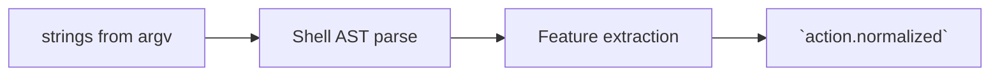

# Shell PEP

Intercept **shell executions** spawned by CLI agent harnesses (`bash`, `sh`, delegated npm scripts, makefile targets). Produce `PolicyInput` with **`action.kind = shell.exec`** and rich normalization for PDP + AIRISK reliability.

Upstream context: [`README.md`](./README.md).

---

## Interception tiers

| Tier | Technique | Coverage |
| ---- | --------- | -------- |
| **CLI exec shim** | Replace bare `posix_spawn` wrappers | Baseline deterministic |
| **Ptrace-lite / seccomp notify** *(optional)* | Syscall trapping | Closing bypass gaps |
| **Interpreter dispatch** | When agent runs `(bash -lc "...")`, parse inner argv | Accuracy vs perf tradeoff |

If only outer argv is visible, PEP MUST mark **`risk.shell.layer = outer_only`** enabling PDP conservative posture.

---

## AST parsing & command understanding

Prefer **POSIX shell parsers** capable of pipelines, command substitutions, redirections:

Captured features SHOULD populate **`action.normalized`**:

| Derived feature | Example | AIRISK usefulness |
| --------------- | ------- | ----------------- |
| `has_pipe()` | `curl | bash` | `shell.pipe_to_shell` |
| `network_keywords` | `curl`, `wget`, `dig` | `needs_network=true` |
| `privilege_patterns` | `sudo`, `doas`, `osascript admin` | `elevated_permission_pattern` |

Fallback: if AST parse fails ⇒ treat command as **`opaque_high_risk`** (PDP escalation / approval defaults).

---

## Write path detection

Shell can mutate filesystem indirectly (`tee`, `jq -r > file`). Detection strategy:

| Signal | Interpretation |
| ------ | ------------- |
| Redirection AST nodes | Emit `anticipated_writes[]` speculative paths relative to cwd |
| Known mutating builtins | Flag `risk.filesystem_writes_probable=true` |

Speculative guesses MUST remain in `risk` — PDP cannot treat them as factual writes until File PEP observes actual syscalls (coordinate via trace correlation).

---

## Workspace boundary interplay

Normalize **cwd-relative** expansions against [`workspace.root`](../03-data-model/policy-input.md):

- Paths resolving outside workspace → `risk.workspace_escape_candidate=true`.

---

## PEP-specific attributes (tracing)

Suggested span attributes documented in tracing repo:

- `kirakira.pep.shell.layer`
- `kirakira.pep.shell.has_pipe`

(See [`../../kirakira-agent-tracing/02-span-taxonomy/kirakira-custom-attributes.md`](../../kirakira-agent-tracing/02-span-taxonomy/kirakira-custom-attributes.md).)

---

## Failure modes → fail-closed

| Scenario | Reaction |
| -------- | ------- |
| Parser timeout | Deny destructive ops; escalate others |
| Child re-exec escapes shim | Sandbox profile upgrade obligation |

Referenced in [`../10-fail-closed/README.md`](../10-fail-closed/README.md).
