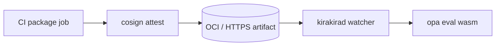

# PDP / OPA integration

Enterprise policy decisions MUST be reproducible offline from **explicit inputs + signed bundles**. **Open Policy Agent (OPA)** is the PDP implementation: deterministic Rego over JSON documents synthesized from PEP/AIRISK data.

Supporting topics:

| Document | Coverage |
| -------- | --------- |
| [bundle-structure.md](./bundle-structure.md) | Repo layout deployed to PEP + `kirakirad` |
| [rego-style-guide.md](./rego-style-guide.md) | Authoring norms & testing |
| [decision-log.md](./decision-log.md) | Streaming decision auditing & redaction |
| [bundle-signing.md](./bundle-signing.md) | Cosign/Sigstore supply chain attestations |

---

## Deployment modes

| Mode | Description | Upside |
| ---- | ----------- | ------- |
| **Embedded WASM PDP** | OPA Wasm module inside `kirakirad` hot path | Low latency |
| **IPC / Sidecar PDP** | `opa eval` HTTP server or unix socket fork | Reduced blast radius in regulated environments |

Both modes assemble identical **`input`** document shape (see schemas + architecture doc).

Inter-mode switching MUST NOT mutate Rego semantics—only isolation characteristics.

---

## Bundle lifecycle overview

```
CI → sign bundle tarball → artifact registry → agent fetch → Wasm load / filesystem mount → PDP eval loop
```



---

## PDP input skeleton (illustrative)

```yaml
input:
  policy_input: {...}           # Mirrors PolicyInput (trimmed optionally)
  airisk: {...}                # Mirrors AiriskOutput
  approvals_cache: [...]       # Optional sticky fingerprints
```

Exact field names SHOULD track `packages/core` schema exports referenced in [`../03-data-model`](../03-data-model).

---

## Fail-closed integration

Failures (bundle signature invalid, unparseable data doc, Wasm trap) escalate per [`../10-fail-closed/README.md`](../10-fail-closed/README.md).

---

## Interfaces

### From AIRISK perspective

AIRISK attaches **immutable** classifications + claims PDP cannot ignore silently (policy choice). PDP MAY override via explicit rules logging precedence.

### To obligation executor

`PolicyDecision.obligations` array encodes deterministic follow-up semantics ([`../09-obligation`](../09-obligation)).

---

## Performance guidance

Target p99 evaluate < **X ms** (**TBD** per hardware) for median developer laptops; amortize costly rules via **`partial eval`** (`opa build --optimize`). Document chosen budgets in infra runbooks.

---

## Related

- Obligation taxonomy: [`../09-obligation/README.md`](../09-obligation/README.md)
- Tracing PDP spans: [`../../kirakira-agent-tracing/02-span-taxonomy/README.md`](../../kirakira-agent-tracing/02-span-taxonomy/README.md)
