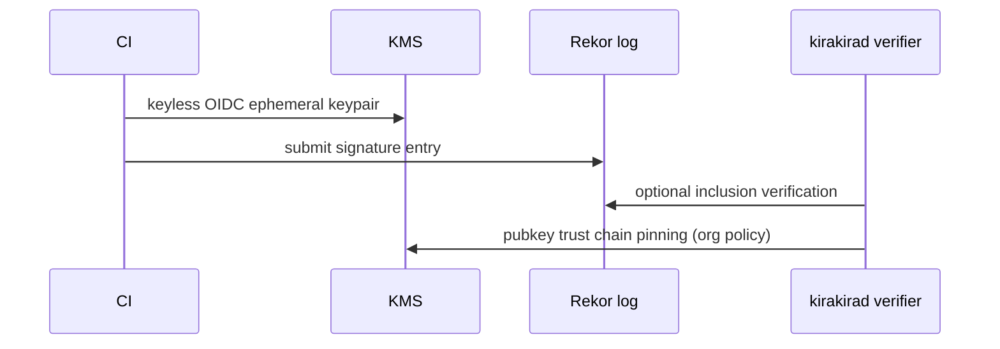

# Bundle signing (Cosign / Sigstore)

Bundles loaded by `kirakirad` MUST be authenticity-verified prior to PDP activation. Preferred stack: **`cosign sign-blob`** with **Sigstore** transparency (Rekor) + optional **`SLSA` provenance**.

Upstream: [`README.md`](./README.md), registry analogies in [`../04-pep-layer/registry-pep.md`](../04-pep-layer/registry-pep.md).

---

## Threat model linkage

Mitigates **supply chain** & **tampered policy** surfaces enumerated in [`../01-threat-model/README.md`](../01-threat-model/README.md).

---

## Artifact graph

```
policies.tgz (unsigned stage)
   ├→ SHA256(content)
   ├→ cosign.sign(blob) → {signature, certs}
   └→ Rekor.upload(entry) → logIndex
bundle.manifest.json captures:
{
  "sha256": "...",
  "signatures": [{"ref": ".sig"}],
  "rekor_uuid": "...",
  "certificate_fingerprint": "..."
}
```



---

## Verification checklist (`kirakira policy verify-bundle`)

| Step | Action |
| ---- | ------- |
| 1 | Recompute tarball digest |
| 2 | Verify signature binds digest |
| 3 | Check signing cert chain & **OIDC issuer allowlist** |
| 4 | Optional Rekor **`verify-blob`** (networked/airgap mirror) |
| 5 | Compare manifest `revision` embedded Rego hashes |

Failures produce `reason_codes: ["bundle.signature.invalid"]` and PDP refuses load.

---

## Key management patterns

| Pattern | Suitability |
| ------- | ----------- |
| **Keyless Sigstore OIDC from GitHub Actions** | OSS-ish velocity |
| **KMS-held long-lived ECDSA-P256 keys** | Regulated tenants |
| **HSM-backed offline ceremony key** | High assurance quarterly drops |

Offline environments mirror Rekor payloads via internal **`transparency-log-replica`** (document operational runbooks separately).

---

## Rotation semantics

Maintain overlapping trust:

```
trusted_keys.json supports [] (multiple certs) until deprecation window lapses.
```

Bundles signed with retiring key flagged `warm` until CRL distribution completes.

---

## Failure → fail-closed

Signature verification failure denies PDP startup & blocks policy hot reload handshake — see [`../10-fail-closed/README.md`](../10-fail-closed/README.md).

---

## Cross-links

- Remote anchoring of audit parity: [`../../kirakira-agent-tracing/04-audit-ledger/remote-anchoring.md`](../../kirakira-agent-tracing/04-audit-ledger/remote-anchoring.md)
