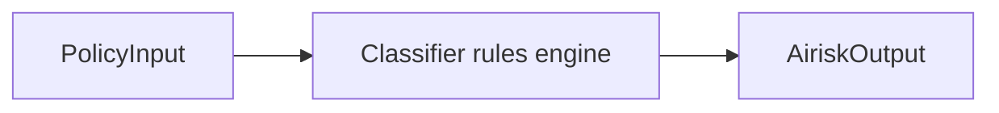

# AIRISK interpreter

**AIRISK** is the deterministic **risk interpretation** stage bridging rich [`PolicyInput`](../03-data-model/policy-input.md) structures and PDP Rego predicates. AIRISK emits [`AiriskOutput`](../03-data-model/airisk-output.md). It intentionally avoids network calls and LLM reliance.

---

## Design principles

| Principle | Rationale |
| --------- | --------- |
| **Deterministic** | Same `(policy_input_normalized, bundle_rule_rev)` ⇒ same classifications |
| **Explainable** | Each classification maps to authored rule identifiers |
| **Extensible via config** | New supply-chain matchers ship as data patches + hot reload |
| **Not authoritative for allow** | PDP may override—but contradictions escalate by default |



---

## 13 core classification rules (stable identifiers)

AIRISK classifications are **orthogonal tags** PDP composes logically (AND/OR) per bundle.

| # | Classification id | Triggers when | PDP hint |
|---|-------------------|---------------|-----------|
| 1 | `shell.pipe_to_shell` | Shell AST shows piping into interpreter (` | bash`). | Obligation **`approval`** & deny in strict bundles |
| 2 | `shell.privilege_escalation_pattern` | `sudo`, elevated macOS dialogs, systemd unit edits. | Default deny unmanaged devices |
| 3 | `shell.network_side_effect` | External fetch verbs (`curl`, `wget`). | Sandbox profile `*-net-restricted` |
| 4 | `mcp.destructive_verb` | MCP tool taxonomy flagged delete/drop/remove. | `approval.human` default |
| 5 | `mcp.oauth_scope_wide` | Token scopes exceed narrow allow baseline (static table). | Force community tier obligations |
| 6 | `file.destructive_tree_op` | rm -rf equivalents / patch deletes many files heuristic. | `sandbox` escalation |
| 7 | `file.workspace_escape_path` | Canonical path exits `workspace.root`. | Hard deny baseline |
| 8 | `network.disallowed_destination_class` | Public IP buckets / cloud metadata IPs (fact table). | Pre-PDP quick deny |
| 9 | `registry.supply_chain_elevated` | Postinstall hooks + mutable tag resolution. | `approval.template` caching |
| 10 | `skill.unverified_bundle` | Missing signature / mismatched SKILL digest relative registry. | Deny prod profiles |
| 11 | `model.disallowed_vendor_route` | Provider not in PDP allowlist bridging. | Model deny |
| 12 | `context.injection_pressure` | Concatenated untrusted blobs exceed entropy / marker heuristics. | Escalate + redact obligations |
| 13 | `obligation.policy_conflict_precursor` | Mutually exclusive PEP signals (sandbox vs full net). | PDP `escalate` sentinel |

Implementations SHOULD unit-test pairwise interactions (e.g. `4 + 12` ⇒ explicit precedence rule).

---

## Extending rule sets

1. Append JSON mapping under `AIRISK/rules/*.yaml` (**path TBD**) with:

```yaml
id: registry.custom_pattern
signals:
  - match: ecosystems == ["pypi"]
    version_not_pinned: true
```

2. Bump rules **digest** surfaced in PDP `explain` ancillary field (non-security).
3. Golden tests ensure **no unintended classification explosion** (>N tags default escalate).

Backward compatibility requires unknown classification ids ⇒ **logged + ignored unless bundle opts into strict**.

---

## Output schema linkage

Structured fields summarized in [`../03-data-model/airisk-output.md`](../03-data-model/airisk-output.md).

Recommended mapping:

```
classifications[*] ::= ids from above table ∪ org custom
claims.*           ::= distilled booleans reused by PDP
scores.*           ::= bounded numeric sliders (supply chain risk, injection pressure)
```

---

## PDP integration pattern

Minimal Rego pattern:

```
deny["shell_pipe"] if {
  "shell.pipe_to_shell" in input.airisk.classifications
  data.strict.mode == true
}

warn_network if {
  "shell.network_side_effect" in input.airisk.classifications
}
```

PDP SHOULD annotate `explain.matched_rules` with both PDP path + originating AIRISK id for RCA.

---

## Performance & fuzzing targets

Interpret stage target < **10%** PDP latency budget; deterministic rule engine should JIT compile matchers.

Periodic fuzz PEP-generated `normalized` payloads to uncover parser crashes ⇒ classify as PDP fail-closed if interpreter aborts unexpectedly.

---

## Cross-links

- PEP hint surfaces: [`../04-pep-layer/README.md`](../04-pep-layer/README.md)
- Tracing AIRISK spans: [`../../kirakira-agent-tracing/02-span-taxonomy/README.md`](../../kirakira-agent-tracing/02-span-taxonomy/README.md)
