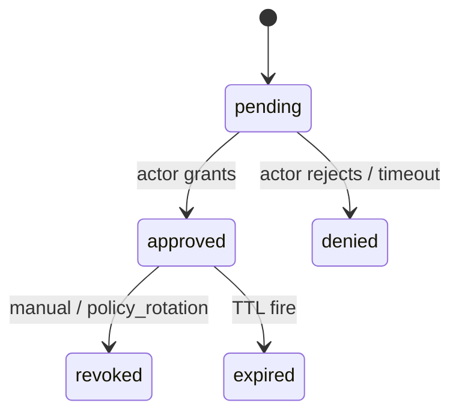

# Approval system

Humans/automation adjudicate PDP **`approval.required`** pathways. Approvals unify Copilot-like tool memory, Claude permission callbacks, Gemini sandbox expansion confirmations, Codex granular approvals—not by duplicating PDP logic—but by attaching **sticky records** to **RFC 8785 canonical fingerprints**.

---

## Lifecycle

| State | Storage | PEP behavior |
| ----- | ------- | ------------ |
| `pending` | `ApprovalRecord` provisional row | BLOCK |
| `approved` | Durable KV / SQLite | ENFORCE sandbox remaining obligations THEN execute |
| `denied` | Immutable row | ABORT invocation |
| `expired/revoked` | Audit trail append | FORCE re-eval / deny |

Formal fields: [`../03-data-model/approval-record.md`](../03-data-model/approval-record.md).

---

## Caching paradigm

Fingerprints amortize approvals **without weakening security**:

| Scope (`policyScopeSchema`) | Semantics |
| --------------------------- | --------- |
| `once` | Single subsequent matching invocation |
| `session` | Lifetime of authenticated agent session token |
| `workspace` | All actions under same `workspace_id` until TTL unless revoked |
| `policy-window` | Valid until PDP bundle rotates past recorded `revision` bound |

Executors MUST reconcile cache invalidations on **`bundle.revision` drift.

---

## Scopes interplay with obligations

Ordering: obligations sorted per [`../09-obligation/README.md`](../09-obligation/README.md)—approvals MAY need to finalize before sandbox spin-up depending on PDP ordering hints.

---

## UX expectations

Structured quick-approval ergonomics summarized in [`ux-card-spec.md`](./ux-card-spec.md).

---

## Deep dives

| Document | Coverage |
| -------- | --------- |
| [fingerprint-algorithm.md](./fingerprint-algorithm.md) | Canonical JSON hashing |
| [cache-strategy.md](./cache-strategy.md) | TTL + revocation hooks |
| [ux-card-spec.md](./ux-card-spec.md) | TUI approvals |

---

## Security notes

Mitigates **`approval fatigue`** threat via template families + TTL + revocation audit events.

Telemetry ties into [`../../kirakira-agent-tracing/04-audit-ledger/README.md`](../../kirakira-agent-tracing/04-audit-ledger/README.md).
