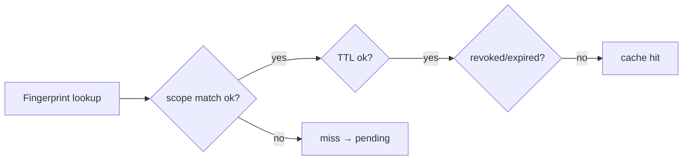

# Approval cache strategy

Balances **least friction** for repetitive safe operations vs **risk of stale allowances** due to drifting context, TTL oversights, silent bundle upgrades.

Relates directly to PDP `approval.cacheable`, `ttl_seconds`, and [`ApprovalRecord.scope`](../03-data-model/approval-record.md).

---

## Cache axes

| Axis | Controlled by |
| ---- | ----------- |
| Fingerprint equality | BLAKE3 exact vs template (see [`fingerprint-algorithm.md`](./fingerprint-algorithm.md)) |
| Scope | `once/session/workspace/policy-window` |
| TTL | PDP `ttl_seconds`, record `expires_at` |
| Bundle rotation | PDP `bundle.revision` monotonic comparator |

---

## Scope semantics recap

| Scope | Cache key constituents |
| ----- | ---------------------- |
| `once` | `fingerprint + decision_id lineage` discard after single allow |
| `session` | + `session_id` |
| `workspace` | + `workspace_id` |
| `policy-window` | + upper bound PDP revision id stamped at approval issuance |

Violation of constituents ⇒ MISS.

---

## TTL recommendations

| Persona scenario | TTL guidance |
| ------------------ | ------------ |
| High velocity safe reads | Long TTL (hours) permissible |
| Network fetch shell | Minutes-level TTL unless template family broad |
| Destructive MCP | TTL 0 forced human per bundle option |

Stale detection job runs background prune → audit ledger emits `approval.pruned_ttl`.

---

## Template cache families

Templates intentionally broaden matching **only along declared axes** (ignored fields list). PDP MUST forbid templates that omit path arguments for destructive classifications.

Misconfiguration ⇒ classification `skill.unverified_bundle` analog for approvals – engineering guard tests.

---

## Invalidation triggers

Mandatory invalidation paths:

| Event | Action |
| ----- | ------- |
| User `/approvals revoke --all` | Hard flush workspace scope buckets |
| Policy bundle rotates past `policy-window.max` | Auto-expire approvals tagged `bundle < new_min` |
| Workspace root path change fingerprint drift | Invalidate template caches referencing path tokens |

Partial invalidations keep operational noise low.

---

## Storage implementation sketch

SQLite table keyed by `(fingerprint_algo, fingerprint_value, workspace_id)` with secondary index on TTL.

Concurrency: SQLite WAL + transactional insert before returning `pending`.

---

## Observable metrics

| Metric | Interpretation |
| ------ | ------------- |
| `kirakira_approval_cache_hit_ratio` | UX smoothness indicator |
| `kirakira_approval_stale_miss_total` drift | Signals TTL tuning issues |

Fed to [`../../kirakira-agent-tracing/README.md`](../../kirakira-agent-tracing/README.md).

---

## Cross-links

- UX ergonomics balancing fatigue: [`ux-card-spec.md`](./ux-card-spec.md)
