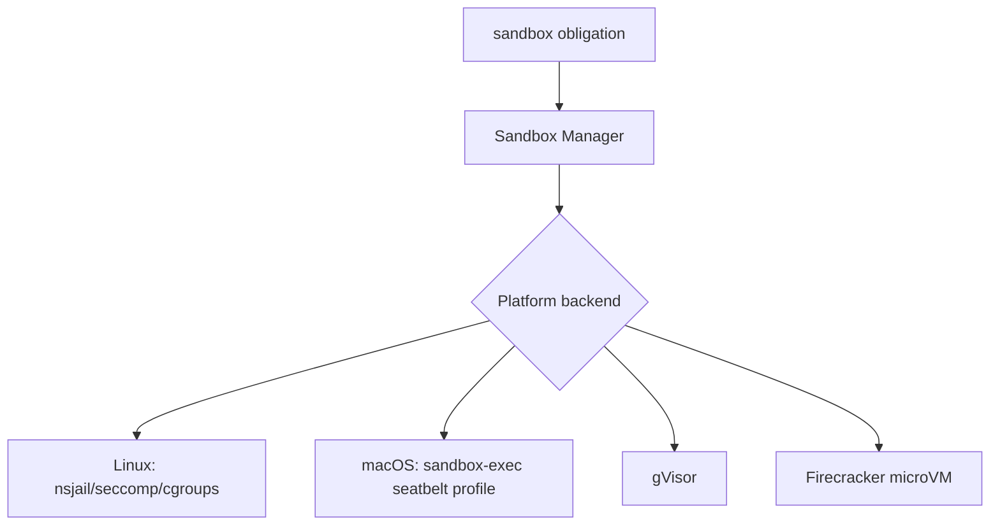

# Sandbox architecture

Isolation layer executing side-effecting tooling **inside machine-enforced profiles** mandated by PDP **`sandbox`** obligations. Collaborates closely with PEP write/network interceptors [`../04-pep-layer`](../04-pep-layer).

---

## Architectural placement

```
Obligation executor selects SandboxProfile → backend adapter → PEP re-invokes child inside namespace/microVM
```



Sandbox Manager persists runtime handles keyed by **`trace_id`** for correlation.

---

## Profile catalog linkage

Operational truth table expands in [`profile-catalog.md`](./profile-catalog.md) — seven canonical tiers balancing developer velocity vs containment.

Backend-specific constraints: [`platform-backends.md`](./platform-backends.md).

---

## Fail-closed integration

Failures creating namespaces or violating seccomp load MUST abort invocation path — see [`../10-fail-closed/README.md`](../10-fail-closed/README.md).

---

## Data model linkage

Structural JSON schema: [`../03-data-model/sandbox-profile.md`](../03-data-model/sandbox-profile.md).

---

## Observability

Each activation emits spans `kirakira.sandbox.activate` referencing profile name & backend id (taxonomy doc forthcoming under tracing subtree).
