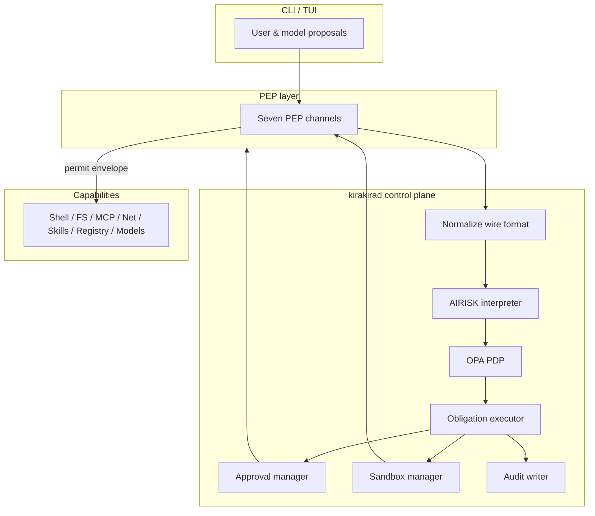
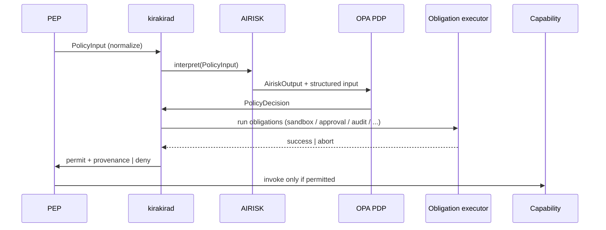

# Kirakira Agent Policy Engine

End-to-end technical documentation for the **Enterprise Agent Middleware (Kirakira)** policy subsystem: PEPs normalize actions, AIRISK interprets risk semantics, **OPA** evaluates Rego bundles as the PDP, obligations drive sandboxing/approval/audit, and the CLI harness **fails closed** when any stage cannot complete safely.

This tree complements the consolidated plane note [`../kirakira-agent-policy.md`](../kirakira-agent-policy.md) with implementation-oriented detail.

## Purpose

Enterprise agent runtimes must align security posture with product leaders (**GitHub Copilot**, **Codex**, **Claude**, **Gemini**, **Cursor**): granular tool governance, sandbox defaults, approvals for side effects, deterministic policy bundles, and auditable traces. The Kirakira Policy Engine provides a single **normalize → interpret → decide → obligate → enforce** pipeline so shell, MCP, skills, filesystem, networking, registry, and model gateways share one decision contract.

Key properties:

| Property | Meaning |
| -------- | ------- |
| **Deny-by-default** | PDP `deny` or obligation failure prevents side effects. |
| **Least privilege** | Sandbox profiles and network allowlists are first-class obligations. |
| **Deterministic PDP** | OPA consumes structured inputs; no non-deterministic “shadow policy” inside the PDP. |
| **Separation of concerns** | PEPs intercept; AIRISK summarizes; PDP authorizes; executors satisfy obligations. |

## Architecture summary

- **PEP**: Policy Enforcement Point — intercepts, normalizes into [`PolicyInput`](./03-data-model/policy-input.md), submits to `kirakirad`, enforces PDP outcome only after obligations succeed.
- **PDP**: Policy Decision Point — OPA evaluating signed bundles ([`./05-pdp-opa`](./05-pdp-opa)).
- **AIRISK**: AI Risk Interpreter — rule-based classifier producing [`AiriskOutput`](./03-data-model/airisk-output.md) consumed by Rego (`./06-airisk`).
- **kirakirad**: Local control daemon exposing IPC/WebSocket/API to PEPs (`./02-architecture`).
- **OPA**: Open Policy Agent — Wasm embed or subprocess; bundle lifecycle in `./05-pdp-opa`.

## Five-stage execution flow

| Stage | Owner | Artifact |
| ----- | ----- | -------- |
| **Normalize** | PEP + schema validators | [`PolicyInput`](./03-data-model/policy-input.md) |
| **Interpret** | AIRISK | [`AiriskOutput`](./03-data-model/airisk-output.md) |
| **Decide** | OPA PDP | [`PolicyDecision`](./03-data-model/policy-decision.md) |
| **Obligate** | Obligation executor, managers | Approvals, sandbox transition, ledger append ([`./09-obligation`](./09-obligation)) |
| **Enforce** | PEP | Underlying shell/MCP/write/network/model call |

## Documentation map

| Section | Contents |
| ------- | -------- |
| [`./01-threat-model`](./01-threat-model) | Threat surfaces, asset boundaries, attacker goals |
| [`./02-architecture`](./02-architecture) | Component boundaries, package map, operational modes |
| [`./03-data-model`](./03-data-model) | JSON/Zod-centric contracts between subsystems |
| [`./04-pep-layer`](./04-pep-layer) | Seven PEPs, action kinds, interception tactics |
| [`./05-pdp-opa`](./05-pdp-opa) | OPA bundles, Rego conventions, signing, decision logs |
| [`./06-airisk`](./06-airisk) | Classification rule set, extensions, PDP integration |
| [`./07-approval`](./07-approval) | Approval lifecycle, fingerprints, caching, UX |
| [`./08-sandbox`](./08-sandbox) | Profiles and platform backends |
| [`./09-obligation`](./09-obligation) | Obligation types and execution semantics |
| [`./10-fail-closed`](./10-fail-closed) | Degradation, recovery, monitoring |
| [`./11-cli-commands`](./11-cli-commands) | `kirakira policy`, `kirakira approval`, `kirakira sandbox` reference |

## Related: tracing & audit

Observability and tamper-evident audit are documented alongside policy because obligations and PDP outcomes **must be trace-linked**. See [`../kirakira-agent-tracing/README.md`](../kirakira-agent-tracing/README.md).

## Package inventory (monorepo)

| Package / path | Role |
| -------------- | ---- |
| `@kirakira/policy-engine` | Client libs for PEP → `kirakirad` IPC, caching hooks, replay utilities |
| `@kirakira/audit-ledger` | Append-only ledger, hash-chain verification, exporters |
| `packages/kirakirad` | Daemon wiring: PDP, AIRISK, managers, OTel exporters |

Canonical Zod schemas: `packages/core/src/schemas/policy.ts` (referenced from [`03-data-model/README.md`](./03-data-model/README.md)).
