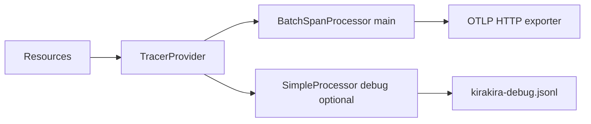

# OpenTelemetry SDK integration

Operational guidance configuring **TracerProvider**, **SpanProcessors**, **Exporters**, **Resource detectors**, aligning with **GenAI semantic conventions**.

Related: [`../02-span-taxonomy/README.md`](../02-span-taxonomy/README.md).

---

## TracerProvider layout

Recommended initialization order:

```
Resource merge (env + static + host)
   ↓
TracerProvider singleton
   ↓
Attach propagators W3C tracecontext + baggage
   ↓
Register OTLP exporters (HTTP/protobuf default)
Optional JSONL dev exporter
```



---

## SpanProcessors — Batch vs Simple

| Processor | Suitable for | Risks |
| --------- | ----------- | ------- |
| **BatchSpanProcessor** (default queued) | Production latency efficiency | Shutdown MUST `forceFlush()` to avoid orphan tail loss |
| **SimpleSpanProcessor** | Unit tests / immediate tail visibility | Amplifies OTLP chatter—avoid prod except critical security paths sparingly |

Policy obligations MAY temporarily attach **critical security span processor** injecting redactors before export.

Flush intervals typical: `scheduledDelayMillis=2000`.

---

## Exporters — OTLP + JSONL

| Transport | Destination | Encoding |
| --------- | --------- | -------- |
| `OTLP_HTTP_PROTOBUF` `/v1/traces` | Collector / SaaS ingestion | Efficient |
| `OTLP_HTTP_JSON` | Easier jq debugging locally | Larger payload |
| `JSON Lines` shim | `./.kirakira/trace-debug.jsonl` non-prod ephemeral | Convenience only—disable by default CI |

Authenticate via:

```
OTEL_EXPORTER_OTLP_HEADERS=Authorization=Bearer *** 
```

(or mTLS terminates at collector.)

---

## Resource attributes baseline

Recommended static keys:

| Attribute | Meaning |
| --------- | ------- |
| `service.name` | `kirakira.cli` vs `kirakirad` distinct values |
| `service.version` | CLI semver pinned |
| `deployment.environment` | `dev`,`staging`,`prod` |
| `kirakira.org_id`, `kirakira.workspace_id` | Enterprise correlation (privacy policy gated) |

Host detectors optional but align multi-node investigations.

---

## GenAI conventions bridge

Spans involving models MUST annotate `gen_ai.*` conventions (see [`../02-span-taxonomy/genai-semconv.md`](../02-span-taxonomy/genai-semconv.md)) plus `kirakira.agent.*`.

---

## Sampling integration

Defer to [`../03-sampling-redaction/README.md`](../03-sampling-redaction/README.md)—SDK sets **ParentBased** root sampler cooperating with PDP sampling hints via attributes not mutating probabilistic RNG unpredictably insecure.

---

## Shutdown lifecycle

Graceful CTRL+C hooks:

```
provider.shutdown(timeout=5000ms)
Exporter errors escalate metric `otel_exporter_failure_total`.
```

Failures tie to tracing fail-closed policy [`../../kirakira-agent-policy/10-fail-closed/README.md`](../../kirakira-agent-policy/10-fail-closed/README.md) selectively (non-blocking default).

---

## Cross-links

Audit ledger correlation IDs: [`../04-audit-ledger/README.md`](../04-audit-ledger/README.md)
