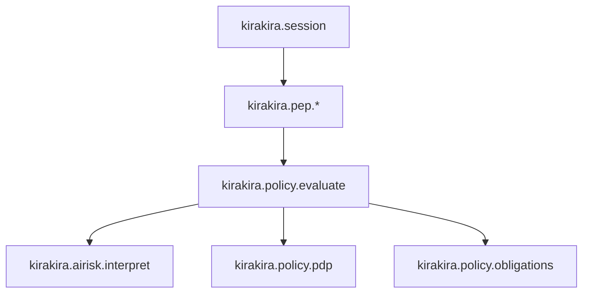

# Span taxonomy — hierarchy & attributes

Complete mental model tying **nested spans** to policy evaluation & capability execution stages.

Supporting attribute references:

| Document | Focus |
| -------- | ------- |
| [genai-semconv.md](./genai-semconv.md) | Model spans |
| [kirakira-custom-attributes.md](./kirakira-custom-attributes.md) | Full `kirakira.*` namespace |

---

## Root span: `kirakira.session`

Emitted per interactive/batch invocation session.

Children:

```
kirakira.session
 ├─ kirakira.pep.ingest.shell
 │    └─ kirakira.policy.evaluate
 │         ├─ kirakira.airisk.interpret
 │         ├─ kirakira.policy.pdp
 │         └─ kirakira.policy.obligations
 │              ├─ kirakira.approval.gate (optional)
 │              ├─ kirakira.sandbox.activate (optional)
 │              └─ kirakira.audit.append
 └─ ... additional parallel PEP ingest spans
```



Naming rule: PEP channel encoded as **`kirakira.pep.<channel>`**.

---

## Span type catalog summary

### `kirakira.policy.evaluate`

| Attribute | Meaning |
| --------- | ------- |
| `kirakira.policy.request_id` | Mirror `PolicyInput.request_id` |
| `kirakira.policy.bundle_revision` | Active PDP revision |

### `kirakira.policy.pdp`

| Attribute | Meaning |
| --------- | ------- |
| `kirakira.policy.effect` | `allow|deny|escalate` |
| `kirakira.policy.reason_codes` | Compressed array textual join |

Duration tracks pure evaluation excluding obligations.

### `kirakira.airisk.interpret`

| Attribute | Meaning |
| --------- | ------- |
| `kirakira.airisk.classification_count` | Cardinality heuristic |
| `kirakira.airisk.rules_digest` hotloaded | Debugging drift |

### `kirakira.policy.obligations`

Spans MAY fan-out child spans per obligation executor stage.

### `kirakira.sandbox.activate`

Attributes include backend id (`linux.nsjail`, `runsc`, `firecracker`).

---

## PEP span variants

Representative PEP types—extend per detailed policy docs [`../../kirakira-agent-policy/04-pep-layer/README.md`](../../kirakira-agent-policy/04-pep-layer/README.md):

| Span name | Distinguished attributes |
| --------- | ------------------------ |
| `kirakira.pep.shell` | argv hash, cwd |
| `kirakira.pep.mcp` | server id composite |
| `kirakira.pep.file` | mutation op |
| `kirakira.pep.model` | normalized model slug |
| `kirakira.pep.network` | egress host/port |
| `kirakira.pep.skill` | SKILL digest |

---

## Error recording

Spans ending `StatusCode.ERROR` SHOULD attach standardized `kirakira.error.kind` enumerated (`pdp_denied`, `sandbox_failed`, …).

Avoid embedding raw stderr—hash & pointer.

---

## Cross-links

Exporters / processors layering: [`../01-otel-architecture/README.md`](../01-otel-architecture/README.md)
