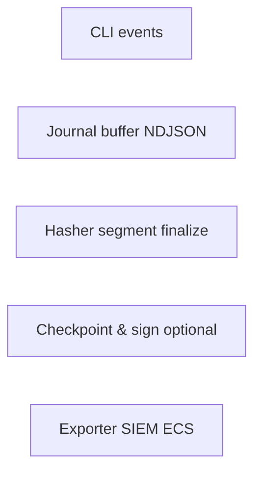

# Audit ledger architecture

Append-only, locally durable **facts** complement ephemeral traces:

| Capability | Provided by |
| ---------- | ----------- |
| Non-repudiation (local assumption) | Hash chain segmentation |
| Fast operator tail | Segment rotation + indexing |
| Enterprise anchoring | Optional Rekor/object storage bridging |

Supporting specifications:

| Spec | Covers |
| ---- | ------- |
| [hash-chain-spec.md](./hash-chain-spec.md) | BLAKE3 iterative chaining |
| [checkpoint-spec.md](./checkpoint-spec.md) | Periodic root aggregation |
| [signing-spec.md](./signing-spec.md) | Ed25519 checkpoints |
| [remote-anchoring.md](./remote-anchoring.md) | Rekor / SIEM handoff |

Policy bridge: each row references `policy.decision_id` & `approval_id` when present.
