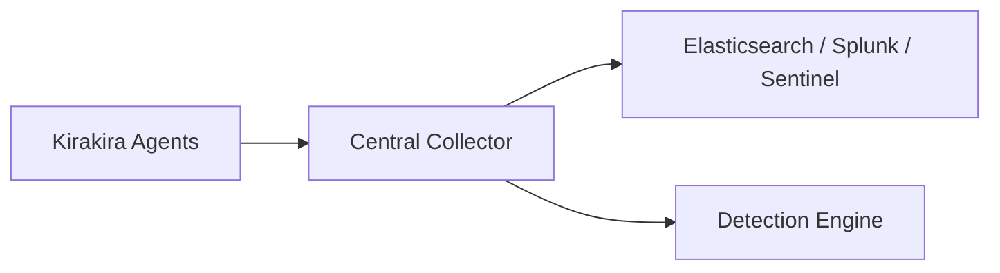

# SIEM integration overview

Bridging `kirakira-agent` telemetry + audit ledger to security analytics platforms (**Splunk**, **Elastic**, **Microsoft Sentinel**) using ECS-normalized payloads + curated detections.

Child documents:

| File | Coverage |
| ---- | --------- |
| [ecs-mapping.md](./ecs-mapping.md) | Field normalization |
| [detection-rules.md](./detection-rules.md) | Ten detection summaries |
| [retention-policy.md](./retention-policy.md) | Data lifecycle tiers |

---

## Integration architecture

```
OTel exporters -> Collector -> transform -> SIEM HTTPS HEC
Audit forwarder --> parallel channel with hash metadata only
Policy decision logs enriched -> lookups on bundle revision index
```



---

## Use cases

| Use case | Data mix |
| -------- | --------- |
| Violation hunts | PDP deny spikes + correlated sandbox failures |
| Insider risk | Repeated approval revocation patterns |
| Supply chain anomalies | Bundles reloading unsigned attempts |

Align incident response playbook references external IR wiki.

---

## Privacy & masking

Honor [`../03-sampling-redaction/README.md`](../03-sampling-redaction/README.md) before egress.

---

## Cross-links

Trace backends selection [`../06-backends/README.md`](../06-backends/README.md)
